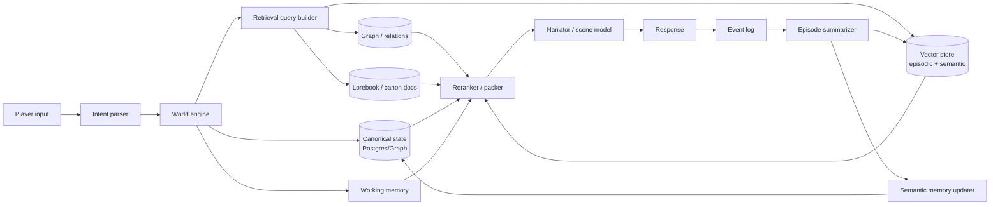
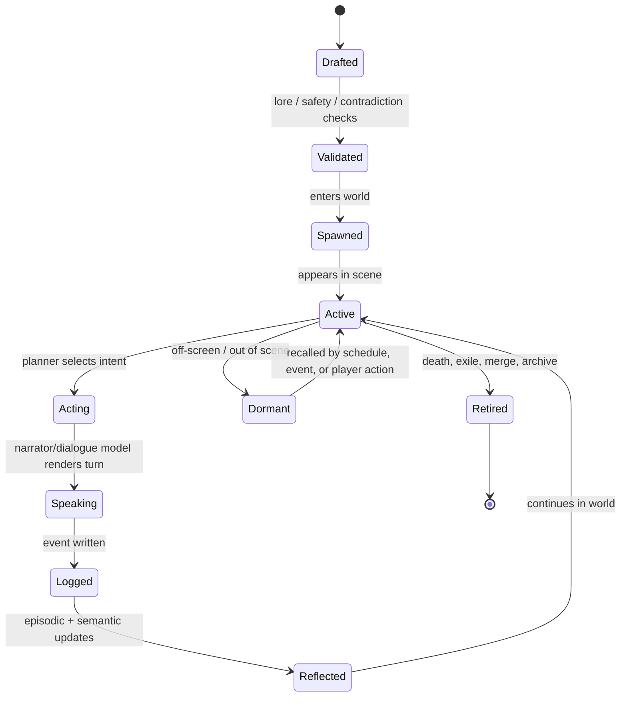
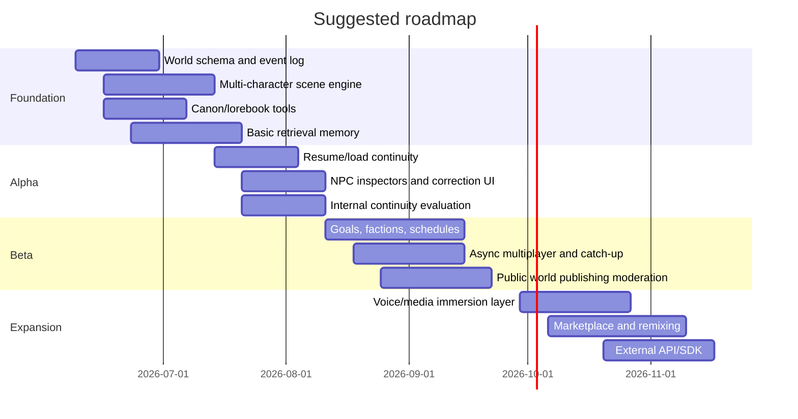

# Building a Persistent Multi-Character RPG World Narration App

## Executive summary

The market currently splits into three neighboring categories rather than one direct category leader. First are **character-centric roleplay/companion products** such as OurDream, Soulkyn, Dreamjourney, CrushOn, Character.AI, and WyvernChat, which are strong at persona creation, multi-character scenes, media features, and creator ecosystems, but generally weak at authoritative world state, deterministic continuity, and long-running campaign logic. Second are **AI Game Master products** such as AI Dungeon, Voyage, Friends & Fables, AI Realm, RoleForge, DungeonsDeep.ai, and FableAI, which are stronger on campaigns, progression, and sometimes rules/maps, but vary widely in persistence and NPC autonomy. Third are **developer platforms** such as Inworld, Convai, Charisma.ai, and Player2, which expose character runtimes and memory systems but do not by themselves solve player-facing worldbuilding, campaign save-state, or creator UX. citeturn9search0turn8search20turn6search5turn28search14turn6search2turn29search11turn5search1turn15search0turn13search13turn13search0turn13search8turn14search6turn11search0turn7search16turn7search11turn7search21turn5search6

That gap is the opportunity. A product specifically for **persistent, multi-character RPG world narration** should be built as a **world-state-first system**, not as a chat transcript with extra prompting. The winning architecture is an authoritative world database plus a memory layer plus an NPC-agent layer plus a narration layer. In other words: facts, inventory, quests, locations, faction standings, schedules, and relationship edges must live in databases and event logs, while the LLM is used to interpret, dramatize, and improvise within those constraints. Research on RAG, MemGPT-style hierarchical memory, episodic memory, and generative agents all points in the same direction: long-horizon quality improves when memory is explicit, structured, retrievable, and layered, rather than stuffed into one giant prompt. citeturn37search0turn19search0turn37search2turn18search0turn19search14

The highest-value product position is therefore not “another AI companion app,” and not “yet another solo D&D clone.” It is **a persistent world simulator with narrator-quality prose**, where players can create or enter a setting, interact with many NPCs, pause for days or weeks, and return to a world that is still coherent. The moat comes from four things competitors only partially combine today: **authoritative continuity, dynamic NPC societies, multi-character scene control, and creator-facing world management tools**. citeturn13search4turn13search16turn14search7turn3search0turn7search19turn7search5turn17search0turn6search13

The practical recommendation is to ship in phases. Phase one should prove the core loop: world creation, canonical lore, persistent save/load, multi-character scene orchestration, and a reliable “NPC remembers what happened” experience. Phase two should add higher-order NPC planning, factions, schedules, asynchronous multiplayer, and admin tooling. Phase three should add media, marketplace features, and API/SDK surfaces. If you get the first phase right, you will already be differentiated from Soulkyn- and OurDream-style companion products and from AI-GM tools that still depend too heavily on chat history or manual note-taking. citeturn8search20turn9search0turn13search16turn15search1turn12search12

## Market landscape and inventory

The inventory below prioritizes English-language products and public documentation available as of 2026-06-04. “Tech stack” is included only where it is public or strongly evidenced by official docs/repositories. When not public, it is marked as undisclosed.

### Closest commercial products

| Product | Fit to target product | Short description | Core features | Business model | Public tech stack |

|---|---|---|---|---|---|

| **DreamGen** citeturn11search14turn12search0turn11search16 | Very high | Roleplay/story platform explicitly supporting multiple characters and fantasy realms. | Multi-character scenarios, worldbuilding tools, unrestricted roleplay, scenario creation, model choices. | Freemium + subscription tiers. | Undisclosed. |

| **AI Dungeon** citeturn5search1turn2search23turn15search1 | High | Large, flexible AI storytelling platform; strongest legacy brand in AI text adventures. | Multiplayer, worlds, Story Cards, memory system, creator scenarios, image generation. | Freemium + paid plans. | Proprietary platform by Latitude; model/runtime details not fully public. |

| **Voyage** citeturn15search0turn15search5turn15search6 | High | Latitude’s newer “AI-native RPG” direction, positioned as progression/rules/world layer beyond AI Dungeon. | RPG progression, creator platform framing, world engine, structured challenge/progression. | Newly launched; pricing not clearly disclosed in reviewed material. | Proprietary/undisclosed. |

| **Friends & Fables** citeturn3search0turn13search13turn3search14 | High | AI GM + world building + VTT, aimed at D&D-like campaign play. | AI GM, persistent campaigns, world tools, tactical combat, multiplayer/asynchronous play. | Freemium + subscriptions. | Web app; deeper stack undisclosed. |

| **AI Realm** citeturn13search0 | High | D&D 5e-inspired AI GM platform with auto-campaign tracking. | AI GM, character creation, rules-inspired play, auto tracking, image generation, multiple AI models. | Freemium + subscription tiers. | Undisclosed. |

| **RoleForge** citeturn13search8turn13search4turn13search6 | High | Purpose-built around persistent world state, real dice, hand-drawn maps, and narrator style controls. | Deterministic rules engine, persistent NPC memory, faction standing, inventory, visual map layer. | Free during alpha. | Undisclosed, but architecture is clearly world-state-first. |

| **DungeonsDeep.ai** citeturn14search6turn14search7 | High | AI tabletop RPG platform emphasizing persistent saves and a visual tabletop. | AI GM, campaign persistence, grid/battle map, spoken narration, rules engine separation. | Free during beta/early access in reviewed materials. | Undisclosed. |

| **FableAI** citeturn11search0turn11search3 | Medium-high | Mobile-first AI text RPG with strong presentation layer. | Voice narration, dynamic soundtracks, AI art, co-op multiplayer, “smart memory system.” | Free plan + upsell. | Undisclosed. |

| **Hidden Door** citeturn4search8turn4search12turn4search3 | Medium-high | Structured co-creative roleplaying platform inside bounded fictional worlds. | Multiple players, narrative engine, reusable “cards,” story constraints to preserve coherence. | Select worlds free; broader monetization evolving. | Proprietary “story engine”; exact stack undisclosed. |

| **Dreamjourney AI** citeturn6search5turn6search13 | Medium-high | Roleplay/storytelling app with explicit persistent-world positioning. | Persistent worlds, Lorebooks, Memory Nexus, multiple models, character/story bots. | Free start + upsell/credits implied; full pricing not clear on reviewed pages. | Undisclosed. |

### Adjacent consumer roleplay and companion platforms

| Product | Why it matters | Core features | Business model | Public tech stack |

|---|---|---|---|---|

| **Soulkyn** citeturn8search15turn8search20turn8search14turn8search21 | Important reference because it already markets no-code multi-character worlds and narrator-driven scenarios. | Character library, premium plans, narrator for multi-character scenarios, linked personas/context modules, RPG worlds and mini-games. | Subscription. | Undisclosed. |

| **OurDream** citeturn9search0turn9search3turn8search6 | Important reference because it monetizes character/chat/media heavily and supports group-chat behavior. | Group chat targeting, public/private bots, image/video generation, voice calls, narration, premium + coins. | Subscription + virtual currency. | PWA/web; deeper stack undisclosed. |

| **CrushOn.AI** citeturn28search14turn28search0turn28search5turn28search6 | Strong adjacent benchmark for long-form roleplay UX. | Long-arc roleplay, group chat, pinned memory, scene cards, free and paid models. | Freemium + subscriptions + credits. | Undisclosed. |

| **Character.AI** citeturn6search2turn6search8turn6search4 | Massive benchmark for creator/community/liquidity, though not world-state-first. | Scenes, custom characters, world/story creation, roleplay memory improvements, voice/chat. | Freemium + subscription. | Uses open-source and proprietary models within a proprietary stack; exact runtime not public. |

| **WyvernChat** citeturn29search0turn29search4turn29search11 | Notable for lorebook-heavy creator ecosystem and many AI model connections. | Many AI characters, lorebooks, free and paid models, story/scenario creation, community events. | Freemium + subscriptions. | Web app; model connections exposed, deeper stack undisclosed. |

| **Kajiwoto** citeturn10search1turn10search0 | Early customizable AI character platform; relevant for training data pipeline ideas. | Character creation, GPT-powered chat, train your own dataset. | Subscription. | GPT-backed; exact broader stack undisclosed. |

| **Backyard AI** citeturn31search0 | Useful adjacent benchmark for privacy/local-first and advanced model controls. | Text and voice character chats, advanced model parameters, community hub. | Free start + subscriptions. | Product page exposes parameter control but not full architecture. |

### Developer platforms and services

| Product | Best use | Core features | Business model | Public tech stack |

|---|---|---|---|---|

| **Inworld** citeturn7search16turn7search4turn7search19 | Realtime game/voice character runtime | Realtime API, character runtime/orchestration, memory retrieval node combining flash + long-term memory, game-engine integrations. | Usage-based/B2B. | Official Unreal tooling and runtime docs; proprietary backend. |

| **Convai** citeturn7search11turn7search5turn2search22turn7search20 | 3D/XR/world character platform | Long-term memory, knowledge bank, session memory controls, multilingual voice-heavy character deployment. | Usage-based/B2B. | Proprietary backend with SDKs/integrations. |

| **Charisma.ai** citeturn7search21turn7search12turn7search6turn7search18 | Interactive narrative and branded/story experiences | Story authoring, Unity/Unreal plug-in, conversational scenarios, admin tools. | Credits + platform fees. | Official engine integration modules; broader stack undisclosed. |

| **Player2** citeturn5search6 | Creator ecosystem for AI mods/NPCs | AI NPC APIs, game/mod distribution, supported engines, revenue angle for creators. | Platform/service model. | Officially lists Unity, Godot, Defold and partners such as Deepgram/Stripe/Google Cloud. |

### Open-source tools and frameworks

| Project | What it is | Core features | Business model | Public tech stack |

|---|---|---|---|---|

| **SillyTavern** citeturn17search1turn17search0turn17search2turn17search11 | The most capable open roleplay front-end ecosystem. | Character cards, group chats, lorebooks/World Info, Data Bank RAG, scripting, extensions. | Free/open source. | JS/Node ecosystem; exact repo details are public, docs expose extension architecture and prompt assembly. |

| **TavernAI** citeturn16search1 | Atmospheric roleplay front-end. | Character creation, online DB, group chat, story mode, world info, swipes, backend flexibility. | Free/open source. | Node.js app; backend-agnostic. |

| **RisuAI** citeturn16search2turn16search18turn16search10 | Cross-platform roleplay app with strong customization. | Multiple APIs, assets in chat, regex tooling, lorebook support. | Free/open source. | Svelte + TypeScript + Tauri + Vite + Tailwind. |

| **KoboldAI** citeturn16search3 | Browser-based AI writing/story front-end. | Memory, Author’s Note, World Info, save/load, adventure mode. | Free/open source. | Open-source repo; multi-model local/remote support. |

| **KoboldCpp / KoboldAI Lite** citeturn16search11turn16search7 | Local model runtime plus lightweight UI. | Memory, World Info, scenarios, characters, TTS, multimodal, multiple API compatible endpoints. | Free/open source. | C++/local runtime with bundled web UI. |

| **AgnAI** citeturn30search1turn30search13 | Multi-user, multi-bot roleplay/chat system. | Multi-bot chat, memory books, scalable chat server orientation. | Free/open source. | Node.js + TypeScript stack. |

| **OpenCharacters** citeturn30search0turn30search20 | Ultra-light character chat/share interface. | Browser-local character definitions, link-based sharing, IndexedDB chat storage. | Free/open source. | Single-page HTML/JS app; no server required. |

| **OpenCharacter** citeturn30search4 | Open-source Character.AI-style alternative. | Local or hosted character runtime. | Free/open source. | Public repo; broader stack details in repo. |

### Academic prototypes and research systems

| Prototype | Why it matters | Key idea | Relevance to your app |

|---|---|---|---|

| **Generative Agents / Smallville** citeturn18search0turn18search4turn33search1 | Foundational paper for believable social NPCs. | Agents remember, reflect, and plan inside a shared sandbox. | Best starting point for town-scale autonomous NPC society design. |

| **Voyager** citeturn18search17turn18search5 | Best-known lifelong embodied agent prototype. | Skill library, iterative prompting, open-ended exploration in Minecraft. | Excellent reference for skill acquisition and persistent competence. |

| **SOTOPIA** citeturn18search18turn18search2 | Benchmark/simulation environment for social intelligence. | Open-ended social tasks and multi-agent interaction. | Useful for training/evaluating relationship-driven NPC dialogue. |

| **LifelongSotopia** citeturn18search14turn32search2 | Important negative result. | Shows social goal achievement and believability decline over long interactions. | Evidence that long-term memory quality needs explicit evaluation and repair loops. |

| **Ella** citeturn18search9 | Lifelong learning in a 3D open world. | Accumulating experiences and knowledge over extended interaction. | Useful reference for persistent adaptation beyond text-only memory. |

| **LLM-Driven NPCs Cross-Platform Dialogue System** citeturn33search4turn33search17 | Practical prototype for cross-surface memory. | Unity + Discord NPC with shared logs in cloud DB. | Relevant if you want world continuity across web, Discord, mobile, or forums. |

| **TUMSphere NPCs** citeturn33search0turn33search20 | Recent applied system with AI NPCs inside VR. | AI-powered NPCs inside a persistent educational virtual environment. | Useful for contextual NPC support, onboarding, and world-native helpers. |

| **SimWorld** citeturn32search15turn32search11 | Rich simulator for physical + social worlds. | Unreal-based environment for evaluating LLM/VLM agents. | Good reference if you later add spatial simulation or embodied NPC evaluation. |

### Comparative feature matrix

The products closest to your concept divide into “world-state-first” and “chat-first” designs. That divide is the key strategic lens. citeturn13search16turn15search4turn8search20turn9search0

| Product | Multi-character scenes | Persistent world state | Lorebook or canon DB | Rules/map layer | Voice or media layer | Creator worldbuilding | Best read |

|---|---:|---:|---:|---:|---:|---:|---|

| DreamGen citeturn11search14turn12search0 | ✓ | △ | ✓ | ✗ | Limited | ✓ | Closest chat-first worldbuilding product |

| Soulkyn citeturn8search20turn8search14 | ✓ | △ | △ | ✗ | Limited | ✓ | Companion-first, multi-character capable |

| OurDream citeturn9search0turn9search3 | ✓ | △ | △ | ✗ | ✓ | △ | Media/companion monetization benchmark |

| AI Dungeon citeturn2search23turn15search1 | △ | △ | ✓ | ✗ | ✓ | ✓ | Freeform story engine with memory aids |

| Voyage citeturn15search0turn15search5 | △ | ✓ | △ | ✓ | Unclear | ✓ | RPG-structured successor direction |

| Friends & Fables citeturn3search0turn13search13 | ✓ | ✓ | ✓ | ✓ | Limited | ✓ | Strong AI GM reference |

| AI Realm citeturn13search0 | △ | ✓ | △ | ✓ | ✓ | △ | Structured GM/rules benchmark |

| RoleForge citeturn13search8turn13search4 | △ | ✓ | ✓ | ✓ | Limited | △ | Best persistence-first positioning |

| DungeonsDeep.ai citeturn14search6turn14search7 | ✓ | ✓ | △ | ✓ | ✓ | △ | Visual-tabletop persistence benchmark |

| Hidden Door citeturn4search8turn4search3 | ✓ | △ | ✓ | △ | Limited | △ | Strong “bounded freedom” design reference |

**Bottom line:** the market still lacks a product that combines DreamGen-style creative freedom, RoleForge/DungeonsDeep-grade persistence, and Generative Agents-style autonomous societies in one web-native consumer product. citeturn11search14turn13search8turn14search6turn18search0

## Product patterns for immersion and persistence

The most important design choice is to treat the world, not the chat, as the product. Products that lean on lorebooks, Story Cards, Memory Nexus, pinned memories, knowledge banks, or runtime memory nodes are all converging on the same truth: **once the conversation is longer than the context window, persistence has to be externalized**. AI Dungeon’s Story Cards and memory system, Dreamjourney’s Lorebooks and Memory Nexus, SillyTavern’s World Info and Data Bank, Convai’s long-term memory, and Inworld’s flash-plus-long-term retrieval are all practical expressions of that principle. citeturn2search23turn15search1turn6search13turn6search5turn17search0turn17search2turn7search5turn7search19

The strongest immersion pattern across products is **bounded freedom** rather than unlimited freedom. Hidden Door explicitly constrains action space to preserve world coherence; RoleForge separates deterministic rules from AI narration; DungeonsDeep.ai says the rules engine and campaign system keep play consistent; and AI Realm exposes auto-tracked campaigns rather than leaving persistence entirely to prose. These patterns matter because they preserve causality. A world feels immersive when it resists the player in believable ways and remembers consequences, not when it says yes to every prompt. citeturn4search3turn4search12turn13search8turn13search16turn14search7turn13search0

A second recurring pattern is **speaker orchestration**. OurDream’s group chat lets the user target a specific respondent; Soulkyn exposes a narrator pattern for multi-character scenarios; SillyTavern group chats have manual and triggered speaker selection. For your app, this should become a real subsystem: the engine should be able to decide who speaks next, who enters a scene, and when the narrator should summarize, interrupt, or cut away. Multi-character narration fails when message ordering is implicit and chat-based; it succeeds when turn-taking is explicit and scene-aware. citeturn9search0turn8search14turn17search11turn17search12

A third pattern is **diegetic presentation rather than dashboard overload**. FableAI uses voice narration, AI art, and dynamic soundtrack to dress the scene; OurDream monetizes narration, voice calls, image, and video generation; CrushOn’s scene cards and Character.AI Scenes show the value of giving each story a presentation layer, not just a transcript. The lesson is not that you need maximal media from day one. It is that the product should feel like a living world, not a prompt IDE. Even simple scene backgrounds, ambient sound, and narrator voice can materially improve immersion if continuity is already strong. citeturn11search0turn11search3turn9search3turn8search6turn28search11turn6search2

A fourth pattern is **player-visible continuity controls**. CrushOn has pinned memory. AI Dungeon exposes memory management. Convai exposes memory review and session controls. Products that let users inspect or reinforce memory reduce frustration and create trust. For your app, creators and players should be able to see what the world knows, lock canon facts, correct erroneous facts, and decide whether an event is local rumor, confirmed fact, secret knowledge, or player-only memory. This is not just a debugging convenience. It is part of the product fantasy: persistent worlds feel real when the player can audit what is “true.” citeturn28search5turn2search23turn2search22

The design patterns that most directly maximize immersion for your specific concept are therefore these:

| Pattern | Why it works | Concrete design recommendation |

|---|---|---|

| **Authoritative world state** | Prevents continuity collapse. | Store quests, inventory, locations, relationships, time, and world flags in SQL as source of truth. |

| **Narrator as first-class agent** | Keeps prose cohesive in multi-character scenes. | Give the narrator its own policy, style controls, and authority to cut scenes, summarize, and route turns. |

| **Scene-based turn controller** | Prevents chaos in ensemble interaction. | Explicit speaker selection, urgency weighting, interruption rules, and arrival/departure events. |

| **Lorebook plus retrieval** | Preserves canon without ballooning prompts. | Static canon entries + dynamic episodic summaries + entity-linked retrieval. |

| **Bounded affordances** | Improves plausibility and consistency. | Actions become structured intents that the world engine validates before narration. |

| **Player-visible memory tools** | Increases trust and reduces repair cost. | Canon locks, memory inspector, correction UI, “pin as world fact,” “mark as rumor,” audit history. |

These patterns are supported both by current product behavior and by research on generative agents, RAG, and long-term memory systems. citeturn18search0turn37search0turn19search0turn19search2turn19search14

## Memory architectures for long-running worlds

“Perfect long memory” is not realistically achieved by a raw LLM alone. Context windows are finite, long-horizon social performance degrades over repeated episodes, and naive retrieval introduces drift. The closest achievable result comes from combining **authoritative canonical state**, **episodic event memory**, **semantic summaries**, **retrieval/reranking**, and **repair loops**. That conclusion is consistent with RAG, MemGPT, MemoryBank, Reflective Memory Management, episodic-memory work, and LifelongSotopia’s findings that believability declines over multi-episode interaction without better long-term mechanisms. citeturn37search0turn19search0turn19search2turn19search14turn37search2turn32search2

### Recommended memory model

Use five memory layers, each with different write/read rules:

| Layer | Stores | Truth level | Read path | Write path |

|---|---|---|---|---|

| **Canonical memory** | Facts: NPC identity, factions, places, quest states, inventory, laws, world flags | Absolute | Direct SQL/graph lookup every turn | Deterministic writes from game logic or admin actions |

| **Working memory** | Current scene, recent actions, active speaker intents, unresolved checks | Temporary | Always injected | Rebuilt turn by turn |

| **Episodic memory** | Timestamped events and scene summaries | High but contextual | Retrieved by semantic + entity + recency filtering | Appended asynchronously every turn/scene |

| **Semantic memory** | Distilled stable facts derived from episodes | Medium-high | Retrieved when relevant | Created by summarizer/reflection jobs with conflict checks |

| **Reflective memory** | Higher-order interpretations: rivalries, grudges, long-term goals, rumors | Interpretive | Retrieved selectively | Low-frequency reflection jobs or curator approval |

LangGraph’s namespace-based long-term memory, Letta’s always-visible memory blocks, Inworld’s flash-plus-long-term retrieval, and Convai’s cross-session long-term memory all map cleanly onto variations of this layered design. citeturn19search3turn19search7turn19search1turn19search5turn7search19turn7search5turn2search22



The key architectural rule is this: **the narration model should never be the only place where truth exists**. If the world state only exists in generated prose, continuity will eventually fail, no matter how large the context window becomes. citeturn19search0turn37search2turn32search2

### Architecture options compared

| Architecture | Summary | Pros | Cons | Best fit |

|---|---|---|---|---|

| **Context-only with rolling summary** | Keep chat history + periodic summary | Very simple, low engineering cost | Fragile, summary loss compounds, poor cross-session consistency | Prototype only |

| **Naive RAG over chat chunks** | Embed transcripts, retrieve relevant chunks | Better recall than summaries alone; easy to implement | Duplicate/conflicting memories; no canonical truth | Early alpha |

| **Hierarchical memory** | Working memory + episodic memory + semantic memory + reflection | Strong continuity, lower prompt bloat, good long-horizon behavior | More moving parts; needs evaluation and conflict resolution | Recommended default |

| **Event-sourced world engine + memory retrieval** | Every world change is an event; retrieval is auxiliary, not authoritative | Best possible consistency and auditability; supports rewinds and admin tools | Highest engineering effort | Recommended long-term target |

RAG established the parametric-plus-nonparametric pattern. Self-RAG showed retrieval should be adaptive rather than always-on. MemGPT and Letta formalize memory tiers and always-visible memory blocks. Generative Agents adds reflection and planning on top of memory. That stack is the right conceptual foundation for a persistent RPG world. citeturn37search0turn37search1turn19search0turn19search1turn18search0

### Retrieval design that actually works

For this product, retrieval should not be “top-k nearest vectors” and stop there. The best retrieval policy is **hybrid**:

- **Entity filter first**: only memories about NPCs/places/factions in or adjacent to the current scene.

- **Time window second**: recent events get a recency boost.

- **Semantic similarity third**: vector search ranks relevant episodes.

- **Keyword/hybrid fallback**: exact names, quest IDs, and proper nouns should also hit. Weaviate’s official hybrid search guidance is useful here because vector-only retrieval misses exact symbolic facts surprisingly often. citeturn36search2turn36search10turn37search0

For vector indexing, **pgvector is usually sufficient for MVP and early growth**, especially when you want joins with structured world tables and transactional consistency. pgvector supports exact and approximate search, and its official docs explain the tradeoff between IVFFlat and HNSW: IVFFlat has faster build/lower memory use, while HNSW generally wins on speed–recall tradeoff. Once the product becomes retrieval-heavy at larger scale, Qdrant, Pinecone, or Weaviate become more attractive operationally. citeturn20search3turn36search15turn36search11turn36search1turn36search5turn36search16turn36search14

### Scalability, latency, and rough cost estimates

The cheapest part of long memory is usually **embeddings**. The expensive part is often **summarization/reflection**, not storage. OpenAI’s `text-embedding-3-small` is listed at $0.02 per 1M tokens, while GPT-5 nano is $0.05 per 1M input tokens and $0.40 per 1M output tokens; GPT-5.4 mini is substantially more expensive at $0.75/$4.50. Supabase Pro starts at $25/month and includes 8 GB database storage, Neon Launch is described as typically around $15/month, Pinecone storage is priced at $3/GB/month with minimum plan commitments, Qdrant Cloud has a free tier with 1 GB RAM and 4 GB disk, and Weaviate has an always-free tier up to 100,000 objects with 1 GB memory and 10 GB disk. citeturn22search0turn35search4turn35search1turn39search0turn39search2turn20search0turn20search12turn20search1turn20search2

The table below uses these **illustrative assumptions**: one 120-token memory write per player turn; one scene summary every 20 turns using a cheap summarizer at 2,000 input tokens and 250 output tokens; and roughly 8 KB stored per memory item once vector plus metadata are included. These are directional estimates, not a promised cloud bill. citeturn22search4turn35search4turn20search0turn39search0

| Scale | Embedding cost | Cheap summary cost | Approx. memory storage footprint | Practical infra interpretation |

|---|---:|---:|---:|---|

| **100K turns/month** | ~$0.24 | ~$1.00 | ~0.8 GB | Fits inside low-end pgvector/managed Postgres; can still prototype on free vector tiers. |

| **1M turns/month** | ~$2.40 | ~$10.00 | ~8 GB | Still cheap on embeddings; storage now fits roughly inside one Supabase Pro DB quota or low-tens-of-dollars in Pinecone storage. |

| **10M turns/month** | ~$24.00 | ~$100.00 | ~80 GB | Storage remains manageable, but operational/search performance now matters more than raw storage price; consider Qdrant/Pinecone/Weaviate or sharded Postgres. |

Latency-wise, vector lookup is rarely the dominant bottleneck if it is kept in-region and query fan-out is controlled. Pinecone’s docs recommend deploying in the same region and avoiding excessive batching, and Pinecone’s architecture page says writes are acknowledged once durable with write latency under 100 ms. The practical implication is that your user-facing latency budget should be optimized mainly around narration-model choice, prompt packing size, and whether summarization happens inline or asynchronously. citeturn36search0turn36search8turn36search16

### Example implementations worth copying

The best memory ideas already shipping are quite concrete:

- **AI Dungeon**: Story Cards plus the newer memory system show how static lore and dynamic memory can coexist. citeturn2search23turn15search1

- **Dreamjourney**: Lorebooks plus Memory Nexus is a good user-facing vocabulary model for persistent world memory. citeturn6search5turn6search13

- **SillyTavern**: World Info plus Data Bank is the open-source reference for lorebook + RAG layering. citeturn17search0turn17search2

- **Inworld**: flash memory plus semantically similar long-term entries bundled into one retrieval summary. citeturn7search19

- **Convai**: long-term memory across sessions with explicit memory review and control. citeturn2search22turn7search5

- **CrushOn**: pinned messages as coarse but highly understandable memory anchors. citeturn28search5

## Dynamic NPC architecture and management

The best dynamic NPC system for your use case is a **hybrid architecture**, not a single-agent prompt. Classic game AI patterns still matter. Behavior Trees remain useful for scene-level behavior control, GOAP remains useful for action planning, and BDI remains useful for higher-level intention management. The LLM should sit on top of those structures as the **dialogue and interpretation layer**, not replace them. citeturn34search13turn34search0turn34search2turn34search5

### Recommended NPC cognition stack

Use four layers per NPC:

| Layer | Purpose | Recommended method |

|---|---|---|

| **Identity layer** | Stable personality, biography, beliefs, speech style, safety bounds | Structured character sheet + memory blocks |

| **Motivation layer** | Long-term goals, commitments, allegiances, grudges | BDI-like goals + social graph weights |

| **Behavior layer** | What to do next in a scene | Behavior tree or utility scorer informed by GOAP-style action library |

| **Dialogue layer** | How to say it | LLM with retrieved state, speaking constraints, and current emotional stance |

This general shape aligns with Generative Agents’ memory-reflection-planning loop, GOAP’s separation of goals and executable actions, ReAct’s alternation between reasoning and action, and CAMEL’s role-based multi-agent coordination. citeturn18search0turn34search0turn32search1turn32search0

### What dynamic NPCs should actually model

For an RPG world, each NPC should minimally track:

- **Identity**: name, species/class/archetype, voice/style, taboos, biography.

- **State**: location, health/resources, current scene, current schedule block.

- **Goals**: short, medium, and long horizon.

- **Beliefs**: facts the NPC thinks are true, including uncertainty.

- **Relationships**: edges to player, NPCs, factions, places, and objects.

- **Memories**: episodic events, semantic takeaways, secrets, rumors.

- **Capabilities**: skills, powers, authority, inventory, tools.

- **Behavior policy**: aggression, curiosity, honor, fear, risk appetite.

- **Narrative role**: merchant, rumor source, antagonist, quest-giver, witness, etc.

Generative Agents showed that memory, reflection, and planning create believable emergent social behavior. SOTOPIA and LifelongSotopia show why social-goal evaluation matters. Cross-platform NPC prototypes show that once interactions span channels, memory must remain attached to the NPC identity, not to a single chat surface. citeturn18search0turn18search18turn18search14turn33search4

### Algorithms by function

| Function | Strong approach | Why | Main weakness |

|---|---|---|---|

| **Procedural generation** | Template + trait sampler + faction/region priors + contradiction checker | Fast, controllable, lore-consistent | Can feel formulaic without enough latent variety |

| **Personality model** | Big Five/archetype tags + taboo list + speech/tempo style + relationship modifiers | Easy to author and test | Needs continual reinforcement over long sessions |

| **Goal and planning** | BDI/GOAP hybrid | Clear intent plus concrete action planning | More engineering than prompt-only agents |

| **Scene behavior** | Behavior tree + utility scoring | Reliable real-time control | Requires good blackboard/state design |

| **Social graph** | Weighted directed graph with typed edges | Enables alliances, debts, rivalries, faction behavior | Must be pruned and versioned carefully |

| **Learning/adaptation** | Event-triggered reflection jobs updating relationship weights and semantic memory | Lets NPCs evolve over time | Risk of drift without canonical constraints |

| **Multi-agent coordination** | Role-based coordinator with explicit scene objectives | Prevents everyone talking at once and supports group tactics | Requires good turn orchestration |

### NPC lifecycle



### Recommended data model

The simplest durable shape is relational tables plus relationship edges plus an event log. A graph database can help later, but you do not need one on day one if Postgres handles entity tables plus adjacency lists well. pgvector’s main advantage here is that vectors can live beside your ordinary world tables, giving you transactional joins between memories and canonical entities. citeturn20search3turn39search1turn39search6

Illustrative schema:

```json

{

  "npc": {

    "id": "npc_123",

    "world_id": "world_42",

    "display_name": "Captain Ilya Voss",

    "archetype": "guard_captain",

    "persona": {

      "traits": ["disciplined", "suspicious", "protective"],

      "speech_style": "formal, terse",

      "taboos": ["betray_oath"],

      "values": {"honor": 0.92, "greed": 0.18, "fear": 0.34}

    },

    "state": {

      "location_id": "loc_gatehouse",

      "status": "on_duty",

      "resources": {"gold": 11, "stamina": 74},

      "quest_roles": ["quest_giver", "witness"]

    },

    "goals": [

      {"goal": "secure_city_gate", "priority": 0.91, "horizon": "short"},

      {"goal": "uncover_smuggling_ring", "priority": 0.73, "horizon": "medium"}

    ],

    "relationships": [

      {"target_id": "player_7", "type": "trust", "weight": 0.41},

      {"target_id": "faction_watch", "type": "loyalty", "weight": 0.95}

    ],

    "memory_refs": ["mem_991", "mem_992"],

    "schedule_id": "sched_day_watch"

  }

}

```

### API design for NPC lifecycle and management

A web product like yours should expose first-party internal APIs even if you never publish them. That forces good architecture early.

| Endpoint | Purpose | Notes |

|---|---|---|

| `POST /worlds` | Create new world/campaign | Initializes clock, factions, canon namespaces |

| `POST /worlds/{id}/npcs` | Create NPC from template or generator | Runs lore/safety/contradiction validation |

| `POST /worlds/{id}/scenes` | Start or resume scene | Defines participants, location, agenda |

| `POST /scenes/{id}/advance` | Advance one turn/tick | Runs turn controller, planner, narration |

| `POST /npcs/{id}/reflect` | Force reflection | Rebuild semantic/relationship state after major events |

| `POST /npcs/{id}/retire` | Archive/remove NPC | Keeps history while removing from active simulation |

| `GET /npcs/{id}/memory` | Inspect memory | Admin/player-visible view with permissions |

| `POST /memory/{id}/correct` | Correct or relabel memory | Upgrade to canon, mark rumor, redact, delete |

| `GET /worlds/{id}/timeline` | Event-sourced replay | Essential for support, debugging, and trust |

| `POST /moderation/review` | Queue scene/world/NPC review | Human fallback for public UGC and edge cases |

### NPC management UX that will matter more than clever prompting

The highest-value admin and creator tools are not glamorous, but they are decisive:

- **World inspector**: current time, active scene, unresolved plots, faction standings.

- **NPC inspector**: motivations, current plan, recent memories, speaking style, contradictions.

- **Memory diff tool**: before/after reflection updates.

- **Canon locks**: facts that the model cannot overwrite.

- **Relationship editor**: adjust trust/fear/debt manually.

- **Lifecycle controls**: spawn, despawn, kill, archive, duplicate, fork into alternate timeline.

- **Audit trail**: every state mutation linked to event ID, model call, or human override.

Products like Convai and Inworld already expose parts of memory review and runtime inspection; research systems like Generative Agents show why the reflection/planning trace matters. Your app should turn those into creator-friendly controls rather than developer-only internals. citeturn2search22turn7search19turn18search0

## PRD and operating model

The PRD should focus on one product promise: **“return to a living world that still remembers what happened.”** Every requirement, metric, and moderation decision should support that promise. The nearest products either emphasize creator/community velocity, AI-GM rules play, or companion intimacy; your PRD should instead optimize for persistent ensemble storytelling. citeturn11search14turn13search13turn8search20turn9search0

### Product requirements document summary

| Priority | Epic | Requirement | Acceptance criteria | Rough effort |

|---|---|---|---|---|

| **P0** | World creation | User can create a world with genre, tone, canon docs, factions, key locations, and starter NPC seeds | New world created in under 5 minutes; canonical facts are queryable and editable | 4–6 eng weeks |

| **P0** | Persistent play loop | User can enter a world, play a scene, leave, and resume later with correct quests, location, NPC state, and timeline | Resume accuracy >95% on automated continuity checks for P0 world facts | 6–8 eng weeks |

| **P0** | Multi-character orchestration | Scene can include narrator + multiple NPCs + player, with controlled speaker selection and event ordering | No duplicate/overlapping speaker turns; targeted NPC invocation works every turn | 4–6 eng weeks |

| **P0** | NPC memory | NPCs remember key interactions, relationships, promises, items, and unresolved threads | NPC memory precision/recall benchmark passes internal threshold; correction UI works | 6–8 eng weeks |

| **P0** | Canon lock and correction | Player/creator can inspect and fix wrong memory or canon | Memory changes audit to timeline; corrections affect future retrieval immediately | 3–4 eng weeks |

| **P1** | Dynamic NPC planning | NPCs have schedules, goals, social graph updates, simple autonomous actions between player sessions | Off-screen world simulation updates without breaking canon | 6–10 eng weeks |

| **P1** | Multiplayer and async party play | Shared world supports party scenes and asynchronous catches-up summaries | Party members see consistent shared state and summary diffs | 6–8 eng weeks |

| **P1** | Admin/moderation | Public worlds and NPCs can be reviewed, risk-scored, appealed, and delisted | Moderator queue, audit logs, policy actions, shadow-ban tools implemented | 4–6 eng weeks |

| **P1** | Evaluation harness | Automated tests for continuity, lore fidelity, NPC distinctiveness, safety, and latency | CI includes replay tests over saved transcripts/world snapshots | 4–5 eng weeks |

| **P2** | Voice/media immersion | Optional narrator voice, scene images, soundtrack, and illustrated codex entries | All media strictly optional; text-only experience remains first-class | 5–8 eng weeks |

| **P2** | Marketplace/community | Users can publish worlds, NPC packs, rule modules, and templates | Submission review flow, ratings, remix/fork tools, versioning | 6–9 eng weeks |

| **P2** | API/SDK | External apps can read world state and trigger scenes via API | Secure scoped tokens, per-world permissions, webhook/event support | 4–6 eng weeks |

### Core user stories

A solo player should be able to create a world, meet three or more NPCs, accumulate obligations and faction standing, return days later, and have those NPCs remember prior promises, injuries, insults, and quest results. That story should not require manual note maintenance. This is exactly where current AI-GM products still create friction and where your app can outperform. citeturn13search16turn12search12turn32search2

A creator should be able to define canon and let the system generate the rest: NPC populations, schedules, rumor pools, side quests, and regional tone. Soulkyn and Dreamjourney demonstrate that users want no-code worldbuilding; SillyTavern shows advanced users want lorebook-level control. Your creator UX should combine both. citeturn8search20turn6search13turn17search0

A moderator or support operator should be able to open a world replay, inspect who wrote what state, see which memory entries were retrieved, and resolve public-content disputes. Without those tools, a persistent-world product becomes unmanageable once public UGC grows. DSA-style platform obligations, GDPR rights, and LLM-specific auditability concerns all push in this direction. citeturn24search0turn23search3turn23search4

### UX flows

The best default flow is:

1. **Create or choose a world**

2. **Establish player persona**

3. **Spawn first scene with narrator**

4. **Meet and recruit/antagonize NPCs**

5. **See timeline, codex, and relationship updates live**

6. **Pause**

7. **Resume later with “what changed while you were away?”**

That final step is especially important. A persistent world should not simply reopen on the last turn. It should summarize off-screen development: which NPC traveled, which rumor spread, which faction moved, whether a debt came due, and what the player now notices on re-entry. This is where autonomous NPC simulation becomes product value, not just technical flourish. citeturn18search0turn13search8turn14search7

### Data schemas

The minimum schema set should include:

- `world`

- `world_version`

- `canon_entry`

- `location`

- `faction`

- `npc`

- `relationship_edge`

- `item`

- `quest`

- `scene`

- `scene_participant`

- `event_log`

- `memory_episode`

- `memory_semantic`

- `player_persona`

- `moderation_case`

- `audit_log`

If you keep those normalized and event-linked, you will be able to build debugging, replay, analytics, search, and moderation on the same substrate. That is a very strong operational advantage over chat-log-native systems. citeturn13search16turn19search3turn20search3

### Metrics that actually matter

The wrong metric is “messages sent.” The right metrics are continuity, immersion, and retention:

| Metric | Why it matters |

|---|---|

| **Return-to-world retention** | Measures whether persistence itself is valuable |

| **Continuity break rate** | % of sessions where users correct wrong canon/memory |

| **NPC distinctiveness score** | Whether ensemble scenes feel like different people |

| **Quest/state consistency** | Deterministic check over quests, inventory, locations |

| **Memory precision/recall** | Whether retrieved memories were relevant and correct |

| **Narrative latency** | Time from user turn to first token and completion |

| **Moderator action rate** | Safety and public-UGC health |

| **Creator publish-to-play conversion** | Whether creator ecosystem has downstream demand |

Research and current products both suggest you should explicitly evaluate long-horizon quality rather than rely on anecdotal chat quality. LifelongSotopia is especially useful as a warning here: long interaction can look good locally while degrading globally. citeturn18search14turn32search2

## Recommended stack, security, and roadmap

### Recommended stack

The best stack for this product is a **world-state-first web stack with Python for AI orchestration and Postgres for canon/state**.

| Layer | Recommendation | Why |

|---|---|---|

| **Frontend** | Next.js + React + TypeScript | Mature streaming UI ecosystem, SSR, easy creator/admin tooling |

| **Realtime transport** | WebSockets or SSE | Good for streaming narration and live scene updates |

| **Core app DB** | Postgres + pgvector | Best blend of structured world state + vector retrieval + transactional joins citeturn20search3turn39search1turn39search6 |

| **Managed DB option** | Supabase or Neon for early stages | Fast startup, auth/storage/realtime convenience, low initial cost options citeturn39search18turn39search0turn39search16turn39search2 |

| **Memory at larger scale** | Stay on pgvector first; move hot episodic search to Qdrant/Pinecone/Weaviate when needed | pgvector is enough longer than most teams expect; managed vector DBs help later with operational scale citeturn20search3turn36search15turn20search1turn20search0turn20search2 |

| **Caching/session state** | Redis | Good for working memory, rate limiting, hot scene state |

| **AI orchestration** | Python + FastAPI + background workers | Best ecosystem for retrieval, prompting, evaluation, and agent tooling |

| **Workflow engine** | Temporal-style durable jobs | Useful for summarization, reflection, off-screen simulation, retries |

| **Model mix** | One fast narrator model, one stronger planner model, one cheap summarizer model, one embedding model | Keeps latency and cost under control |

| **Embedding default** | Small, cheap text embedding model first | Embedding cost is usually negligible compared with generation citeturn22search0turn22search4 |

| **Asset storage** | S3-compatible object storage | Scene art, codex images, voice assets, exports |

| **Payments** | Stripe | Standard subscription/creator payout base |

| **Observability** | Structured traces + prompt/memory logging + evaluation dashboards | Essential for continuity debugging |

If you want the most practical early architecture, use **Supabase + pgvector + Redis + Python orchestration + Next.js** until you prove demand. Only split out a dedicated vector system when retrieval volume or operational concerns justify it. Supabase’s product and pricing pages explicitly position it as Postgres + auth + storage + realtime + vector embeddings, which matches a lot of your early platform needs. citeturn39search18turn39search0

### Security, privacy, and moderation

Persistent worlds raise unusual privacy risks because they store not just messages but **continuing identity graphs**: preferences, roleplay patterns, relationships, habits, and possibly sensitive psychological content. If you serve EU users, GDPR creates obligations around lawful basis, access, deletion, correction, retention limits, and data minimization. If your product is accessible to children or likely to attract them, COPPA also becomes relevant for under-13 users in the United States. citeturn23search3turn24search2turn24search14

For public UGC and social discovery, the DSA matters in Europe because it imposes online-platform obligations around notice-and-action and safer online environments. Even if you are initially small, building with platform governance in mind is cheaper than retrofitting it later. citeturn24search0turn24search4

At the application-security level, you should assume prompt injection, sensitive information disclosure, and insecure output handling are normal attack classes, not corner cases. OWASP’s LLM guidance is directly relevant here. In practice, that means separating tool privileges from the LLM, validating structured outputs before writes, scoping retrieval by tenant/world, and not letting retrieved user content overwrite system roles or canonical world rules. citeturn23search0turn23search4turn23search8

Moderation should be layered:

- **Preventive**: policy prompts, blocked tags, age gates, character/world submission linting.

- **Automated**: moderation models for text/image, keyword/rule systems, risk scoring, duplicate detection.

- **Human review**: queue for public bots/worlds, appeals, edge-case adjudication.

- **Post-incident**: audit trail, export, account/world takedown, reversible world delisting where lawful.

OpenAI’s moderation docs are a good example of how to route content to filtering, review, or interventions depending on scores. And if your platform allows image or media generation, adopting C2PA-style provenance metadata is sensible because persistent world apps often accumulate large stores of generated media that later need auditability. citeturn23search2turn24search1turn24search5

For child safety, do not treat it as only a trust-and-safety policy issue. It must be an operational pipeline issue. NCMEC’s CyberTipline exists specifically for reporting suspected child sexual exploitation, and any platform in this space should have an escalation process, logging policy, and legal review path long before public launch. citeturn24search3

### Competitive gaps you can win

The biggest gaps in the market are not small missing features. They are structural:

| Gap | Evidence in market | Your opportunity |

|---|---|---|

| **World-state authority is weak in chat-first apps** | Companion/roleplay apps emphasize characters, scenes, voice, and media more than deterministic world persistence. citeturn8search20turn9search3turn28search14turn6search2 | Build a world engine first, then layer prose on top. |

| **AI GM products are often rules-first or campaign-first, not society-first** | Friends & Fables, AI Realm, RoleForge, and DungeonsDeep focus on GMing, rules, or maps. citeturn13search13turn13search0turn13search8turn14search6 | Differentiate with autonomous NPC society, off-screen simulation, and ensemble drama. |

| **Developer platforms stop before player UX** | Inworld, Convai, and Charisma expose runtimes and tooling, but not a consumer persistent-world product out of the box. citeturn7search16turn7search11turn7search21 | Own the consumer product and later expose APIs. |

| **Open-source tools are powerful but fragmented** | SillyTavern/TavernAI/RisuAI/AgnAI have flexibility but require user assembly. citeturn17search1turn16search1turn16search2turn30search1 | Offer turnkey continuity, moderation, multiplayer, and creator tools. |

### Prioritized roadmap

A realistic roadmap for a new team is below. Effort assumes a small but capable team, roughly 5–7 engineers plus product/design support.



And in priority order:

| Milestone | What ships | Rough effort | Success condition |

|---|---|---:|---|

| **MVP** | World creation, scene play, save/resume, lorebook, event log, 3–6 NPC scenes | 10–14 weeks | Users can leave and return without obvious continuity collapse |

| **Alpha** | Memory inspector, correction tools, internal replay/eval harness | +4–6 weeks | Team can reliably diagnose and fix memory failures |

| **Beta** | Goal-driven NPCs, factions, off-screen updates, async party play, moderation queue | +8–10 weeks | World feels alive even when player is absent |

| **Launch** | Publishing, versions/forks, subscriptions, creator metrics | +6–8 weeks | Creation loop and community loop both work |

| **Expansion** | Voice, scene art, soundtrack, APIs, marketplace | +8–12 weeks | Higher immersion without weakening core continuity |

### Final recommendation

If I were scoping this from scratch, I would **not** start with romance/companion mechanics, and I would **not** start with a full tabletop rules engine. I would start with:

- one great text-first narrator,

- authoritative world state in Postgres,

- hybrid memory,

- multi-character scene control,

- relationship/faction tracking,

- player-visible canon correction tools.

That combination is where the current landscape is still weakest, and it is also the subset most likely to create a genuinely sticky product. citeturn13search16turn18search0turn37search0turn19search1turn17search0

### Open questions and limitations

This report is broad, but not literally exhaustive in the sense of every mobile-only or poorly documented AI roleplay app on the market. I prioritized products and projects with official pages, documentation, repositories, or primary research that materially inform the design of a **persistent, multi-character RPG narration** system. Several commercial products also do not publicly disclose enough technical detail to support strong stack-level conclusions, so those entries are marked as undisclosed rather than inferred.