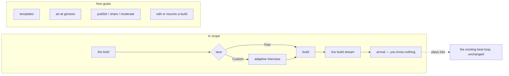
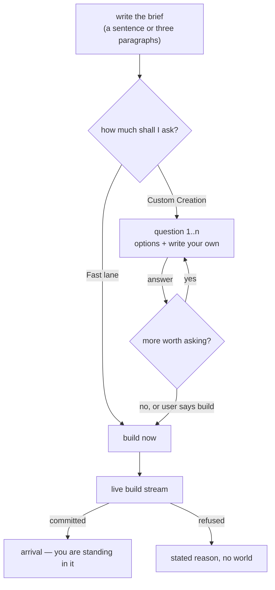

# PRD: World Creation — from a description to a world you can walk into

> **Status:** Draft (2026-08-15) | **Owner:** TBD
> **Scope decision:** **In MVP scope** — this is the `B2 — World creation` stub in `MASTER_INDEX.md:125` finally written. It closes the half the stub calls "the iceberg": the creation *flow* shipped 2026-08-08 (SPEC-028) and authors **no entities**; the seeding *pipeline* did not.
> **Depends on:** the frozen canon engine (`30_architecture/canon_engine/`, invariants I-1…I-10), the Rules Register (**the law** — B-1, B-2, B-4, B-5, B-7, GA-2, GA-3, D-1, D-11, E-1), `10_prds/compendium/00_time_and_mutability_rules.md`, `01_epistemic_type_canonical_enum.md`, and the one worked example of authored content surviving the gate: `fn_instantiate_drowned_lantern` (`core/db/migrations/20260813142100_world_templates.sql`).
> **Note:** the engine set is read-only input here. Where this PRD and the frozen contract disagree, the engine wins and the gap becomes a SPEC entry — never a workaround.

## 1. Problem Statement

**The problem:** there is exactly one populated world in this product, and a human hand-wrote it in plpgsql. `POST /worlds` gives you a real, listed, **unplayable** world — a directory row plus operating defaults, zero entities, `playable:false`, and a 404 on every world-scoped endpoint because `ResolveViewer` finds no `player_entity_id` (`core/api/worldshandler.go:93-107`, `core/api/viewer.go:46-48`). The only path to a playable world is `POST /worlds/{id}/refresh`, which re-instantiates that one hand-authored template and answers **501 `unknown template`** to anything else (`core/api/worldrefresh.go:65-67`). A user with a world in their head has no way in.

**Impact hypothesis:** the world is the product. A platform that can host exactly one authored fiction is a demo of an engine, not a product — and the engine is already the expensive part. Every mechanism a generated world needs already exists and is already validated: perception fan-out, the naming wall, portals, tension budgets, journeys, the append-only gate. What is missing is the act of **authoring**, and the honest scope of this work is a translator: a user's prose in, a canon-valid world out.

**Why now:** the hand-authored world has been played (`The Drowned Lantern`, tick 65 at the time of writing, four participants, a real transcript). The Validation Ladder question the B2 stub poses — "prove a hand-made world plays well before building the world-factory" — has been answered yes. That was the gate.

## 2. Goals & Success Signals

**Goal:** a user types what they want — a sentence or three paragraphs — chooses how much they want to be asked, and ends up standing in a world that follows their description, in which they know nothing yet.

| Signal | Target | Measurement |
|---|---|---|
| A stranger's brief becomes a playable world | 10 consecutive briefs from someone who has never read this repo | each yields `playable:true` and survives **5 beats** with zero 404s and zero naming-wall violations |
| Engine invariants hold on authored worlds | **0 failures** | I-1…I-10 (`canon_engine/07`) run in CI against a *generated* world, not only the fixture |
| The player genuinely knows nothing on arrival | **exactly 1** perception held by the player at tick of arrival | assert on a generated world: one `direct` row, two `perception_subject` links (self + room) |
| Names are unearned by default | **0** canonical names reachable | `fn_unearned_names(world, player)` is non-empty for every other actor; no compendium page for them resolves |
| Fast lane wall time | p50 ≤ 90 s, p95 ≤ 180 s | the `world genesis timing:` log line (§7) |
| Fast lane cost | p50 ≤ $0.25 per world, hard ceiling configurable | `cost_usd` rolled up per build via a genesis-scoped cost sink |
| Nothing half-built is ever listed | **0** worlds in the directory with entities but no player | one transaction per build; `fn_world_directory` never sees an incomplete world |

## 3. Scope / Non-Goals

**In scope (MVP):** one free-text brief; two lanes (Fast and Custom) chosen after the brief is written; an adaptive interview for the Custom lane; one LLM-authored world document per build; deterministic engine-side commit of that document into canon; a live build stream the user watches; an arrival scenario with no prior interactions; the frontend journey that carries all of it.

**Non-goals — these already have answers, do not re-litigate:**
- **World templates.** Deliberately unbuilt (`MASTER_INDEX.md:125`, GA-2/GA-3): a starter scene is authored fiction, and the service must never learn what a world is "usually" like. This feature authors *from the brief*, never from a library of shapes. The single `drowned_lantern` function stays exactly as it is — a pinned fixture, not a pattern to generalize.
- **Image generation during creation.** A null backdrop, portrait and cover are the *ordinary* state (`core/api/scenehandler.go:31-34`). Worse, E-1/D-3 require core-side content classification *before* any Image Platform call, and classification is 100% documentation today (verified: no `content_profile`/`world_visibility`/`age_rating` anywhere in `core/`). Generating art from an unclassified user brief would break governance on day one.
- **Publishing, sharing, visibility, moderation UI.** A created world is private — one creator, one player — which per `prd_private_public_content_governance.md:§3-4.1` is precisely the regime that needs no sanitization. Hard-prohibited classes (§7.3) remain refused. Everything else in that PRD fires when sharing does, and sharing is not in this feature.
- **Editing a world after it exists.** Canon is append-only (ADR-001/006). You play a world forward; you do not go back and revise its genesis. A world you dislike is superseded by making another — the `archived_at` precedent already set by refresh (`core/api/worldrefresh.go:80-81`).
- **Resuming an abandoned build.** The build is watched (decision 2026-08-15). Close the tab and the build is lost with its spend, exactly as a beat is. A jobs table, a `building` directory state and polling are all real work for a case the user can simply repeat.
- **Relationship UI** (B-3/B-4), **multi-player**, **world deletion**, and **retro-fitting existing worlds** — out, all of them.

## 4. Acceptance Criteria

1. **One brief, two lanes, chosen after writing.** The user writes the description first and *then* picks Fast lane or Custom Creation — the lane choice is never a fork the user must understand before they have said anything. Both lanes consume the identical brief and produce the identical kind of artifact; Custom only adds answers.
2. **A world is playable or it does not exist.** One transaction per build: the `world` row, `seed_world_defaults`, every entity, every event, every perception and the `player_entity_id` stamp commit together or roll back together. A failed build leaves **no** directory row — never a listed world that 404s. This is the discipline `worldrefresh.go:40-88` already keeps across three writes; it extends, it does not change.
3. **Every created world satisfies the playable floor, mechanically checked.** Not "playable" in the thin `player_entity_id IS NOT NULL` sense (`schema.sql:3050`) but the real floor the hand-authored template establishes: the player actor has an `actor_state` row with `attrs.location_id`; that location has `attrs.description` and `attrs.tension` in the closed set; at least two locations exist joined by a portal artifact carrying `{open, locked, connects:[a,b]}`; every actor and artifact worth naming has `attrs.descriptor`; coordinates and a parent area exist so distance and travel time are derivable. A build that cannot produce all of it fails loudly (AC-10), it does not ship a world where `scene/current` 500s with `viewer has no resolvable place`.
4. **You arrive knowing nothing, and that costs nothing to author (B-1, B-2, I-3).** The player's entire epistemic state at genesis is one accepted `ActorMoved` and one `direct` perception — `"I stepped into <place>."`, `acquired_tick = valid_tick = arrival tick`, subject-linked to self and room. **No authored roster of who is present**: that would fake fan-out the player never received (the template says so in as many words at `20260813142100_world_templates.sql:400-401`). Everyone else in the room is situationally visible through the co-location candidate query; the player holds no perception *about* them, so their compendium pages 404 and their names render as descriptors. Absence is the answer, not a gap.
5. **Every authored perception cites an accepted event, and no one remembers the future (I-2, I-9).** `perception_record.source_event_id` is NOT NULL for a reason. Because `AttributeChanged` and `ObjectRelocated` generate **no** fan-out (`generate_perceptions`, `schema.sql:3275-3385`; the latter is SPEC-034, open), authored backstory knowledge must be written as explicit `perception_record` rows against the backstory events that justify them — exactly as the template does. `acquired_tick ≥` the source event's tick, always.
6. **The player has a premise, not a mind (B-4).** The Custom lane **may ask who you are** and the brief may say — that is authorship of a premise and it is allowed (product decision 2026-08-15, amending the frontend's law 12 the way the login gate amended law "no session identity": a mandatory *question* is not the forbidden *character selector*). What stays forbidden is unchanged and absolute: the player actor gets **no `personality_core`, no traits, no trait_provenance, no inner state, ever** — the template's "Kade gets NO core (premise, not a mind)" is the rule, not a fixture detail. There is no roster to choose from, no "view as", no perspective switcher.

**Amended 2026-08-20** (spec: `docs/superpowers/specs/2026-08-20-kickstart-arrival-choice-design.md`): a pre-play choice among authored *premises* — the kickstart's character candidates and scenarios — is not the roster this criterion forbids, by the same reasoning that amended law 12 for the login gate: what the rule protects is the D-7 mid-play perception boundary, and a premise choice at tick 0 touches no perception. What stays forbidden is unchanged: no mid-play switching, no "view as", and no traits, core or inner state for the player under any candidate.
7. **The model authors fiction; the engine authors structure.** The genesis seat emits **no uuid, no coordinate, no tick, no radius, no count, no number of any kind** — the same leash `place_author` wears (`schema/place_author.v1.schema.json`, and its prompt's "YOU NEVER EMIT A COORDINATE, A RADIUS, OR ANY NUMBER OF ANY KIND"). Ids come from `gen_random_uuid()`, footprints from `fn_extent_class_metres`/`fn_area_around`, ticks from the ladder in §4 of the Spec Body, speeds and durations from `seed_world_defaults`. A schema that cannot express geometry cannot leak it.
8. **The interview asks only what the brief left open, one question at a time.** Questions are authored per world from the brief's actual gaps — never a fixed spine, because a fixed spine *is* teaching the service what a world usually contains (GA-2/GA-3). Each question carries 3–5 concrete options **and** a free-text "write your answer" **and** a recommended default; the brief's own content is never asked back at the user. The user may stop and build after any answer.
9. **The build is watchable and every frame is honest.** Progress streams as SSE, the transport the beat loop already uses (`core/api/beatsstream.go`). Each frame names what was actually authored and committed — "the harbor quarter", "four people", "a locked cellar hatch" — in the world's own language. No invented percentage, no fake stage list, no progress bar that is really a timer (law 2: never invent a displayed value). World-authored strings render verbatim. *(Amended 2026-08-20, empirically: a slow provider left the stream silent for a full minute and the founder read it as a hang. While the one long seat call is in flight the stream now also carries liveness lines — "Still writing — N seconds in." — each stating only measured fact: the call is alive, and for how long.)*
10. **Refusal is an ordinary answer.** A brief the seat cannot turn into a coherent world, or one that trips a hard-prohibited class (`prd_private_public_content_governance.md:§7.3`), ends the stream with a stated reason and **no world**. This is the `errIntrusionRejected` posture (`core/api/worldactor.go:26`) applied to genesis: refusing is a normal outcome, not a crash, and it never leaves debris.
11. **Cost is bounded, attributed and logged.** A build installs its own cost sink — the existing one is scoped to the beat handler (`core/api/costsink.go:49`, `beatsstream.go:314`), so a genesis path that skips this reports `cost_usd=0.000000` and rolls up nowhere. One `world genesis timing:` line per build carrying calls, tokens, wall time and `cost_usd`, plus a configurable ceiling that refuses the build rather than silently spending past it.
12. **No new write path into canon (D-1).** Authored content reaches canon through `apply_event`/`apply_ruled_event` or the same in-transaction SQL discipline the template uses with `origin='fast_path'` — never a bypass, never direct mutation of a projection. `sm_project` only fires under `status='accepted'`; the unique `(world_id, in_world_tick, beat_seq)` ordering key holds.
13. **Testable with zero model spend.** `DREAMCHAT_BRIDGE=fake` binds a deterministic fake for every new seat, exactly as the other seven have (`main.go:167-176`), and the fake's output is captured as the CI-validated contract the way `place_author_1.json` and `world_actor_1.json` already are (`schema_payloads_test.go`). The full journey — brief, interview, build, arrival — runs green with no API key.
14. **The frontend law amendment is explicit, and its own reason has already expired.** `src/laws/laws.test.ts:157-165` fails the build on the copy `Create New World|New World|Import Seed|Create a world`. Its stated rationale, verbatim at `laws.test.ts:156`, is: *"Creation exists server-side but is unauthenticated; a control would ship a hole."* **That premise is dead** — B-1 landed 2026-08-13 and every route now requires a bearer token (`core/api/auth.go:127-139`), which is exactly the reasoning the sibling law used to amend itself (`laws.test.ts:170-176`: *"B1 landed … a mandatory gate is not the thing this law forbids"*). So the amendment is not a carve-out for a feature we happen to want; it is retiring a guard whose hole is closed. What the law still forbids is restated in the same commit and unchanged: no create affordance on the **picker** (surface 1 stays read-only), no dead navigation (D-14), no "view as" or viewer switcher (D-7). Creation lives on its own surface, reachable from the dashboard, never bolted onto the picker.

## 5. Open Questions

1. **Does the brief persist on the `world` row, and may it ever be rendered?** There is no free-text column today (the 8 columns at `schema.sql:3942-3961` are all). Recommendation: persist it for provenance and debuggability, and **never** render it as world content — the world's own `tagline`, places and people are the fiction; the prompt that produced them is not (D-7, law 1). Needs a decision because it is a schema change.
2. **Do the interview's questions and answers persist?** Recommendation: no table. The client carries the brief and prior answers back on each request, which keeps the interview stateless and adds nothing to the schema. Re-open if a resumable interview is ever wanted.
3. **What are the actual ceilings on cast, places and artifacts?** The hand-authored benchmark is 5 actors / 6 locations / 9 artifacts / 11 events / 8 perceptions. Deliberately **not** fixed as a rule here: D-9 says no doc convergence without evidence, and a hard table of counts is the thin edge of a template. Set empirically from the first ten builds.
4. **Does `POST /worlds` (empty, `playable:false`) survive this feature?** It is the seam the refresh path reuses (`createWorldTx`) and its `world_created/1` contract pins `playable: const false`. Recommendation: keep it as the internal seam, stop offering it as a user-facing act.
5. **Does creation supersede the Refresh button?** Refresh mints a fresh copy of the one template. Once a user can author a world, refresh reads as "start this same world over". Recommendation: leave it, revisit once creation is real.
6. **Which SPEC entries does this file?** At minimum the genesis seat's contract and the new payload versions are gaps the frozen set is silent on. Next free id is **SPEC-035** (`open-spec-items.md`, highest is SPEC-034). Assigned by the implementing chunk, not pre-assigned (D-5).

---

# Spec Body (the model this PRD commits to)

## 1. The two lanes

One screen, one textarea, no lane choice visible until there is something to build from.

**Fast lane** is the brief alone. **Custom Creation** is the same build preceded by an interview. They are not two pipelines: the interview produces *answers*, the answers join the brief, and one identical genesis step consumes both. Anything else would mean two things to keep correct.

## 2. The division of labour

This is the load-bearing decision of the whole feature, and it is not new — it is `place_author`'s discipline scaled from one place to a world.

| The model authors | The engine authors |
|---|---|
| who is here, what they want, what they are hiding | every uuid |
| what the places are and how they feel | every coordinate, area, radius (`fn_extent_class_metres`, `fn_area_around`) |
| what objects matter and who holds them | every tick and `beat_seq` |
| what happened before you arrived | which events are `accepted`, in what order |
| who knows what, and how they came to know it | every `perception_record` row's provenance links |
| the world's name, tagline, and mood words | movement speeds, duration classes, extent classes, tension budgets (`seed_world_defaults`) |

The seat's schema is `additionalProperties: false` with no numeric field anywhere. It cannot emit geometry, ids or time even if it tries — the same reason `place_author` gets three fields and not five.

## 3. The genesis document

One structured document per build, one seat call for the world's fiction (plus the interview's calls in the Custom lane). Named parts, all prose or closed enums:

- **the world** — display name, tagline (authored fiction; the service never composes one), mood and ornament words for `world_theme/1`.
- **the place graph** — a parent region and its rooms, each with a descriptor, a `description` for the narrator's Tier-2 data, a `tension` from the closed set `frantic|tense|normal|calm|none`, an `extent_class` from `intimate|small|medium|large|vast`, and named ways between rooms which become portal artifacts carrying `{open, locked, connects}`.
- **the cast** — actors with a descriptor (how a stranger sees them, since no one has earned a name), a canonical name, traits as `traits/1` with `malleability`, and one thing each is hiding.
- **the objects** — artifacts with descriptors, where they sit or who carries them.
- **what happened before** — backstory beats: what occurred, who was involved, and *who came away knowing it and how* (`direct|shared|told|overheard|public|rumor|inference` — the canonical enum, `01_epistemic_type_canonical_enum.md`). Knowledge is authored *with* its path, never as a free-floating fact (B-2, B-7).
- **your arrival** — the premise: where you walk in and why. The player's identity when the brief or interview supplied one; a descriptor and canonical name; **no traits, no core** (B-4).

Every part is validated in Go after the schema constrains it — leash then belt, the pattern every seat already follows. A part that fails validation fails the build with a stated reason; there is no silent repair into something plausible.

## 4. The commit ladder

Time is assigned by the engine, in the shape the hand-authored world already proves works (`20260813142100`, ticks 25 → 30-37 → 40 → 50). A fresh world is at tick 0 (`fn_world_now` = `max(in_world_tick)`, 0 when empty).

1. **`world_genesis`** — the naming event. Per-viewer name perceptions hang here; this is what `fn_perceived_name` reads for knowledge that predates play. **Nobody gets a name perception for the player**: no one in the room knows who walked in.
2. **backstory** — one accepted event per beat of history, strictly ascending ticks, each carrying the explicit `perception_record` rows for whoever came away knowing, and `trait_provenance` for every trait it justifies (D-11: coupled quantities derive from a recorded generating structure).
3. **scene genesis** — one event carrying the whole opening state as `state_mutation` rows under ascending `beat_seq`: where everyone stands, each room's `tension` and `description`, portal state, what is carried, coordinates, the parent area.
4. **arrival** — the player's `ActorMoved`, the highest tick in the world. The live beat handler mints the next tick after it.

`acquired_tick = valid_tick =` the source event's tick on every authored perception, which satisfies I-9 by construction.

## 5. The interview

The grilling pattern, turned into a product surface: relentless about what matters, silent about what it can already work out.

- **Facts are looked up, not asked.** If the brief says it, the interview does not ask it. The seat receives the brief and the answers so far and is asked what is genuinely still undetermined *about this world* — not what a world usually needs.
- **One question at a time.** Multiple questions at once is bewildering; the answer to one changes what is worth asking next.
- **Every question carries a recommendation.** Options are concrete and drawn from this brief, plus "write your answer", plus a marked default so the user can move fast without thinking.
- **The user is never trapped.** "Build it now" is available after every answer.
- **Stateless.** The client sends `{brief, answers[]}` and gets the next question or "nothing worth asking". No session, no table, no resumption.
- **Genre-agnostic (GA-1/GA-3).** The structure of the interview is identical for a noir thriller, a workplace drama and a horror story; only the content differs. No question exists because a genre usually has one.

## 6. The build stream

SSE, `Content-Type: text/event-stream`, the transport the beat loop already uses — a build is a long authored act with intermediate results, which is exactly what that transport is for.

Frames name what was committed, in the world's language, as it lands: the world's name, then the region, then the rooms, then the people, then what happened before, then the way in. The terminal frame carries the world id and the fact that it is playable; the failure frame carries a stated reason. There is no percentage, no ETA and no stage checklist rendered from nothing — if a frame is on screen, something real is behind it. During the authoring call itself the only real thing is that the call is still running, so that is exactly what the stream says, with the measured elapsed time and nothing else.

## 7. Refusal, failure, cost

- **Refusal** ends the stream with a reason and no world: an incoherent brief, or a hard-prohibited class.
- **Failure** — a seat error, a validation failure, a gate rejection — rolls the transaction back whole. No half-world is ever listed.
- **Cost** — one genesis-scoped cost sink, one `world genesis timing:` line (calls, tokens, cached, `cost_usd`, wall ms), and a configurable ceiling that refuses rather than overspends. The per-beat `COST WARNING` precedent (`beatsstream.go:333`) is the shape.

## 8. What this must never learn

GA-2 and GA-3 are the sharpest constraints in this document, and the `MASTER_INDEX` stub says why templates were left unbuilt: **the service must not learn what a world is "usually" like.** In practice, for this feature:

- No genre taxonomy anywhere in code, prompt or schema — no `fantasy|scifi|noir` field, no genre-conditional branch.
- No fixed cast/place/object counts as a rule. The *floor* is mechanical (a place to stand, a way out, someone to meet); the *shape* comes from the brief.
- No library of starter scenes, no "world types", no example worlds in the prompt that would become the shape of every world.
- System vocabulary stays genre-agnostic: the interview asks about *pressure* and *people*, never about quests, factions, mana or relics (those are world content, never core vocabulary).

## 9. Final Product Rule

**A created world must be indistinguishable, to the engine, from the world a human hand-wrote.** Same tables, same gate, same invariants, same naming wall, same tick discipline — and, to the player, the same experience of walking into a place that was already there and already busy, knowing nothing about it. If a generated world needs any special case anywhere in the engine to be playable, the generation is wrong, not the engine.
