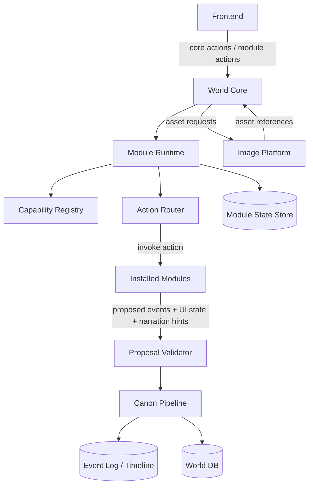
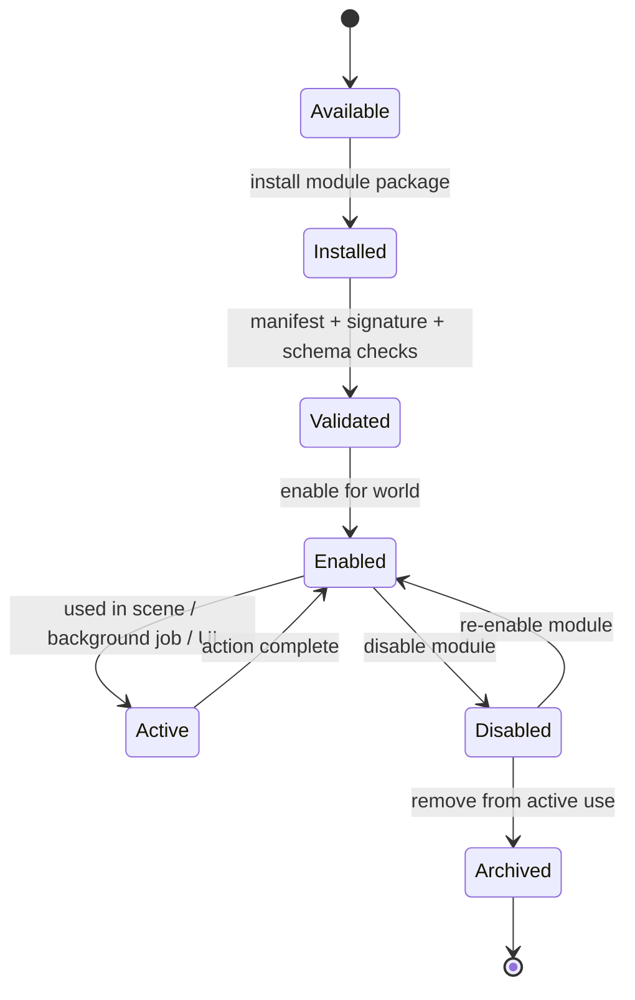
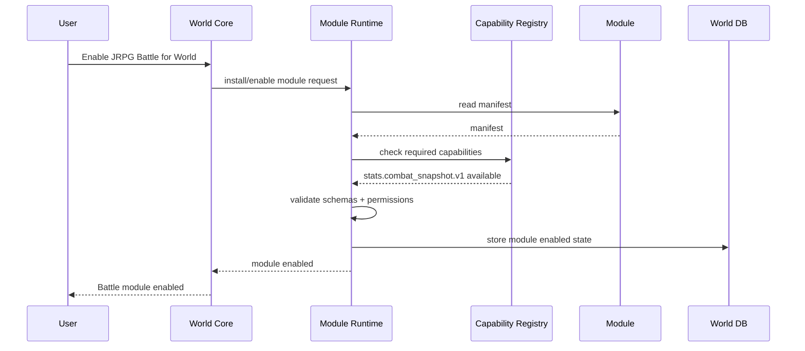
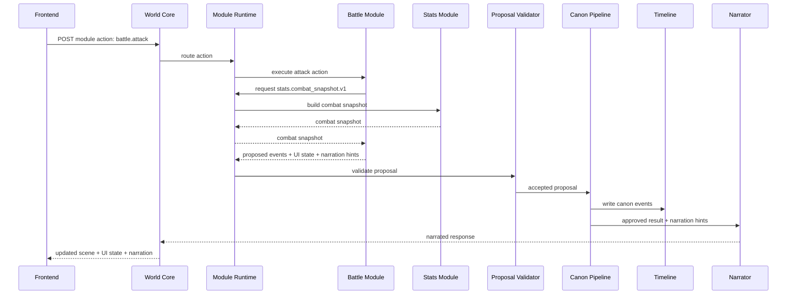
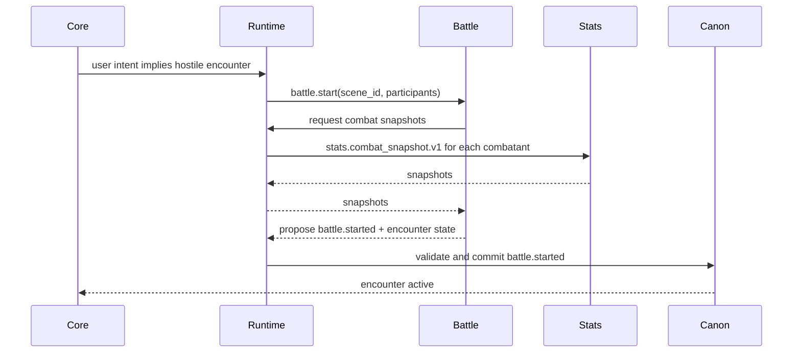
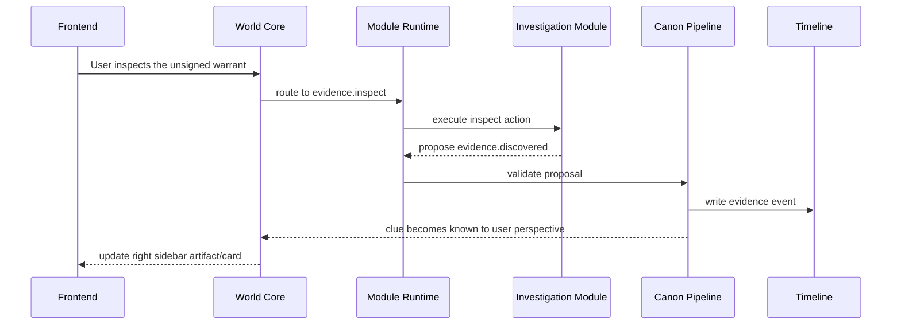

# DreamChat Plug-and-Play Runtime Module Architecture

## 1. Purpose

This document defines the recommended architecture for supporting **plug-and-play gameplay/world modules** inside DreamChat.

The goal is not only clean backend architecture. The goal is to let DreamChat become a **persistent world platform**, where different worlds can enable different systems without hardcoding one fixed game type into the core product.

DreamChat should support worlds such as:

- pure narrative worlds
- JRPG-style battle worlds
- investigation/case-file worlds
- political simulation worlds
- romance/social-drama worlds
- economy/trade worlds
- survival/crafting worlds
- horror/sanity worlds
- faction-war worlds

The core product promise remains stable:

> A persistent AI RPG world where dynamic entities remember, relationships evolve, time matters inside the story, and the world maintains continuity.

Modules should expand what a world can do without weakening that promise.

---

## 2. The Challenge

DreamChat is not a normal chatbot and should not become one fixed RPG rules engine.

The difficult architectural challenge is this:

> How can external or optional modules add meaningful mechanics while the core world still protects continuity, canon, memory, knowledge boundaries, correction rules, and timeline history?

A module like `JRPG Battle` is a perfect stress test.

It is not only UI.

A battle module may need to:

- read entity stats
- read scene participants
- start an encounter
- resolve turns
- apply damage
- consume items
- create injuries or deaths
- affect relationships
- affect reputation
- write timeline events
- influence narration
- expose a battle UI panel
- depend on a stats module
- optionally interact with inventory, status effects, morale, or relationship modules

If the core backend needs to know what `attack`, `hp`, `mana`, `defense`, `initiative`, or `limit break` mean, then the system is not truly plug-and-play.

If the battle module can directly mutate canon, then the world can break.

So the architecture must avoid both extremes:

| Bad Extreme | Why it fails |
|---|---|
| Core knows every module mechanic | Not marketplace-friendly; hardcoded; cannot support unknown future modules. |
| Modules directly mutate world truth | Breaks canon, memory, correction, auditability, and knowledge boundaries. |

The right model is:

> The Core knows the module protocol.  
> Modules know their own mechanics.  
> Modules propose world changes.  
> The Core validates and commits canon.

---

## 3. Architecture Goal

The architecture should allow modules to be:

- installed
- enabled per world
- disabled safely
- versioned
- dependency-checked
- permissioned
- dynamically discovered
- connected to other modules through contracts
- given private state
- allowed to expose UI surfaces
- allowed to propose world changes
- blocked from bypassing canon

The architecture should also allow a future module marketplace.

That means the Core cannot be written as if it knows every possible future module.

Instead, modules must be self-describing.

---

## 4. Recommended Architecture

The recommended architecture is:

> **Authoritative World Core + Module Runtime + Capability Contracts + Proposal / Validation / Commit Pipeline**

High-level shape:

```text
Frontend
  renders core UI
  renders module-provided UI surfaces
  sends user actions to the backend

World Backend
  Authoritative World Core
  Module Runtime
  Canon/Event Pipeline
  Memory/Knowledge/Correction Systems

Image Platform
  separate service
  generates images and assets
  does not own world truth
```

The image platform remains an external capability. It should not own canon or world state.

---

## 5. Core Concepts

### 5.1 Authoritative World Core

The World Core owns the concepts that must remain stable across all worlds and modules.

The Core owns:

- world identity
- user-controlled entity
- entities/NPCs
- scenes
- locations
- timeline
- canonical events
- knowledge boundaries
- memory boundaries
- correction window
- present-forward correction rules
- backstage review triggers
- module installation state
- module permission checks
- event validation
- audit log

The Core should not own:

- HP
- mana
- attack power
- sanity
- political capital
- clue confidence
- crafting recipes
- romance score
- faction influence formula
- battle turn resolution

Those belong to modules.

### 5.2 Module Runtime

The Module Runtime is the system that lets the Core load and interact with modules without knowing their internal mechanics.

It handles:

- module manifest parsing
- dependency resolution
- capability registration
- module lifecycle
- module action routing
- module state storage
- permission enforcement
- schema validation
- module event proposal intake
- module UI surface registration
- enable/disable behavior
- version compatibility

The Module Runtime is the bridge between the stable Core and optional world systems.

### 5.3 Capability Contracts

A capability contract is a typed agreement between modules.

Example:

```text
stats.combat_snapshot.v1
```

A battle module may require this capability.

A stats module may provide it.

The Core does not need to know the internal fields of every stats system. It only needs to know that a module provides the declared contract and that calls/responses validate against the declared schema.

### 5.4 Module Manifest

A module manifest is the module's public declaration.

It tells the system:

- what the module is
- what version it is
- what capabilities it provides
- what capabilities it requires
- what actions it exposes
- what events it may propose
- what UI surfaces it contributes
- what permissions it needs
- what private state schemas it owns

### 5.5 Proposal / Validation / Commit Pipeline

Modules do not directly write canon.

Modules return proposed changes.

The Core then decides whether those proposed changes become authoritative world events.

Flow:

```text
Module Action
  -> Module computes result
  -> Module proposes events/state changes
  -> Core validates proposal
  -> Core commits accepted canon events
  -> Timeline/memory/backstage systems react
  -> Narration receives approved result
```

This protects the world from module chaos.

---

## 6. System Diagram



---

## 7. Module Lifecycle

A module can be in several states.



### 7.1 Available

The module exists in a registry, marketplace, local codebase, or trusted internal package list.

### 7.2 Installed

The module package is available to the backend.

### 7.3 Validated

The system has checked:

- manifest format
- version compatibility
- required dependencies
- declared schemas
- permissions
- signing/trust status, if marketplace modules are supported

### 7.4 Enabled

The module is enabled for a specific world.

Not every world should have every module enabled.

### 7.5 Active

The module is currently participating in a scene, job, backstage review, or UI flow.

### 7.6 Disabled

The module no longer runs or exposes active actions, but historical data remains readable.

This is critical.

Disabling a module should not destroy history.

### 7.7 Archived

The module is no longer used by the world, but timeline events and read-only historical records remain.

---

## 8. Connect / Disconnect Flow

### 8.1 Connecting a Module



### 8.2 Disconnecting a Module

```mermaid
sequenceDiagram
  participant User
  participant Core as World Core
  participant Runtime as Module Runtime
  participant Registry as Capability Registry
  participant DB as World DB
  participant Timeline

  User->>Core: Disable JRPG Battle
  Core->>Runtime: disable module request
  Runtime->>Registry: check dependent modules
  Registry-->>Runtime: no blockers / or list blockers
  Runtime->>DB: mark module disabled
  Runtime->>Timeline: keep battle events readable
  Runtime-->>Core: module disabled safely
  Core-->>User: Battle disabled; history preserved
```

Important rule:

> Disable does not mean delete.

A world that had 200 battles should still be able to show those events in history after the battle module is disabled.

---

## 9. Module Communication Model

Modules should not call each other directly by implementation details.

Bad:

```ts
battleModule.statsService.getStrength(entityId)
```

Better:

```ts
moduleRuntime.callCapability("stats.combat_snapshot.v1", {
  entity_id,
  scene_id,
  world_id
})
```

The battle module does not need to know whether stats come from:

- a simple stats module
- a JRPG stats module
- a D&D-like stats module
- a grimdark wound module
- a horror sanity module

It only needs a compatible capability response.

---

## 10. Module Action Flow

Example: user clicks `Attack`.



---

## 11. Canon Protection Rules

Modules can propose:

- event types
- state updates
- UI state
- narration hints
- module-private state changes
- relationship change requests
- status updates
- knowledge updates

Modules cannot directly mutate:

- canonical entity identity
- timeline
- knowledge ownership
- public/private truth status
- correction history
- core memory boundaries
- cross-module authoritative state

The Core validates and commits.

This matters because DreamChat must preserve:

- long-gap entity recovery
- long-running entity recall
- memory evolution recall
- private/public knowledge boundaries
- bounded backstage propagation
- correction window behavior
- present-forward correction rules

---

## 12. Module State Model

Modules need state, but module state should be namespaced.

Example:

```text
module_state
  world_id
  module_id
  entity_id / scene_id / encounter_id / null
  state_key
  state_payload_json
  version
  created_at
  updated_at
```

A battle module can store encounter state.

A stats module can store stat sheets.

An investigation module can store case files.

The Core does not need to understand every field. But it does need to control:

- ownership
- permissions
- versioning
- auditability
- backup/export
- safe disable behavior

---

## 13. Frontend Module Surfaces

Modules may expose UI surfaces, but the frontend should render them through controlled slots.

Possible slots:

```text
scene.topOverlay
scene.rightAuxCard
scene.bottomPanelAddon
scene.actionBar
entity.sheetTab
timeline.eventRenderer
knownWorld.cardRenderer
correction.editor
creator.moduleSettings
```

Example:

```yaml
ui_surfaces:
  - slot: scene.bottomPanelAddon
    component: battle_controls
  - slot: entity.sheetTab
    component: stats_sheet
  - slot: timeline.eventRenderer
    component: battle_event_summary
```

The frontend should not decide mechanics.

It should:

- render module-provided UI schema/components
- send module actions to the backend
- display returned state
- respect world/core permissions

---

## 14. Example Module 1: Basic Stats Module

### 14.1 Purpose

The Basic Stats module gives entities simple numerical attributes that other modules can use.

It does not create gameplay by itself.

It provides reusable character/entity state.

### 14.2 Manifest Example

```yaml
module_id: stats.basic
version: 1.0.0
display_name: Basic Stats
category: world_system

provides:
  - capability: stats.combat_snapshot.v1
  - capability: entity.stats_sheet.v1

requires: []

permissions:
  read:
    - entity.identity
    - entity.status
  propose_events:
    - entity.stats.initialized
    - entity.stats.changed
  module_state:
    - stats.basic.*

actions:
  - id: stats.initialize_entity
    input_schema: schemas/initialize_entity.input.json
    output_schema: schemas/proposal.output.json

  - id: stats.modify
    input_schema: schemas/modify_stats.input.json
    output_schema: schemas/proposal.output.json

ui_surfaces:
  - slot: entity.sheetTab
    component: basic_stats_sheet
```

### 14.3 Internal State Example

```json
{
  "entity_id": "npc_kael",
  "stats": {
    "hp": {"current": 34, "max": 40},
    "power": 12,
    "defense": 8,
    "speed": 10,
    "focus": 6
  }
}
```

### 14.4 Capability Response Example

When another module asks for `stats.combat_snapshot.v1`, Basic Stats can respond:

```json
{
  "entity_id": "npc_kael",
  "combat_snapshot": {
    "offense": 12,
    "defense": 8,
    "speed": 10,
    "resources": [
      {"id": "hp", "current": 34, "max": 40}
    ],
    "traits": []
  }
}
```

The requesting module does not need to know the original stat sheet format.

---

## 15. Example Module 2: JRPG Battle Module

### 15.1 Purpose

The JRPG Battle module adds turn-based combat to worlds that want it.

It should be optional.

A political drama world may not use it.

A fantasy adventure world may use it heavily.

A horror world may replace it with a panic/survival module.

### 15.2 Manifest Example

```yaml
module_id: battle.jrpg
version: 1.0.0
display_name: Turn-Based JRPG Battle
category: gameplay_system

requires:
  - capability: stats.combat_snapshot.v1

provides:
  - capability: encounter.turn_based.v1

permissions:
  read:
    - world.current_time
    - scene.participants
    - entity.identity
    - entity.status
    - module_state.stats.basic.*
  propose_events:
    - battle.started
    - battle.turn_resolved
    - battle.ended
    - entity.status_changed
    - entity.injured
    - entity.defeated
  module_state:
    - battle.jrpg.*

actions:
  - id: battle.start
    input_schema: schemas/battle_start.input.json
    output_schema: schemas/proposal.output.json

  - id: battle.attack
    input_schema: schemas/battle_attack.input.json
    output_schema: schemas/proposal.output.json

  - id: battle.defend
    input_schema: schemas/battle_defend.input.json
    output_schema: schemas/proposal.output.json

  - id: battle.flee
    input_schema: schemas/battle_flee.input.json
    output_schema: schemas/proposal.output.json

ui_surfaces:
  - slot: scene.bottomPanelAddon
    component: jrpg_battle_controls
  - slot: scene.rightAuxCard
    component: active_encounter_status
  - slot: timeline.eventRenderer
    component: battle_event_summary
```

### 15.3 Battle Start Flow



### 15.4 Attack Proposal Example

```json
{
  "module_id": "battle.jrpg",
  "action_id": "battle.attack",
  "proposal": {
    "events": [
      {
        "type": "battle.turn_resolved",
        "actor_entity_id": "npc_kael",
        "target_entity_id": "npc_bandit_02",
        "payload": {
          "action": "attack",
          "result": "hit",
          "damage": 12
        }
      },
      {
        "type": "entity.status_changed",
        "target_entity_id": "npc_bandit_02",
        "payload": {
          "status": "defeated"
        }
      }
    ],
    "module_state_updates": [
      {
        "key": "battle.jrpg.encounter.enc_123",
        "operation": "patch",
        "payload": {
          "active_turn": "player",
          "combatants": [
            {"entity_id": "npc_kael", "state": "active"},
            {"entity_id": "npc_bandit_02", "state": "defeated"}
          ]
        }
      }
    ],
    "narration_hints": {
      "tone": "tense",
      "summary": "Kael lands a clean strike and drops the second bandit."
    },
    "ui_state": {
      "battle_panel": {
        "active_turn": "player",
        "available_actions": ["attack", "defend", "flee"]
      }
    }
  }
}
```

### 15.5 Core Validation

The Core checks:

- battle module is enabled
- required stats capability exists
- action input matches schema
- proposed events are allowed for this module
- referenced entities exist
- target is present or reachable in the encounter
- proposed status change is legal
- event visibility is correct
- knowledge boundaries are preserved
- correction window rules are respected
- timeline write is allowed

Only then does the Core commit the event.

---

## 16. Example Module 3: Investigation / Evidence Module

This second example shows that modules are not only combat modules.

### 16.1 Purpose

The Investigation module adds case files, clues, evidence quality, suspect links, and deduction support.

It can be used in:

- detective fiction
- political intrigue
- cyberpunk investigation
- courtroom drama
- horror mystery
- spy thrillers

### 16.2 Manifest Example

```yaml
module_id: investigation.evidence
version: 1.0.0
display_name: Investigation Evidence System
category: gameplay_system

requires: []

provides:
  - capability: evidence.case_file.v1
  - capability: evidence.clue_graph.v1

permissions:
  read:
    - scene.current
    - entity.identity
    - location.identity
    - known_world.visible_facts
  propose_events:
    - evidence.discovered
    - evidence.updated
    - case.opened
    - case.theory_created
    - entity.knowledge_updated
  module_state:
    - investigation.evidence.*

actions:
  - id: case.open
    input_schema: schemas/case_open.input.json
    output_schema: schemas/proposal.output.json

  - id: evidence.inspect
    input_schema: schemas/evidence_inspect.input.json
    output_schema: schemas/proposal.output.json

  - id: case.create_theory
    input_schema: schemas/case_theory.input.json
    output_schema: schemas/proposal.output.json

ui_surfaces:
  - slot: scene.rightAuxCard
    component: active_case_card
  - slot: knownWorld.cardRenderer
    component: clue_graph
  - slot: timeline.eventRenderer
    component: evidence_event_summary
```

### 16.3 Evidence Discovery Flow



### 16.4 Proposed Event Example

```json
{
  "module_id": "investigation.evidence",
  "action_id": "evidence.inspect",
  "proposal": {
    "events": [
      {
        "type": "evidence.discovered",
        "actor_entity_id": "player_entity",
        "target_object_id": "artifact_unsigned_warrant",
        "payload": {
          "clue_id": "clue_department_seal",
          "description": "The warrant carries a department seal but no visible authorizing signature.",
          "confidence": "observed",
          "visibility": "known_to_player_perspective"
        }
      }
    ],
    "narration_hints": {
      "tone": "procedural_tension",
      "summary": "The seal is real, but the missing signature makes the warrant procedurally suspicious."
    },
    "ui_state": {
      "active_case_card": {
        "title": "Unsigned Department Warrant",
        "status": "Unverified",
        "new_clues": ["department_seal", "missing_signature"]
      }
    }
  }
}
```

This module touches knowledge boundaries heavily.

The Core must decide whether the clue is:

- directly observed
- private to the user
- shared with present NPCs
- public knowledge
- rumor
- uncertain
- hidden from some entities

The module can suggest visibility, but the Core commits it.

---

## 17. Benefits

### 17.1 Product Flexibility

The same DreamChat platform can support multiple genres and play styles.

The world can be:

- fantasy adventure
- modern investigation
- political thriller
- survival horror
- romance/social sim
- faction simulator
- economic sandbox

without rebuilding the core.

### 17.2 Marketplace Path

Because modules are self-describing and contract-based, a future marketplace becomes possible.

Creators could publish:

- battle systems
- stat systems
- faction systems
- relationship systems
- investigation systems
- crafting systems
- world templates
- genre packs

### 17.3 Core Continuity Protection

Modules expand behavior, but the Core still protects:

- canon
- timeline
- correction rules
- memory boundaries
- public/private knowledge
- audit trail
- event validity

### 17.4 Scales by Relevance

Not every module needs to run all the time.

Modules can activate based on:

- current scene
- user intent
- enabled world systems
- active participants
- triggered actions
- backstage review queue
- time progression

This supports scale because the system does not need to simulate everything equally all the time.

### 17.5 Safer Experimentation

A new module can be tested in one world without affecting other worlds.

A module can be disabled without deleting historical events.

A module can be upgraded through versioned contracts.

### 17.6 Better Observability

Because modules propose events and the Core commits them, every important state change can be traced.

This helps with:

- debugging
- replay
- memory correction
- support
- moderation
- creator tools
- automated evaluation

---

## 18. Cons and Risks

### 18.1 More Architecture Upfront

This is more complex than hardcoding the first mechanics directly into the backend.

The PoC should not overbuild the marketplace.

Recommendation:

> Build the module runtime minimally now, but keep marketplace-grade boundaries in mind.

### 18.2 Contract Design Is Hard

Bad capability contracts can create lock-in.

Example:

```text
stats.strength.v1
```

is probably too narrow.

Better:

```text
stats.combat_snapshot.v1
```

because it lets different stats modules provide a combat-ready abstraction.

### 18.3 Modules Can Create Canon Pressure

A powerful module can propose many changes.

The Core must avoid uncontrolled cascades.

This is especially important for:

- battle deaths
- faction wars
- economy shocks
- political coups
- relationship breakups
- criminal investigations

### 18.4 UI Fragmentation

If every module contributes UI freely, the interface may become a dashboard mess.

The frontend should expose strict slots and keep the play-first UX intact.

### 18.5 Security / Trust Later

If marketplace modules are supported later, the platform will need:

- signing
- sandboxing
- permission prompts
- review workflows
- version pinning
- capability restrictions
- tenant isolation

Do not treat third-party modules as trusted backend code.

---

## 19. Scaling Model

### 19.1 PoC Stage

Use internal first-party modules inside the backend repo.

Suggested first modules:

```text
narrative.core
relationship.core
known_world.core
backstage.core
stats.basic
battle.jrpg_demo
investigation.evidence_demo
```

Do not build marketplace infrastructure yet.

But enforce:

- manifests
- declared actions
- declared event proposals
- module state namespace
- proposal/validation/commit boundary

### 19.2 Alpha Stage

Add:

- versioned capabilities
- dependency resolver
- module settings UI
- per-world module enable/disable
- module UI slots
- module event renderers
- test harness for module actions

### 19.3 Beta / Marketplace-Ready Stage

Add:

- sandboxed runtime
- signed modules
- module registry
- creator publishing flow
- compatibility checks
- migration hooks
- per-module analytics
- review/moderation
- rollback

### 19.4 Scale Rule

The Core should scale around canon and event log.

Modules should scale around relevance.

Not every module should run for every action.

A module should run when:

- a user action targets it
- the scene has active module state
- another module requests its capability
- a backstage trigger touches its domain
- a scheduled job belongs to it

---

## 20. Minimal Implementation Recommendation

For the next implementation document, define these first:

1. `module_manifest` schema
2. `module_installation` table
3. `module_state` table
4. `capability_registry`
5. `module_action_router`
6. `proposal_validator`
7. `canon_commit_pipeline`
8. `module_ui_surface_registry`
9. first internal module: `stats.basic`
10. second internal module: `battle.jrpg_demo`

The first technical success test should be:

> Can we enable `stats.basic`, then enable `battle.jrpg_demo`, run a battle action, commit accepted canon events, render battle UI state, and later disable the battle module while preserving timeline history?

If yes, the architecture is real.

---

## 21. Final Recommendation

DreamChat should treat modules as **installable world systems**.

The right mental model is:

> DreamChat Core is the World OS.  
> Modules are installable world systems.  
> The event log is the historical filesystem.  
> The canon pipeline is the kernel permission layer.  
> The frontend is the shell.  
> The image platform is an external media service.

This architecture is a good fit because it protects the core product promise while allowing the product to grow beyond one fixed genre or rules system.

The Core remains stable.

Modules evolve.

Worlds choose what they need.

Canon stays protected.

That is the right balance for DreamChat.
