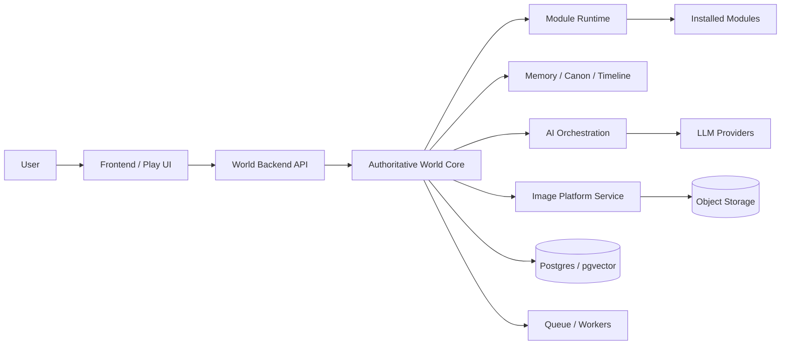
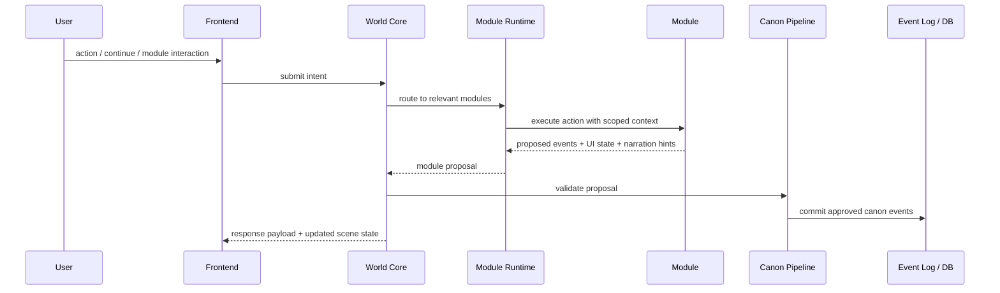

# 03 Platform Architecture

> Status: Draft for review  
> Scope: Full platform shape for DreamChat persistent AI RPG worlds  
> Principle: The world is the product; chat, media, and modules are interfaces into the world.

## 1. Challenge

DreamChat is not a chatbot with decorative RPG features. It is a persistent world platform. The architectural challenge is to preserve durable world continuity while allowing optional gameplay/world systems to be added later.

The product must avoid two failure modes.

First, continuity collapse. If truth only lives in chat history or generated prose, NPCs will eventually forget, know impossible things, contradict relationships, or treat private information as public.

Second, feature lock-in. If the backend hardcodes one battle system, one stats model, or one genre-specific ruleset, DreamChat becomes one game instead of a world platform.

## 2. Goal

Build DreamChat as a **World Operating System**:

- a stable Authoritative World Core
- a Module Runtime for optional systems
- an AI Orchestration layer for interpretation and narration
- a Memory / Canon / Timeline layer for continuity
- a Frontend that is play-first but workspace-capable
- an Image Platform that remains an external media service

## 3. High-Level Architecture



## 4. Repository Shape

```text
dreamchat-frontend
  Next.js / React / TypeScript
  Play UI, workspace UI, module UI surfaces, streaming rendering

dreamchat-world-backend
  Authoritative World Core
  Module Runtime
  AI orchestration
  Memory/canon/timeline
  Backstage/correction

dreamchat-image-platform
  Existing standalone image generation platform
  Image jobs, prompts, storage, asset metadata, provider adapters
```

## 5. Backend Layers

```text
world-backend/
  core/
    world/
    entity/
    scene/
    canon/
    timeline/
    knowledge/
    correction/
    backstage/
    module-runtime/
  ai-orchestration/
  memory/
  workers/
  adapters/
  modules/
```

## 6. Core Rule

Modules and AI models do not directly mutate canon.

They produce proposals. The World Core validates, commits, rejects, or converts those proposals.



## 7. Scaling Model

The synchronous path should stay small:

- parse intent
- read current world state
- route to relevant module(s)
- validate proposal(s)
- stream narration / response

The async path should handle:

- summarization
- semantic memory updates
- reflection
- backstage review queues
- image generation
- evaluation runs
- analytics

## 8. Benefits

- Protects world continuity.
- Allows optional modules without hardcoding one rules system.
- Keeps the image platform separate.
- Creates a path toward a future module marketplace.
- Supports replay, correction, audit, and evaluation.
- Scales by bounded processing, lazy updates, workers, and module relevance.

## 9. Cons / Risks

- More complex than a chat-first prototype.
- Requires strong event/schema discipline.
- Requires clear ownership boundaries.
- Requires validation tooling early.
- Bad module contracts can fragment the ecosystem.

## 10. Recommendation

Build the PoC with the full architecture direction but a small implementation surface:

- event log
- canon pipeline
- World Core
- Module Runtime skeleton
- first-party Stats module
- first-party JRPG Battle demo module
- image service adapter
- simple AI orchestration

Do not build public marketplace or arbitrary third-party modules in the PoC.
