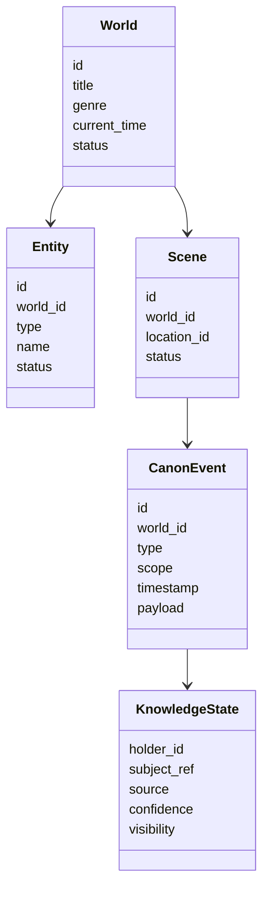
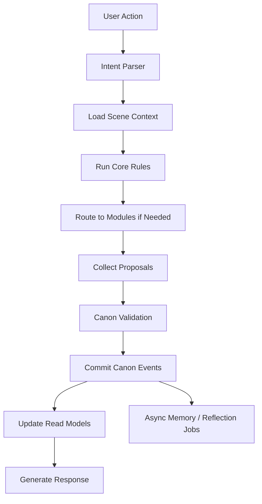
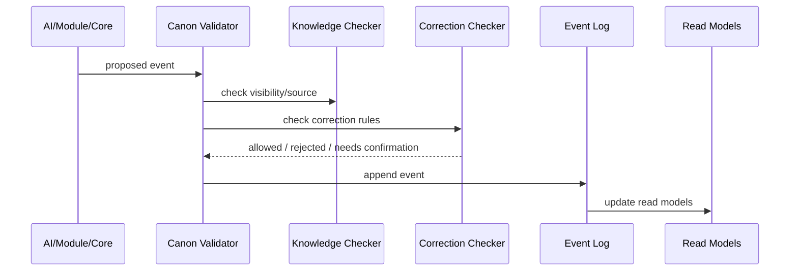

> ⚠️ **STATUS: SUPERSEDED IN PART (2026-06-10)** by the Canon Engine set (`30_architecture/canon_engine/`, v4.1 — frozen build contract). Canon, events, projections, corrections, time, validation: **the engine set wins on every overlap.**
> **What survives:** module installation state, module permission checks, and world-core/module boundary framing — the engine set does not cover the Module Runtime. Treat those parts as directional input for a future module-runtime spec.

---

# 04 World Core Architecture

> Status: Draft for review  
> Scope: Authoritative world state, invariants, canon, correction, and backstage  
> Principle: The World Core owns truth; modules and AI propose changes.

## 1. Challenge

The World Core must let a world feel alive without simulating everything all the time.

It needs to support persistence, entity identity, relationships, knowledge boundaries, in-world time, backstage review, correction, and optional modules.

It must avoid omniscient NPCs, random updates, unbounded cascades, one-message-one-canon-action noise, and module-specific truth fragmentation.

## 2. Goal

The World Core is the durable substrate of DreamChat. It is not a narrator, not a chat transcript, and not one genre-specific rules engine.

It owns universal world primitives and invariants:

```text
World
Entity
Scene
Location
Relationship
Known World
Timeline
Canon Event
Knowledge State
Correction Window
Backstage Review Queue
Module Installation State
```

It does **not** own:

```text
specific HP formulas
specific battle mechanics
specific economy formulas
specific romance scoring
specific crafting rules
image generation internals
```

## 3. Domain Model



## 4. Core Invariants

1. Canon is committed through the canon pipeline.
2. Every durable world change links to an event.
3. Entities do not automatically know unrelated events.
4. In-world time changes only when fiction says time passed.
5. Corrections are auditable.
6. Backstage updates are bounded.
7. Modules may propose changes but cannot directly commit world truth.
8. The world can be replayed or inspected from the event log.

## 5. Main Flow



## 6. Canon Event Pipeline

Canon events are durable world mutations.

Examples:

- entity learned something
- relationship changed
- item ownership changed
- participant entered or left a scene
- battle started or ended
- location state changed
- promise made
- rumor began spreading



## 7. Backstage Integration

Backstage is controlled world-state review, not global simulation.

The World Core owns:

- decay inputs
- review queues
- priority ordering
- update radius limits
- conversion of wider effects into pressure/hooks

Modules may contribute context, but the core controls scheduling and bounded propagation.

## 8. Correction Integration

Correction modes:

1. Current correction window: repair the current moment before acceptance.
2. Present-forward correction: late correction affects now and future behavior.
3. Future advanced mode: propagation-density-based rewrite or fork.

## 9. Benefits

- Centralizes continuity.
- Supports audit, replay, correction, and evaluation.
- Allows modules without losing truth ownership.
- Supports genre-agnostic worlds.

## 10. Cons / Risks

- Requires event and read-model discipline.
- Can become over-abstract if built too broadly too early.
- Needs good tooling so users do not see internal complexity.

## 11. Recommendation

For PoC, implement a small World Core:

- world
- entity
- scene
- location
- relationship
- canon event
- knowledge state
- correction window
- backstage review queue
- module installation state
