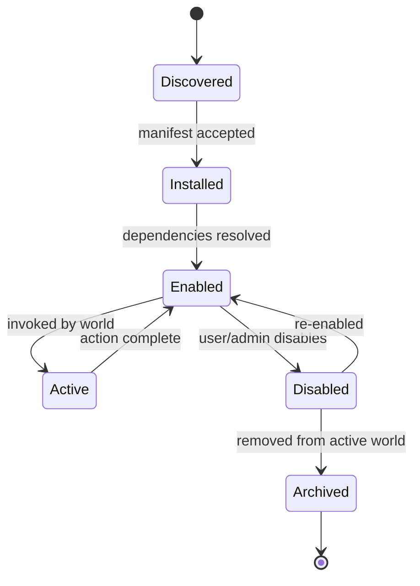
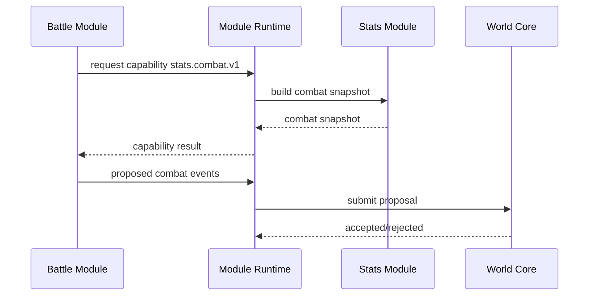
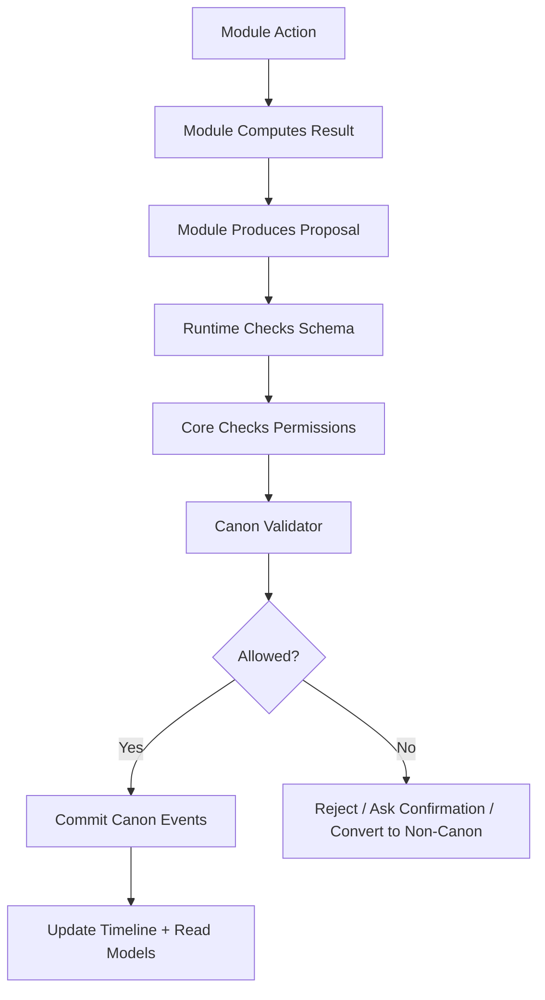
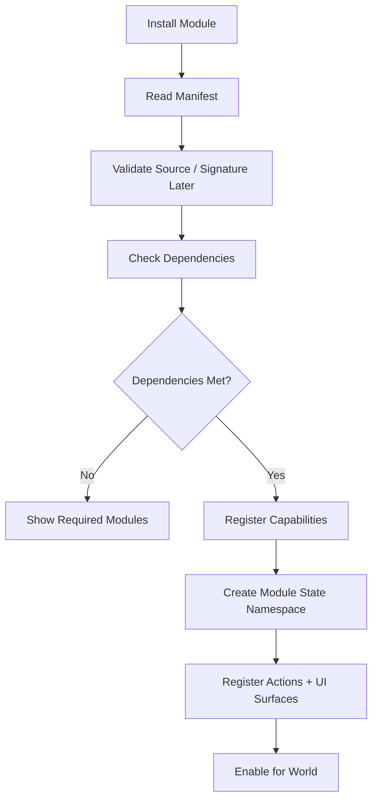
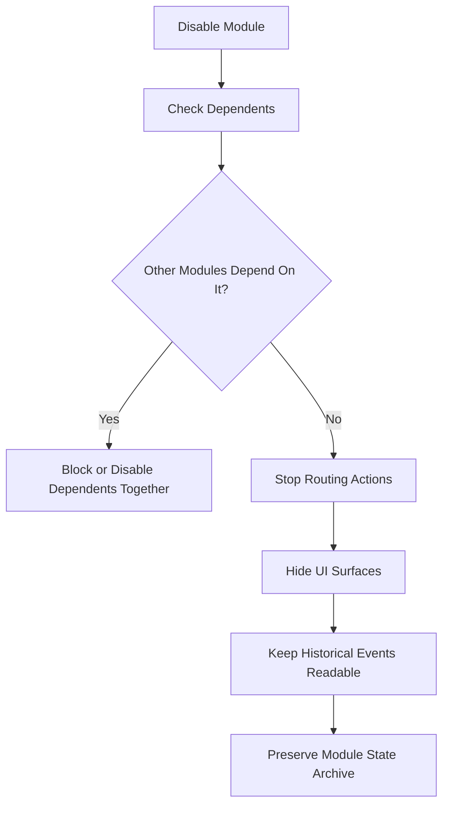
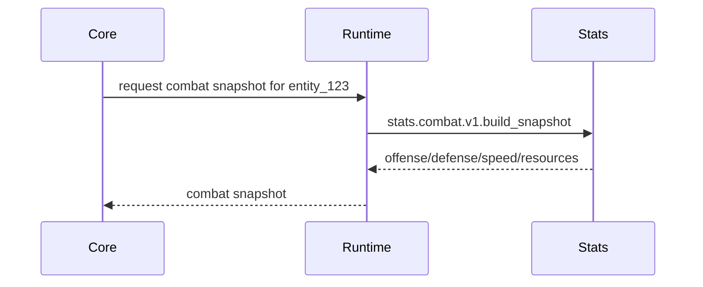
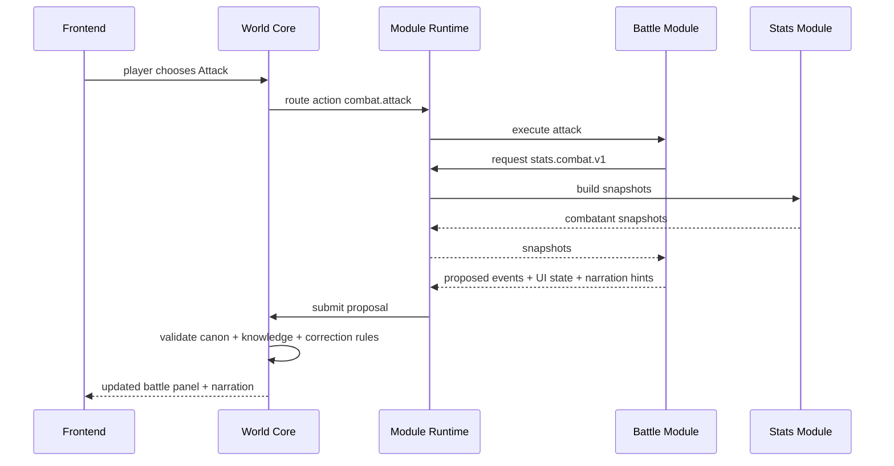

# 05 Plug-and-Play Module Architecture

> Status: Draft for review  
> Scope: Module Runtime, module lifecycle, dependency contracts, proposal pipeline  
> Principle: Modules own mechanics, but the World Core owns canon.

## 1. Challenge

DreamChat must support installable systems such as Stats, Battle, Investigation, Crafting, Economy, Factions, Horror/Sanity, and Romance/Social Dynamics.

The hard example is Battle.

Battle is not only UI. It can change entities, injuries, death/defeat, inventory, relationships, scene flow, timeline, memory, and future consequences.

If Battle writes directly into the world, the system becomes unsafe. If the Core hardcodes Battle, DreamChat becomes one fixed game.

## 2. Goal

Use a Module Runtime where modules are self-describing, dependency-aware, permissioned, and proposal-based.

Modules can be powerful, but they cannot directly mutate canon.

## 3. Conceptual Model

```text
World Core = operating system kernel
Module Runtime = plugin loader + permission manager + router
Modules = installable world systems
Canon Pipeline = protected write boundary
Frontend Slots = approved visual surfaces
```

## 4. Module Lifecycle



## 5. Module Manifest

```yaml
module_id: battle.jrpg.turn_based
version: 1.0.0
display_name: Turn-Based JRPG Battle
requires:
  - capability: stats.combat.v1
provides:
  - capability: combat.encounter.v1
actions:
  - id: combat.attack
    input_schema: schemas/combat_attack_input.json
    output_schema: schemas/combat_attack_output.json
proposes_events:
  - combat.started
  - combat.action.resolved
  - combat.ended
ui_surfaces:
  - scene.bottom_panel_addon
  - entity.sheet_tab
permissions:
  read:
    - scene.participants
    - entity.public_state
  propose:
    - canon.event.combat
    - canon.event.entity_status
```

The Core does not need to know what `attack` means internally. It only needs to understand manifests, schemas, permissions, and proposed event types.

## 6. Capability Contracts

A capability contract is a typed interface that modules provide or require.

Examples:

```text
stats.combat.v1
inventory.equipment.v1
relationship.affinity.v1
evidence.case_file.v1
faction.influence.v1
crafting.recipe_system.v1
```

The Core resolves contracts. It does not hardcode internal fields.

## 7. Communication Pattern

Modules should communicate through the runtime, not through direct imports.



## 8. Proposal / Validation / Commit



## 9. Connect Flow



## 10. Disconnect Flow



Disable is safe. Delete is dangerous. Historical events must remain readable.

## 11. Example 1: Stats Module

```yaml
module_id: stats.basic
version: 1.0.0
provides:
  - capability: stats.combat.v1
state_namespace: module.stats.basic
actions:
  - stats.assign
  - stats.modify
proposes_events:
  - stats.assigned
  - stats.modified
```

Interaction:



## 12. Example 2: JRPG Battle Module

Requires:

```yaml
requires:
  - stats.combat.v1
optional:
  - inventory.equipment.v1
  - relationship.affinity.v1
```

Flow:



Proposed output:

```json
{
  "proposed_events": [
    {
      "type": "combat.damage_dealt",
      "actor_entity_id": "entity_kael",
      "target_entity_id": "entity_bandit_02",
      "payload": {"amount": 12, "damage_type": "slash"}
    },
    {
      "type": "entity.status_changed",
      "target_entity_id": "entity_bandit_02",
      "payload": {"status": "defeated"}
    }
  ],
  "narration_hints": {
    "tone": "tense",
    "summary": "Kael lands a clean strike and the bandit drops his weapon."
  },
  "ui_state": {
    "active_turn": "player",
    "encounter_status": "ongoing"
  }
}
```

## 13. Benefits

- Future marketplace path.
- Worlds can choose mechanics.
- Core remains genre-agnostic.
- Canon is protected.
- Modules can be disabled without destroying history.
- Scales by running only relevant modules.

## 14. Cons / Risks

- Requires manifest/schema/version discipline.
- Cross-module compatibility can become complex.
- Third-party modules eventually need sandboxing and review.
- Bad capability contracts can fragment the ecosystem.

## 15. Recommendation

For PoC:

1. `stats.basic`
2. `battle.jrpg.demo`
3. optionally `investigation.evidence.demo`

Do not build marketplace yet. Design the runtime as if marketplace is coming later.
