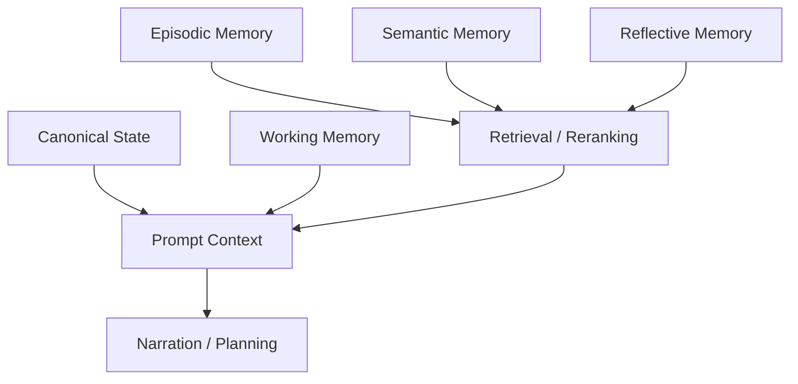
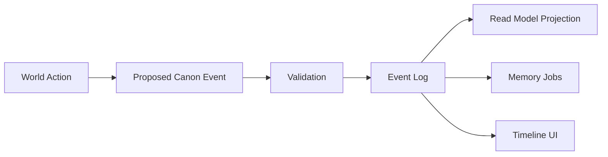
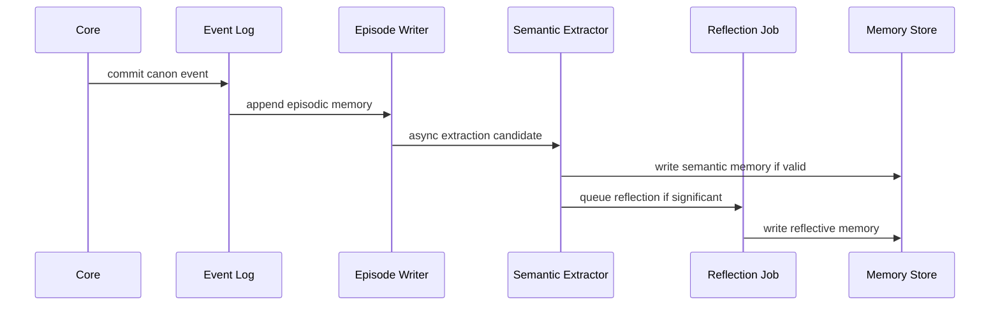
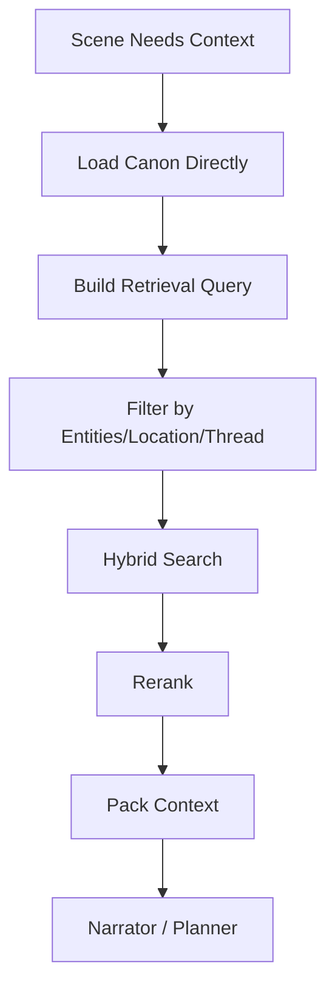
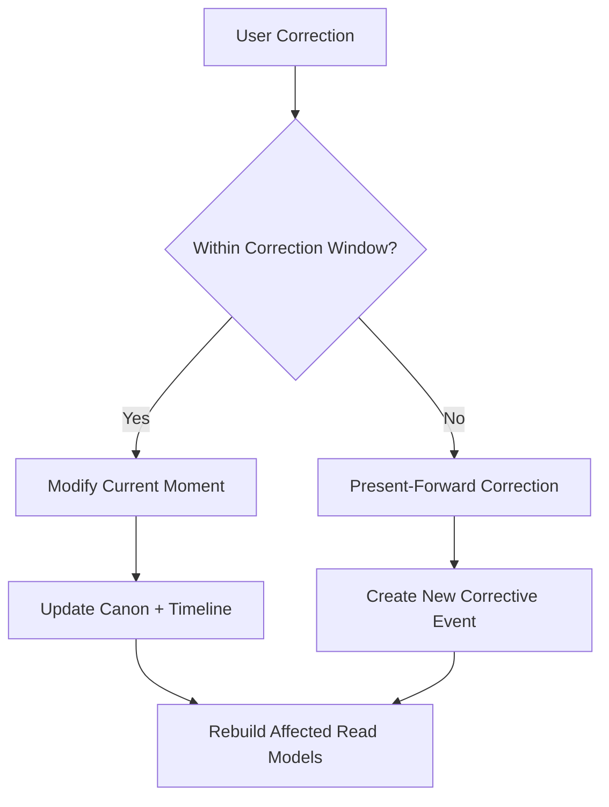

> ⚠️ **STATUS: SUPERSEDED (2026-06-10)** by the Canon Engine set (`30_architecture/canon_engine/`): canon pipeline → doc 04, retrieval/context → doc 06 + ADR-014/-018, timeline/time → doc 10 + ADR-021/-030, correction → ADR-016. Memory consolidation/reflection is explicitly **parked** in engine ADR-024 — do not build from this doc. Kept for provenance of the layered-memory reasoning.

---

# 06 Memory / Canon / Timeline Architecture

> Status: Draft for review  
> Scope: Canon state, event log, memory layers, timeline, knowledge boundaries, correction  
> Principle: The narration model is never the only place where truth exists.

## 1. Challenge

LLMs cannot be the source of truth. Chat history, rolling summaries, and naive RAG will eventually drift.

DreamChat needs separate memory layers with different truth levels, read paths, and write rules.

## 2. Goal

Support believable long-running continuity by storing what matters in durable structures:

- canon state
- timeline/event log
- episodic memory
- semantic memory
- reflective memory
- knowledge boundaries
- correction audit

## 3. Memory Layers



### Canonical State

Absolute or near-absolute world truth: entity identity, current location, relationship state, ownership, confirmed facts, active scene state.

### Working Memory

Current-scene temporary context: participants, recent exchange, user intent, active beat/scene segment.

### Episodic Memory

Timestamped events and scene summaries: what happened, who witnessed it, what was said, what changed.

### Semantic Memory

Distilled stable facts: Mara distrusts the department, Eli recognized the seal, Kael owes the user a favor.

### Reflective Memory

Higher-order interpretations: grudges, long-term goals, emotional reframing, faction concern.

## 4. Canon Event Log



Every important change should link to:

- source
- in-world timestamp
- affected entities
- visibility
- confidence
- correction status

## 5. Knowledge Boundaries

Knowledge is not global.

```text
Direct memory != secondhand knowledge != rumor != public record
```

Example:

```yaml
holder_entity_id: entity_mara
subject_ref: event_123
knowledge_type: direct | told | inferred | public | rumor | record
source_ref: entity_eli
confidence: 0.72
bias: possible
known_since_world_time: 1421-04-08T21:00
```

## 6. Memory Write Flow



## 7. Memory Read Flow



Recommended retrieval order:

1. Direct canonical state.
2. Entity/location/thread filters.
3. Time/recency weighting.
4. Semantic search.
5. Keyword fallback.
6. Reranking and contradiction checks.

## 8. Correction Flow



## 9. Timeline

The timeline is operational infrastructure, not just UX. It supports replay, audit, correction, continuity checks, memory evolution tracking, and historical module readability.

## 10. Benefits

- Prevents chat-history collapse.
- Preserves knowledge boundaries.
- Supports long-gap entity recovery.
- Supports memory evolution over time.
- Enables audit, correction, and replay.

## 11. Cons / Risks

- More work than chat summaries.
- Requires event/read-model discipline.
- Reflection and semantic extraction can introduce drift if not validated.

## 12. Recommendation

For PoC:

- canonical state in Postgres
- append-only event log
- simple episodic summaries
- pgvector for retrieval
- basic semantic facts with source links
- correction audit
- knowledge visibility metadata

Do not overbuild reflective memory before canonical/event memory is stable.
