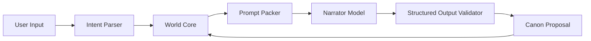
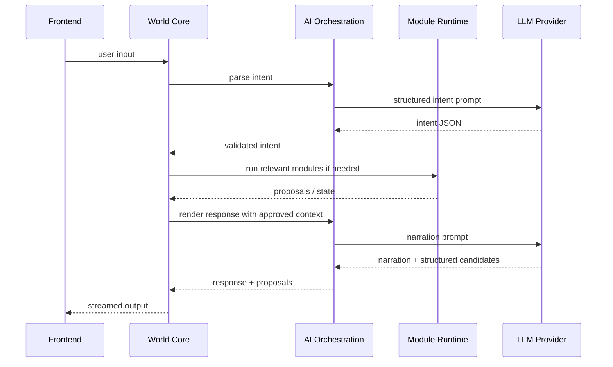
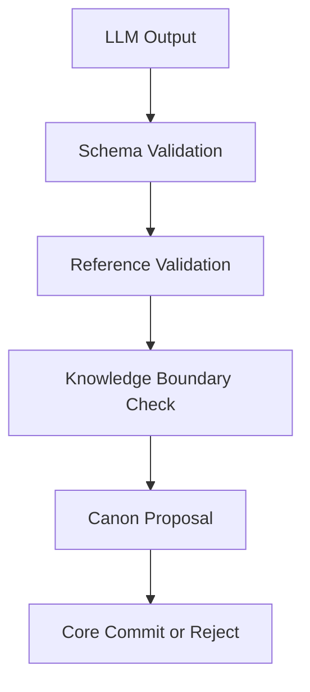

# 07 AI Orchestration Architecture

> Status: Draft for review  
> Scope: LLM workflows, structured outputs, narration, intent, prompt packing, async AI jobs  
> Principle: AI interprets and dramatizes; the World Core validates and commits.

## 1. Challenge

DreamChat needs natural language freedom and strong creative narration, but must not let the model silently own world truth.

The AI layer must balance creativity, latency, cost, NPC distinctiveness, module mechanics, memory retrieval, safety, and correction.

## 2. Goal

Use AI as an orchestration and rendering layer:

```text
Intent parsing
Scene planning
Speaker orchestration
Narration rendering
NPC dialogue rendering
Memory extraction
Semantic summarization
Backstage review assistance
Correction interpretation
Prompt/context packing
Structured output validation
```

## 3. AI Is Not the Core



## 4. Turn Flow



## 5. Model Roles

Recommended model roles:

```text
Fast intent model
Strong narrator model
Cheap summarizer model
Specialized evaluator model
Embedding model
Optional image-prompt model
```

Avoid one giant model doing everything.

## 6. Prompt Context Layers

Prompt packing should include:

1. Product/system rules.
2. Current scene working memory.
3. Direct canonical state.
4. Relevant retrieved memory.
5. Module-provided context.
6. Knowledge boundaries.
7. Output schema.

Do not dump raw history.

## 7. Speaker Orchestration

The scene engine should decide who may speak or act. The AI can recommend, but the core validates.

Rules:

- present participants may speak
- off-screen speakers require valid in-world channel
- private facts require valid knowledge path
- narrator can frame but not silently commit canon
- targeting a participant does not guarantee obedience

## 8. Module Interaction

Modules can provide constraints and narration hints.

Example:

```json
{
  "module_context": {
    "battle.jrpg": {
      "encounter_status": "ongoing",
      "active_turn": "player",
      "valid_actions": ["attack", "defend", "use_item"]
    }
  }
}
```

The narrator can dramatize module outcomes, but should not override mechanics.

## 9. Structured Output Validation



## 10. Async AI Jobs

Async jobs:

- episode summarization
- semantic extraction
- reflection
- backstage review
- image prompt generation
- continuity evaluation
- module event summarization

These should not block first token unless essential.

## 11. Benefits

- Keeps prose creative.
- Protects canon from hallucination.
- Supports model tiering for cost/latency.
- Works with module mechanics.
- Enables evaluation and repair loops.

## 12. Cons / Risks

- Fast-changing technical area.
- Prompt packing mistakes can cause continuity failures.
- Structured outputs require schema maintenance.
- Too many inline calls can hurt latency.

## 13. Recommendation

For PoC:

1. Intent parser.
2. Scene response generator.
3. Memory extractor.
4. Simple evaluator/validator.
5. Async summarizer.

Avoid too many agents at first. Coherent continuity matters more than agent count.
