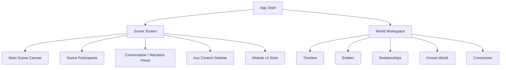
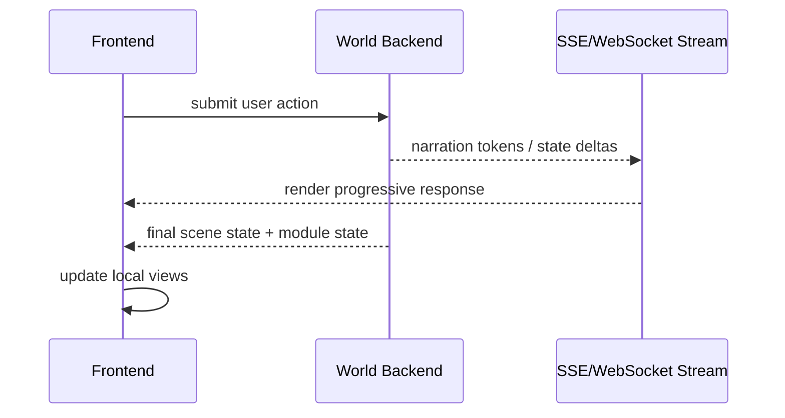

# 08 Frontend Architecture

> Status: Draft for review  
> Scope: Play-first UI, workspace layer, streaming, module surfaces  
> Principle: The frontend renders the world; it does not decide canon.

## 1. Challenge

The UI must feel like returning to an ongoing world, not opening a dashboard. But users also need timeline, known entities, relationships, artifacts, correction tools, and module surfaces.

The frontend must support:

```text
Play layer = current scene and interaction
Workspace layer = optional inspection/control
Module surfaces = dynamic extensions
```

## 2. Responsibilities

The frontend owns:

- scene layout
- visual themes
- participant strip
- conversation/narration panel
- aux context sidebar
- world workspace navigation
- correction UX
- streaming output rendering
- module UI slots
- local optimistic state where safe

It does not own:

- canon decisions
- battle results
- memory truth
- knowledge boundaries
- backstage review logic
- correction propagation rules

## 3. UI Architecture



## 4. Data Flow



## 5. Module UI Slots

Modules should not redesign the whole frontend. They contribute to approved slots:

```text
scene.top_overlay
scene.bottom_panel_addon
right_aux_context_card
entity.sheet_tab
workspace.tool_panel
timeline.event_renderer
known_world.card_renderer
correction.editor_extension
```

Examples:

- Battle module adds a battle control panel.
- Investigation module adds a clue card and evidence board.
- Stats module adds an entity sheet tab.

## 6. Module UI Contract

Module UI should be data-driven at first.

```json
{
  "slot": "scene.bottom_panel_addon",
  "component_type": "battle_controls",
  "state": {
    "active_turn": "player",
    "actions": ["attack", "defend", "use_item"]
  }
}
```

The frontend maps approved component types to safe components.

Do not execute arbitrary marketplace frontend code in the first version.

## 7. Theme System

The UX skeleton should stay stable while themes vary.

Theme families:

- Cinematic Storyworld
- Noir Operations
- Balanced Default

## 8. Default Scene Screen

The default scene screen contains:

- main scene canvas
- participant avatars
- active speaker
- conversation/narration panel
- input and Continue button
- aux sidebar tabs: Current, Previously, Open Threads
- workspace navigation

## 9. Benefits

- Immersive and genre-agnostic.
- Keeps canon in backend.
- Supports module surfaces without frontend rewrites.
- Supports creator/debug layers later.

## 10. Cons / Risks

- Module UI slots can clutter the play surface.
- Arbitrary third-party UI is dangerous too early.
- Overly smart frontend can reintroduce canon fragmentation.

## 11. Recommendation

Use Next.js + React + TypeScript.

Start with first-party registry-driven surfaces. Delay arbitrary third-party UI until sandboxing and review exist.
