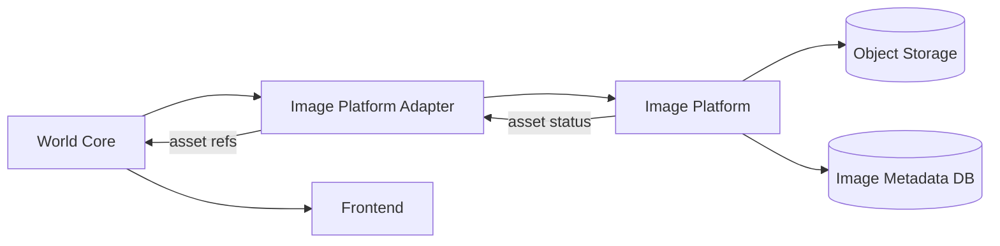
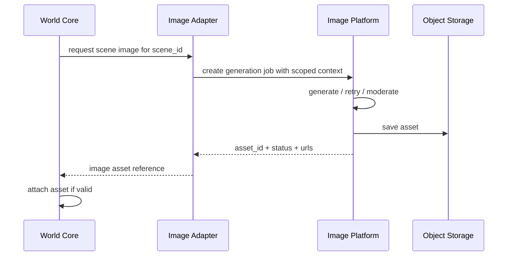

# 09 Image Platform Integration

> Status: Draft for review  
> Scope: Integration between World Core and existing standalone Image Platform  
> Principle: Images support immersion; they do not automatically create canon.

## 1. Challenge

DreamChat uses visuals to reduce cognitive load and improve immersion. But generated visuals can hallucinate details. If an image shows an extra scar, sword, person, building, or symbol, that should not automatically become true.

The image platform is already its own service and should remain separate.

## 2. Goal

The World Core requests images, the Image Platform generates assets, and the World Core decides how assets attach to scenes, entities, artifacts, or locations.

## 3. System Position



## 4. Responsibilities

World Core owns:

- scene truth
- entity identity
- location state
- artifact truth
- asset-to-world attachment
- visibility and permission

Image Platform owns:

- image job lifecycle
- prompt template execution
- provider adapters
- generated variants
- storage URLs
- regeneration history
- cost tracking

## 5. Image Request Flow



## 6. Asset Attachment Rule

Image generation output is illustrative by default.

The core may:

- attach image as illustrative
- reject/regenerate
- ask user/creator to confirm details
- extract candidate details as proposals
- commit confirmed details through the canon pipeline

## 7. Module Interaction

Modules request images through the core, not directly.

Example:

1. Battle module requests an encounter illustration.
2. Core verifies the encounter exists.
3. Core requests image generation.
4. Image Platform returns asset.
5. Core attaches asset to the scene as visual support.

## 8. Image Job Lifecycle

```text
requested → queued → generating → ready → attached
                      ↘ failed → retryable / abandoned
                      ↘ rejected → regenerate
```

## 9. Metadata

```yaml
asset_id
world_id
source_scene_id
source_entity_id
source_artifact_id
prompt_template_id
provider
status
visibility
canon_attachment: illustrative | confirmed | rejected
storage_url
thumbnail_url
created_at
regeneration_of
```

## 10. Benefits

- Keeps image generation scalable and isolated.
- Prevents visual hallucinations from becoming canon.
- Supports provider swapping.
- Enables async generation.
- Tracks image cost separately.

## 11. Cons / Risks

- Images may contradict canon.
- Async generation can lag behind scene flow.
- Too much visual reliance can weaken text-first experience.

## 12. Recommendation

For PoC:

- scene background generation
- entity portrait generation
- image references stored in World Core
- generated images marked illustrative unless confirmed
