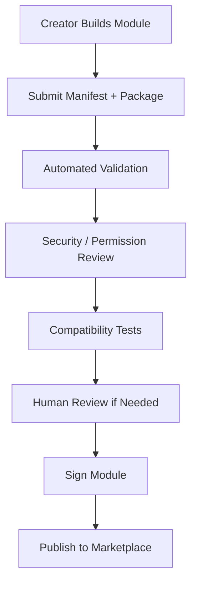
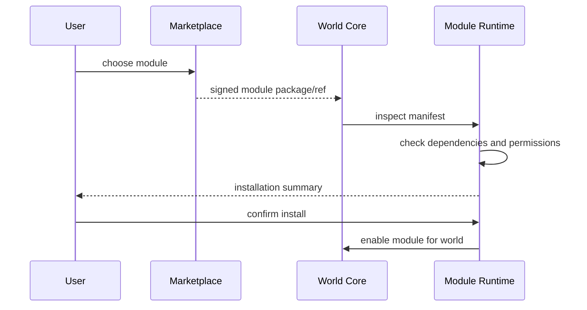

# 10 Marketplace / Module Publishing Architecture

> Status: Future-facing draft  
> Scope: Publishing, reviewing, installing, versioning, and managing modules  
> Principle: Marketplace is not PoC, but module architecture should not block it.

## 1. Challenge

A module marketplace is powerful but risky.

Marketplace modules may affect world mechanics, entity state, canon proposals, UI surfaces, prompt context, costs, user-generated content, and safety-sensitive content.

Therefore modules need review, versioning, permissions, compatibility checks, and sandboxing before public distribution.

## 2. Marketplace Scope

Future marketplace objects may include:

- gameplay modules
- world templates
- NPC packs
- visual themes
- prompt/narrator styles
- rulesets
- artifact packs
- scenario templates
- creator tools

This document focuses on gameplay/world modules.

## 3. Publishing Flow



## 4. Install Flow



## 5. Versioning

```text
module_id: battle.jrpg.turn_based
version: 1.2.0
compatible_core: >=0.5.0 <1.0.0
requires:
  - stats.combat.v1
```

Rules:

- old timeline events remain readable
- disabling a module does not erase history
- upgrades need migrations
- breaking changes require explicit confirmation

## 6. Permissions

```yaml
permissions:
  read:
    - scene.current
    - entity.public_state
    - relationship.visible
  write_module_state:
    - module.own_namespace
  propose:
    - canon.event.combat
    - canon.event.entity_status
  ui:
    - scene.bottom_panel_addon
    - entity.sheet_tab
  ai_context:
    - prompt.constraints
```

## 7. Sandbox Strategy

Early phase:

- first-party modules only
- no arbitrary third-party code
- registry-driven frontend components

Later phase:

- signed modules
- sandboxed execution
- Wasm plugin host or isolated worker runtime
- restricted host functions
- resource limits
- execution timeout
- audit logs

## 8. Package Contents

```text
module-package/
  manifest.yaml
  schemas/
  migrations/
  prompts/
  ui-contracts/
  tests/
  docs/
  package.wasm or service-ref later
```

## 9. Compatibility Testing

Test:

- manifest schema
- dependency resolution
- permission scope
- migration safety
- event proposal schemas
- install/disable lifecycle
- sample world replay
- security constraints
- content policy linting

## 10. Review Levels

```text
Private module
  only creator's worlds

Unlisted module
  share by link

Reviewed public module
  discoverable in marketplace

Official module
  first-party or strongly verified
```

## 11. Benefits

- Turns DreamChat into a world platform.
- Allows creator ecosystem growth.
- Lets modules be reused across worlds.
- Creates monetization path later.

## 12. Cons / Risks

- High security risk if arbitrary code is allowed too early.
- Compatibility fragmentation.
- Moderation burden.
- Support/debugging complexity.
- Bad modules can harm continuity.

## 13. Recommendation

Do not build marketplace in PoC.

Prepare for it by implementing:

- module manifests
- dependency graph
- version fields
- permission declarations
- namespaced module state
- module event types
- disable-not-delete semantics
