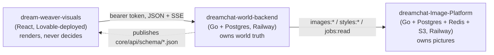
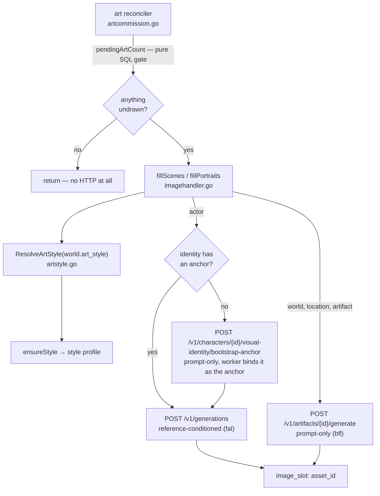
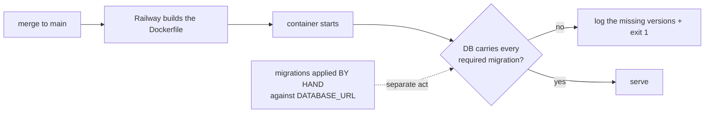

# System map — what exists, where it lives, and what owns what

**Status:** Living. Amend it in the same PR that changes the shape it describes.
**Purpose:** the picture an agent needs before touching anything. Read with `AGENTS.md`, which makes
it mandatory, and the ADRs it links, which are the decisions behind each seam.

This document describes what IS, not what is planned. Every claim here is checkable against the repo
or against production; if one is not, it is a bug in this file and fixing it is in scope for whoever
found it.

---

## 1. Three repositories, one product

The split itself is not decided here — it is **D-3** (the Image Platform never owns world truth) and
**D-7** (the frontend owns presentation only), described at length in
`modules/modular_architecture_world_engine.md` §2.1–2.3 and `modules/plug_and_play_module_architecture.md`.
Those documents are largely *proposed* module architecture and use "should"; this section records only
what is running today, and where they disagree with reality, reality is here and the module system
they describe is still unbuilt.



- **`dreamchat-world-backend`** — canon, perception, the play loop, world creation, and every
  decision about what is true. The only writer of world state.
- **`dream-weaver-visuals`** — the surface. Generates its types from the backend's published schemas
  and vendors them under `contracts/`; `bun run verify:contract` fails when they drift from backend
  `main`. **This is the live frontend.** `dreamchat-frontend` is the older one and is not the
  deployment target.
- **`dreamchat-Image-Platform`** — generation, storage, delivery, cost, and provider routing. It
  never learns what a world IS; it is handed a subject description and a style.

`dc-fix/` in the workspace is a **git worktree of this repo** (`.git` is a gitdir file, not a
directory — a `-d` test on it lies), currently detached and not deployed. Do not edit it and do not
read it as a source of truth; it is stale scratch space.

---

## 2. Creating a world

```mermaid
sequenceDiagram
  participant U as User
  participant FE as create surface
  participant BE as world-backend
  participant S as world_genesis seat
  participant AR as art reconciler

  U->>FE: brief (+ optional interview, + optional art style)
  FE->>BE: POST /worlds/genesis {brief, answers, art_style}
  BE->>BE: ResolveArtStyle — omitted is legal (house look); a bad key is refused BEFORE any spend
  BE->>S: one call, schema-leashed
  S-->>BE: world_genesis/1 (no numeric field anywhere)
  BE->>BE: ONE transaction — entities, events, knowledge, arrival
  BE-->>FE: SSE frames, then `world` {id, playable:true}
  BE->>AR: kick (detached — the stream has already ended)
  AR-->>AR: cover, places, objects, cast — minutes later
```

The build is one transaction so a failure leaves no directory row. **Art is deliberately outside it**
(ADR-P021): a dozen images is minutes of another service, and a provider outage must delay pictures,
never destroy an authored world.

---

## 3. The art pipeline



Facts that are easy to get wrong:

- **Nothing is commissioned by hand.** Genesis kicks the reconciler and a ticker sweeps every live
  world, so entities created mid-story get art without any new wiring (ADR-P021).
  `POST /worlds/{w}/images/scenes` and `.../portraits` still exist and are now **manual/diagnostic
  only** — the reconciler is the writer. Do not wire a creation path to them.
- **`image_slot` is ours, the asset is theirs.** The platform stores no `entity → asset` mapping and
  offers no "current asset for identity X" endpoint, so we persist it.
- **A portrait carries its anchor** (`subject.anchor_asset_id`). The platform's reuse key folds it and
  `/v1/generations` has no prompt of its own — the anchor IS the description. Omit it and a re-anchored
  character is served the portrait drawn from the anchor you just replaced.
- **Portals are not drawn.** An artifact carrying `connects` is an opening between two places, not a
  thing. The descriptor test alone is not enough — doors have descriptors.

---

## 4. Every prompt in the system

There are exactly two kinds, and both are enumerated.

| Surface | Where | Count |
|---|---|---|
| Seat rulebooks | `core/api/prompts/*.txt`, `//go:embed` into each builder | 8 seats + `system-anthropic.txt` |
| The image style | `core/api/artstyle.go` — look + latitude + negatives | 1 module |

`system-anthropic.txt` is a driver-level system injection, not a D-13 seat (see `prompts/README.md`).
It carries the same block because it rides alongside whatever seat assembled the prompt.

Nothing else in THIS repo instructs a model: the 25 published JSON Schemas carry no behavioural
language, the image platform ships no prompt templates of its own, governance treats `content_class`
as opaque and never parses it, and neither frontend contains model-facing copy.

The one edge worth knowing: a user's `custom:<prose>` style IS text that becomes prompt material
(ADR-P023). It is bounded and hashed, never free-form injection into a seat.

Every seat prompt carries the same byte-identical latitude block, enforced by
`promptlatitude_test.go` (ADR-P022). The image style carries the same intent in the medium's own
vocabulary — censorship in a picture is a composition, not a refusal.

---

## 5. Deployment reality



**The deploy does not apply migrations.** Nothing in the Dockerfile or Railway config runs `dbmate`.
A merged, tested, green schema change reaches production as code while the database stays where it
was — which is exactly how a naming-wall fix sat inert in production for a day. The boot refusal
(ADR-P020) converts that silence into a loud failure at the only moment nothing has been served yet.

Services: `world-api`, `image-api`, `image-worker`, `Postgres` (image platform), `Postgres-V-ye`
(world backend), `Redis`. All deploy from their repo's `main`.

---

## 6. Where the seams are

| Seam | Owner | Do not duplicate it |
|---|---|---|
| What a world is true about | `core/db` + `apply_event` | Never write canon from Go directly except genesis' documented `fast_path` |
| What a viewer may know | perception + `fn_display_name` | Never send canon rows to the frontend |
| What a model is told | `core/api/prompts/*.txt` | One block, byte-identical, all nine |
| What a picture looks like | `core/api/artstyle.go` | Never restate a style's look in a client |
| What has been drawn | `image_slot` | Never infer it from the platform |
| What the API promises | `core/api/schema/*.json` | The frontend vendors these; it does not invent them |


---

## 7. Which rules a test enforces, and which are only written here

A rule with a test or a CI check is obeyed. A rule that is only written down gets broken, and the
founder has to notice and say so. Both lists below are accurate as of this commit — if you add a
gate, move the row.

### Enforced — a test or CI check fails if you break it

| Rule | Gate |
|---|---|
| `schema.sql` + `migrations.txt` match the migrations | `make schema-check` (CI: `invariants`) |
| Production DB carries every required migration | boot refusal, ADR-P020 |
| Every published schema has a real captured payload | SPEC-011 (`make schema-contract`) |
| Every prompt file AND every embedded prompt carries the latitude, byte-identical | `promptlatitude_test.go` |
| The style catalogue is served, in order, without leaking prompt prose | `worldartstyleshandler_test.go` |
| Portals are not drawn | `artcommission_test.go` |
| A PR branch contains `origin/main` | `.github/workflows/branch-currency.yml` |
| A built world commissions its own art | `genesisart_test.go` |
| Frontend contracts match backend `main` | `bun run verify:contract` — **in the FRONTEND repo only.** A backend PR that changes a published schema passes backend CI without it, and breaks the frontend on ITS next run. |

### Not enforced — nothing stops you breaking these

| Rule | The gate that does not exist yet |
|---|---|
| A seat's production config can serve its contract (ADR-P024) | boot check on resolved seat params, or `make doctor` against a committed required-env manifest |
| Mutation-test the guard you wrote | nothing forces the revert; the discipline is in the pre-flight only |
| Amend this map in the PR that changes its shape | a CI check that a PR touching `art*.go`, `worldgenesis*`, `image*`, `prompts/`, `schemaversion*` also touches `system_map.md` |
| The frontend must not hardcode the style catalogue | a contract test in `dream-weaver-visuals` |
| New creation paths must not call the manual image triggers | a grep gate limiting who may call `fillScenes`/`fillPortraits` (the KICK is now tested; the ban on hand-calling is not) |
| Cite register rule IDs in plans and PRs | a PR-body check |

Adding any row from the second table to the first is always in scope and never needs permission.


---

## 8. Which files to edit for common tasks

Every file you must change to add an art style, add a seat, or publish a schema.

This list exists because the ADRs understated it. ADR-P023 said adding an art style is "one entry in
`artStylePresets`. Do not add it anywhere else." That was wrong — a test file also hardcoded the list
of styles, so a sixth style broke a test the ADR promised would not exist. (That test now reads the
list from the module, so for art styles the ADR is finally correct.)

Adding a seat is the worse case: the docs implied "write a prompt file," and it is four files.

**Adding an art style — 1 file.** `artStylePresets` in `core/api/artstyle.go`. The endpoint
test derives its expectation from `ArtStyleCatalogue()`, so the promise in ADR-P023 is now true. A
preset naming a world genre (`cyberpunk`, `high-fantasy`) violates GA-2 and must not be added.

**Adding a seat — 4 files.** Miss one and a test names it:
1. `core/api/prompts/<seat>.txt`, carrying the latitude block verbatim (ADR-P022).
2. `allSeatNames` in `core/api/seatconfig.go` — omit it and `seatConfigFromEnv` rejects the seat's own
   provider override with `unknown seat`.
3. The `embedded` map in `core/api/promptlatitude_test.go` — the test fails on a prompt file with no
   entry, by design.
4. Its `Seat` definition and capability floor (D-13), plus a deterministic fake shaped like its own
   output — a stand-in laxer than the real driver is how three bugs shipped green.

**Publishing a schema — 2 or 3 files.** The schema itself, plus a captured payload (SPEC-011 fails
the build without one). Where the payload comes from depends on what produces it:
- SQL projection → a query in `ci/gen_payloads.sh`.
- Go-assembled response, SSE frame, or handler output → a Go test that writes the payload, invoked
  from `gen_payloads.sh` (see how the genesis frames and `art_styles/1` are captured).
- A seat/input contract rather than a response → also register it in `INPUT_CONTRACT_SCHEMAS` in
  `ci/schema_contract.py`, or coverage fails on a schema that legitimately has no wire payload.
