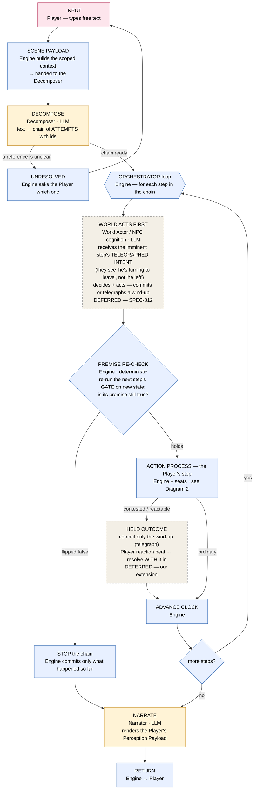
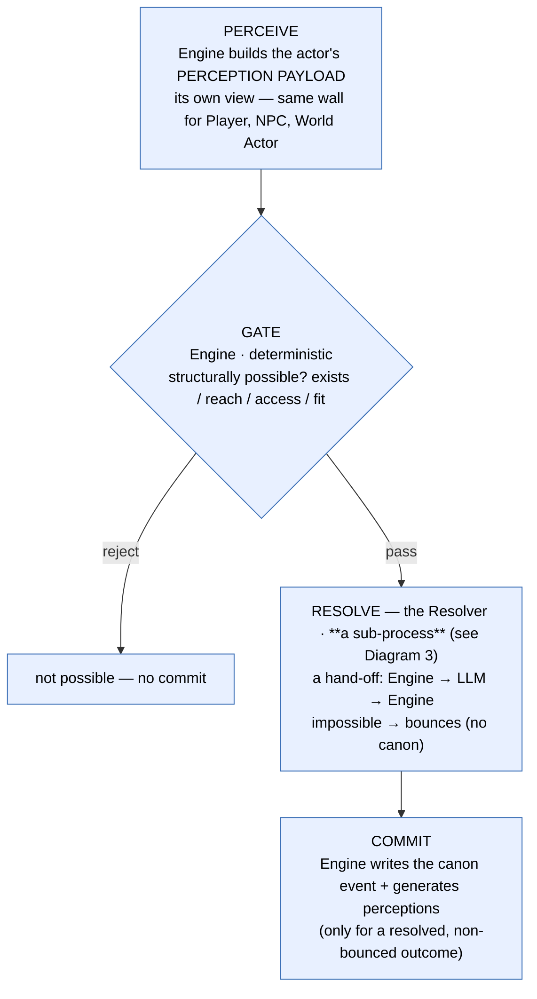
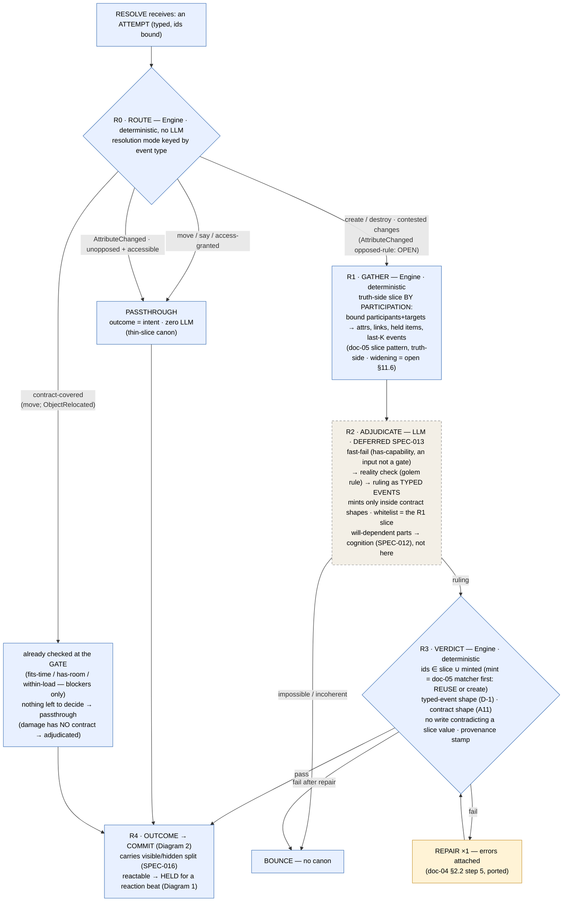

# FINAL — Interaction Loop Diagram

The loop has **two layers**, and the world gets the **first word on every step**.

- **Orchestrator** — sequences the beat: decompose once, then for each step the **world acts first** (an LLM
  decision), a **deterministic premise re-check** runs, the player's step runs, the clock advances; after all
  steps, narrate and return.
- **Action process** — the reusable, **actor-agnostic** unit: **perceive → gate → resolve → commit**, run
  identically whether the actor is the Player, an NPC, or the World Actor.

Two principles it encodes: **no "sacred first action"** (the world reacts before your step resolves), and a
**contested outcome is held, not committed** (wind-up telegraphs, you get a reaction beat, then it resolves
with your reaction in it — no fait accompli).

---

## Cast — who performs each stage (the names we use in discussion)

| Actor | What it is | Performs |
|---|---|---|
| **Player** | the human | Input; reaction beats |
| **Engine** | the deterministic Go core; the **only writer of canon** | Scene Payload, Gate, Premise re-check, Commit, clock, the Orchestrator |
| **Decomposer** | LLM seat | Decompose (text → attempts + ids) |
| **Resolver** | the outcome stage, truth-side — **routed sub-process (Diagram 3)**: R0 deterministic router (most actions = zero LLM) → R1 Engine gathers the truth slice → R2 LLM adjudicates (adjudicated routes only) → R3 Engine verdicts the ruling + repair ×1 → R4 commit | Resolve |
| **World Actor / NPC cognition** | LLM seat(s) | "World acts first" — decides what NPCs & the world do · **DEFERRED (SPEC-012)** |
| **Narrator** | LLM seat | Narrate (prose from the Player's perceptions) |

**The Engine has no model of the world.** It reads only structural, always-present fields (existence, reach,
capacity, authority, access, readiness) and does arithmetic over **LLM-minted** typed data; *what things
are* and *what's possible* live in the LLM (which reasons and mints) and in committed canon — never hard-coded
in Engine logic. Judging whether an actor *has the capability* is an input to adjudication (the LLM), not a
gate check.

**Named artifacts:** **Scene Payload** = the scoped context the Engine builds for the Decomposer.
**Perception Payload** = an actor's own view (feeds its `perceive`; the post-beat one feeds the Narrator).

**Named stages:** Decompose · Gate · Resolve (= reality check + outcome) · Commit · Premise re-check · Held
outcome · Narrate — plus the two structures they sit in, the **Orchestrator** (sequences the beat) and the
**Action Process** (perceive → Gate → Resolve → Commit).

**Colours below:** rose = Player · blue = Engine (deterministic) · amber = LLM seat · dashed = deferred.

---

## Diagram 1 — The Orchestrator (one beat)

## Diagram 2 — The Action Process (one machine, any actor)

## Diagram 3 — Resolve (the sub-process: route first, LLM only where unavoidable)

Resolve receives an **attempt** (typed, ids bound). A **deterministic router** picks the resolution mode by
event type — most actions resolve with **zero LLM calls** (thin-slice canon: move/say = passthrough). Only
adjudicated routes (create/destroy, contested changes) pay the LLM path — and its ruling is an **untrusted
proposal** that faces the same verdict-and-repair wall the input side has (ADR-012 discipline, ported).

## Reading it

- **The Action Process is one machine, run by anyone.** The Player's step, an NPC's action, and a World
  Actor event all flow through **perceive → Gate → Resolve → Commit**. Same pipeline for every actor — the
  anti-enum guarantee.
- **Gate ≠ Resolve, and Resolve routes before it reasons (Diagram 3).** Gate (Engine, deterministic) =
  *"can you attempt it?"* — structural only. Then the Resolver: a **deterministic router** (R0) sends most
  actions through passthrough or contract arithmetic — **zero LLM**. Only adjudicated routes pay: Engine
  **gathers** the truth-side slice by participation (R1), the **LLM** fast-fails / reality-checks / rules
  as typed events (R2; impossible → **bounce, no canon**), and the Engine **verdicts** the ruling as an
  untrusted proposal — id-whitelist, shapes, no-contradiction, provenance — with **repair ×1** then bounce
  (R3). Capability lives here, not in the Gate. The Engine brackets the LLM: routes first, verdicts last.
- **Three different "no"s — keep them apart:**
  - **Gate reject** — structurally impossible (not in reach). No canon.
  - **Reality bounce** — possible to reach, but incoherent (you can't fly). No canon.
  - **Outcome failure** — possible *and* coherent, but it didn't land (the keeper stays hard and lies).
    **Writes canon** — failure is a result, and the chain continues.
- **The world's "first word" is two steps, not one.** The *decision* to act — the World Actor / NPC
  cognition choosing to cut in — is an **LLM call** (deferred); that is the real pushback. The **Premise
  re-check** after is the only deterministic part: re-run your next step's Gate and see if its precondition
  flipped. The world *acting* is not a stop; a *broken premise* is.
- **Held outcome = the reaction window.** For a reactable action, only the wind-up commits; the outcome waits
  for the Player's reaction beat, then resolves contested. Replay still holds: telegraph → reaction →
  resolution are committed events, in order.
- **Only three things stop the chain:** Gate reject, a broken premise (Premise re-check), or the turn
  budget. An outcome *failure* does not stop it.

## What is built / deferred / ours / still open

- **Canon, buildable:** the Action Process spine (perceive → Gate → Resolve → Commit); the Premise re-check;
  structural deception (Gate reads canon, the re-check reads perception).
- **Deferred subsystems:** the World Actor + NPC cognition (SPEC-012); uncertain-outcome Resolve /
  adjudication (SPEC-013). Until these exist, "world acts first" has nothing to run and Resolve is
  passthrough.
- **Our extension (banked, not engine-canon):** world-first-per-step + symmetric telegraph + the
  held-outcome reaction window.
- **Still open (decide before building the world tier):**
  1. Does the world cascade run on **every step**, or **only when the clock crosses a pending event**?
  2. Intra-tick **ordering** when several NPCs act on the same tick.
  3. **Presence caps** (~6 present-and-acting; ~10 present-but-known-to-the-World-Actor).
  4. Reaction depth: only the **Player** gets a reaction beat; NPCs do **not** re-react (depth-1).
