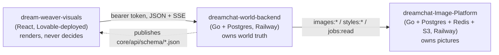
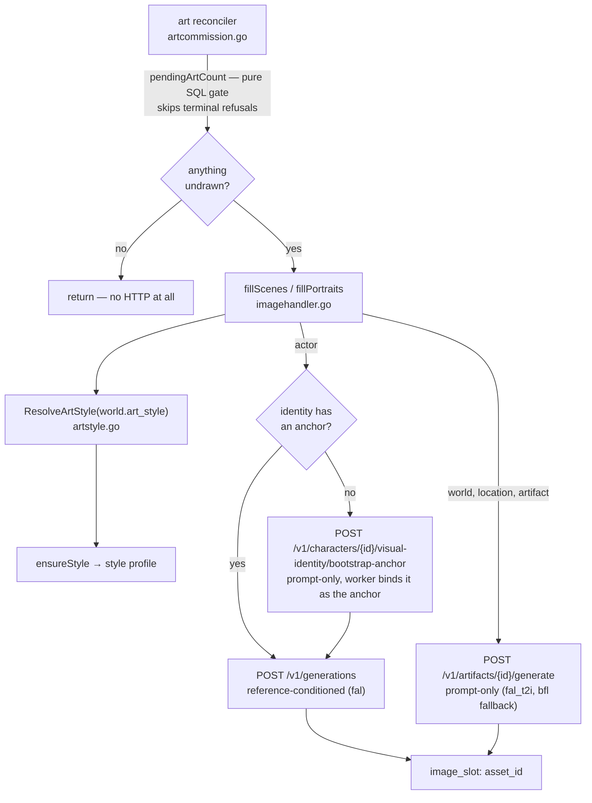
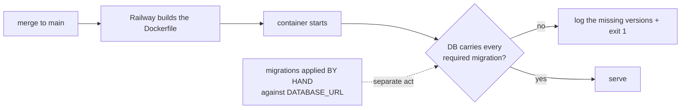

# System map — what exists, where it lives, and what owns what

**Status:** Living. Amend it in the same PR that changes the shape it describes.
**Purpose:** the picture an agent needs before touching anything. Read with `AGENTS.md`, which makes
it mandatory, and the ADRs it links, which are the decisions behind each seam.

This document describes what IS, not what is planned. Every claim here is checkable against the repo
or against production; if one is not, it is a bug in this file and fixing it is in scope for whoever
found it.

---

## 1. Three repositories, one product

The split itself is not decided here — it is **D-3** (the Image Platform never owns world truth) and
**D-7** (the frontend owns presentation only), described at length in
`modules/modular_architecture_world_engine.md` §2.1–2.3 and `modules/plug_and_play_module_architecture.md`.
Those documents are largely *proposed* module architecture and use "should"; this section records only
what is running today, and where they disagree with reality, reality is here and the module system
they describe is still unbuilt.



- **`dreamchat-world-backend`** — canon, perception, the play loop, world creation, and every
  decision about what is true. The only writer of world state.
- **`dream-weaver-visuals`** — the surface, on port **5273**. Generates its types from the backend's
  published schemas and vendors them under `contracts/`; `bun run verify:contract` fails when they
  drift from backend `main`, and `../harness/check.sh contract-drift` compares both working trees.
  **This is the live frontend.** `dreamchat-frontend` is its **ARCHIVED** predecessor
  (`workspace:ADR-W003`) — it carries an `ARCHIVED.md`, its CI is manual-only, and port 5173 is
  retired with it.
- **`dreamchat-Image-Platform`** — generation, storage, delivery, cost, and provider routing. It
  never learns what a world IS; it is handed a subject description and a style.

`dc-fix/` in the workspace was a **git worktree of this repo** and was **removed on 2026-08-25**
(`workspace:ADR-W003`) — detached at `ef7f9da`, 78 commits behind `main` and 0 ahead, so nothing was
stranded. It is worth knowing why it was a hazard: its `.git` was a gitdir *file*, not a directory, so
a `-d` test on it lied; and its own `AGENTS.md` named the wrong frontend repo and a schema file that
exists in neither tree. A long-lived worktree is a second copy of the law, and the copy is always the
one that goes stale. `../harness/check.sh repos` refuses if it comes back.

---

## 2. Creating a world

```mermaid
sequenceDiagram
  participant U as User
  participant FE as create surface
  participant BE as world-backend
  participant S as world_genesis seat
  participant AR as art reconciler

  U->>FE: brief (+ optional interview, + optional art style)
  FE->>BE: POST /worlds/genesis {brief, answers, art_style}
  BE->>BE: ResolveArtStyle — omitted is legal (house look); a bad key is refused BEFORE any spend
  BE->>S: one call, schema-leashed
  S-->>BE: world_genesis/1 (no numeric field anywhere)
  BE->>BE: ONE transaction — entities, events, knowledge, arrival
  BE-->>FE: SSE frames, then `world` {id, playable:true}
  BE->>AR: kick (detached — the stream has already ended)
  AR-->>AR: cover, places, objects, cast — minutes later
```

The build is one transaction so a failure leaves no directory row. **Art is deliberately outside it**
(ADR-P021): a dozen images is minutes of another service, and a provider outage must delay pictures,
never destroy an authored world.

**A world's ideas are entities too.** `registerEntities` (`worldgenesiscommit.go`) writes each
authored concept into `entity_registry` as `entity_kind='concept'` at the same genesis commit, so a
belief can point at one. `entity_registry.descriptor` carries the concept's `what_it_is` — the
descriptor IS the truth, one field with one meaning, authored identity that is never spoken to a
character. A concept has **no state row and no position** and cannot act: `loadGenesisIDs`'
`default` branch deliberately drops it rather than filing it under `things` (a concept is not an
artifact). Not built yet: no positions, no grade, nobody holds a concept yet — see `SPEC-051` and
`docs/design/2026-09-02-concepts-as-knowledge.md`.

---

## 3. The art pipeline



Facts that are easy to get wrong:

- **Nothing is commissioned by hand.** Genesis kicks the reconciler and a ticker sweeps every live
  world, so entities created mid-story get art without any new wiring (ADR-P021).
  `POST /worlds/{w}/images/scenes` and `.../portraits` still exist and are now **manual/diagnostic
  only** — the reconciler is the writer. Do not wire a creation path to them.
- **A terminal refusal leaves the pending set; a transient one does not.** `pendingArtCount` skips
  slots whose `last_error` starts with `provider_unpaid` or `provider_content_rejected`
  (`terminalArtRefusalSQL`) because asking again cannot change either. This function once *claimed in
  prose* that a failed owner drops out on its own — it did not, since a failed slot has `asset_id
  NULL` and `job_id NULL`, which IS the pending condition. That cost 875 doomed submits in 24h, which
  drained the shared request budget the asset READ path spends and blacked out art that already
  existed. The **fill selection deliberately does not** skip them: that asymmetry is the recovery
  path, because `regenerate` deletes only ACTOR slots, so an explicit `POST .../images/scenes` is the
  only way a failed cover or place returns after someone pays. Gated across repos by
  `../harness/check.sh terminal-codes`.
- **`image_slot` is ours, the asset is theirs.** The platform stores no `entity → asset` mapping and
  offers no "current asset for identity X" endpoint, so we persist it.
- **A portrait carries its anchor** (`subject.anchor_asset_id`). The platform's reuse key folds it and
  `/v1/generations` has no prompt of its own — the anchor IS the description. Omit it and a re-anchored
  character is served the portrait drawn from the anchor you just replaced.
- **Portals are not drawn.** An artifact carrying `connects` is an opening between two places, not a
  thing. The descriptor test alone is not enough — doors have descriptors.

---

## 4. Every prompt in the system

There are exactly two kinds, and both are enumerated.

| Surface | Where | Count |
|---|---|---|
| Seat rulebooks | `core/api/prompts/*.txt`, `//go:embed` into each builder | 9 seats + `system-anthropic.txt` |
| The image style | `core/api/artstyle.go` — look + latitude + negatives | 1 module |

`system-anthropic.txt` is a driver-level system injection, not a D-13 seat (see `prompts/README.md`).
It carries the same block because it rides alongside whatever seat assembled the prompt.

Nothing else in THIS repo instructs a model: the published JSON Schemas under `core/api/schema/`
carry no behavioural language, the image platform ships no prompt templates of its own, governance
treats `content_class` as opaque and never parses it, and neither frontend contains model-facing
copy. (This sentence used to name a count. It said 25 when there were 28, and the seat row above said
8 when there were 9 — a bare count in a living document is a rot generator, so both now name the
directory instead.)

The one edge worth knowing: a user's `custom:<prose>` style IS text that becomes prompt material
(ADR-P023). It is bounded and hashed, never free-form injection into a seat.

Every seat prompt carries the same byte-identical latitude block, enforced by
`promptlatitude_test.go` (ADR-P022). The image style carries the same intent in the medium's own
vocabulary — censorship in a picture is a composition, not a refusal.

---

## 5. Deployment reality



**The deploy does not apply migrations.** Nothing in the Dockerfile or Railway config runs `dbmate`.
A merged, tested, green schema change reaches production as code while the database stays where it
was — which is exactly how a naming-wall fix sat inert in production for a day. The boot refusal
(ADR-P020) converts that silence into a loud failure at the only moment nothing has been served yet.

Services: `world-api`, `image-api`, `image-worker`, `Postgres` (image platform), `Postgres-V-ye`
(world backend), `Redis`. All deploy from their repo's `main`.

---

## 6. Where the seams are

| Seam | Owner | Do not duplicate it |
|---|---|---|
| What a world is true about | `core/db` + `apply_event` | Never write canon from Go directly except genesis' documented `fast_path` |
| What a viewer may know | perception + `fn_display_name` | Never send canon rows to the frontend |
| What a model is told | `core/api/prompts/*.txt` | One block, byte-identical, all nine |
| What a picture looks like | `core/api/artstyle.go` | Never restate a style's look in a client |
| What has been drawn | `image_slot` | Never infer it from the platform |
| What the API promises | `core/api/schema/*.json` | The frontend vendors these; it does not invent them |


---

## 7. Which rules a test enforces, and which are only written here

A rule with a test or a CI check is obeyed. A rule that is only written down gets broken, and the
founder has to notice and say so. Both lists below are accurate as of this commit — if you add a
gate, move the row.

### Enforced — a test or CI check fails if you break it

| Rule | Gate |
|---|---|
| `schema.sql` + `migrations.txt` match the migrations | `make schema-check` (CI: `invariants`) |
| Production DB carries every required migration | boot refusal, ADR-P020 |
| Every published schema has a real captured payload | SPEC-011 (`make schema-contract`) |
| Every prompt file AND every embedded prompt carries the latitude, byte-identical | `promptlatitude_test.go` |
| The style catalogue is served, in order, without leaking prompt prose | `worldartstyleshandler_test.go` |
| Portals are not drawn | `artcommission_test.go` |
| A PR branch contains `origin/main` | `.github/workflows/branch-currency.yml` |
| A PR cites rule IDs, and every id it cites EXISTS | `.github/workflows/pr-contract.yml` job `cites-the-law` → `ci/check_citations.sh`. An invented id is an invented constraint and fails the build. Citing nothing passes — the mandatory-cite half was cut 2026-08-27 because `Rules: B-1` satisfied a change to the Makefile. **There is no `citations.yml`; this row named one for weeks and the file never existed.** |
| A built world commissions its own art | `genesisart_test.go` |
| Frontend contracts match backend `main` | `bun run verify:contract` — **in the FRONTEND repo only.** A backend PR that changes a published schema passes backend CI without it, and breaks the frontend on ITS next run. |
| Vendored frontend contracts are byte-identical to `core/api/schema/` | `../harness/check.sh contract-drift` — **in the WORKSPACE harness, not this repo's CI.** See the matching row below. |

**The decisions live in the files, and a Go test holds the line.** Measured 2026-08-26: 11 of 59
non-test files under `core/api/` declared what governed them, and `ruling.go` — the LLM-to-canon
boundary — named nothing. Now 37 of 59. `core/api/governance_test.go:29,75,84,114` is the enforcement:
it requires the named ADR to exist **and** to reciprocally claim the file, which is strictly sharper
than counting comment headers. `../harness/check.sh governed-by` and its `GOVERNED_FLOOR` ratchet were
deleted 2026-08-27 — the floor was pinned at the measured value, so it could only fire on deleting an
existing header, and it printed 22 filenames as a permanent warning on every run.

The reasoning matters more than the number. This project holds **96 decisions indexed by identifier**,
and an agent arrives with a *question*. It cannot find the decision, so it decides locally — which is
the most expensive failure mode here and an **indexing** problem, not a discipline one. Every other
gate in this repo fires at PR time, by which point the wrong shape is written and its author is
invested in it. A `Governed-by:` line is the only lever that acts *before* a line is written, because
it is inside the file the agent already opened. `../harness/brief.sh <path>` is the same information on
demand, and `../docs/00_workspace/closed-questions.md` is the index by question rather than by id.

**Friction is logged live, by a command.**
`../harness/friction.sh gap|conflict|surprise|decision "…"` appends a timestamped line to the round's
journal under `../docs/00_workspace/friction/`. The bar is anything unexpected, because an unexpected
situation is evidence the **input** was incomplete — the spec, the dossier, the error message, the map.

No gate measures it any more. `../harness/check.sh journal` enforced timestamp spread and was deleted
2026-08-27: it failed only when three rows shared one hand-typed `HH:MM:SSZ` string, compared against
no clock at all, so pressing a different digit defeated it permanently. `../harness/check.sh friction`
went the same day — it required a literal `**Reviewer:**` line, and both blocks on record read
`**Reviewer:** none`. `ci/check_closeout.sh`, which required the `Friction:` verdict in the PR body,
went with them.

**What replaced all three is the area expert** (`../harness/roles/area-expert.md`), which rules on the
friction as part of its approval and may delete a rule. That is the mechanism the log always claimed —
"the only mechanism by which a rule in this harness can ever die" — and before 2026-08-27 it had run
16 rows, 3 WASTE verdicts and **zero deletions**, because no independent reviewer had ever ruled.

**A green mutation table covers one class of two, and the second one shipped a bug.** A `sed` script
mutates *source*, so it structurally can only ask "what if the code is wrong". It cannot ask "what if
the **input** is wrong". SPEC-035 was mutation-tested — 4 mutants, 4 caught — and shipped with
`witnesses: "<uuid>"` as a bare string committing zero witnesses and no `halt_reason`: the precise
defect that SPEC was filed to remove, reintroduced inside its own fix. Repaired by
`20260825140000_witnesses_malformed_is_refusal.sql`, gated by 2 assertions, mutation-tested in both
directions. `ci/mutate.sh` documents both classes; `../harness/roles/area-expert.md` carries the four
questions to ask per field a change reads — **absent · null · wrong type · empty**, plus the
kill-vector rule that separates a load-bearing assertion from one fact wearing three fixtures. See
`failure-log.md` #45.

**The mutation experiment now has a runner, and is still honour-system.** `ci/mutate.sh` (7 selftest
probes) applies named mutants, runs a test command, restores on any exit, and fails when a mutant
survives, when a sed script matches nothing, or when the baseline is already red. What it does **not**
have is a CI job: nothing forces a round to run it, because the mutants worth trying depend on the
change and cannot be enumerated in advance. So it stays in the not-enforced table below — but the
excuse "there was no runner" is gone, and `round-protocol.md` §7 plus all seven area briefs now name
the command.

**Gate ORDER is load-bearing, and it is not obvious.** Learned in the SPEC-034 round, where both
of these were nearly reported as regressions the author had caused:

- `make schema-check` leaves the database **migrated but unseeded**. Running `make schema-contract`
  straight after it fails with `invalid input syntax for type uuid: ""` — a seed lookup returning
  empty, not a contract breach.
- **`go test ./...` in `core/api` mutates the world too, and is not idempotent against itself.**
  `pressure_test.go` reads `world_eruption` for a seeded world/tier and fails with `chance = 1, want
  exactly 0.70 … (run make reset)` once a prior run has drained it. Two consequences, both hit on
  2026-08-26: running the Go suite twice turns it red on its own, and running it before `make test`
  turns **pgTAP** red. A mutation experiment over Go tests therefore needs `make reset` inside the test
  command, or every verdict after the first few is "caught because the DB was dirty" — which is not a
  verdict at all.
- `make schema-contract` **mutates the world** (`ci/gen_payloads.sh` writes transcript rows to capture
  payloads). Running `make test` straight after it reddens seed-dependent suites — the shared
  stateful-singleton hazard, from the one direction the docs did not warn about.

**So: `make reset` between them, or run them in separate sittings.** The safe order is
`make reset && make test`, then `make reset && make schema-check`, then `make reset && make
schema-contract`. A red gate right after another gate is a sequencing artefact until proven otherwise —
check by re-running it on a fresh `make reset` **before** believing it.

### Not enforced — nothing stops you breaking these

| Rule | The gate that does not exist yet |
|---|---|
| A seat's production config can serve its contract (ADR-P024) | boot check on resolved seat params, or `make doctor` against a committed required-env manifest |
| Mutation-test the guard you wrote | nothing forces the revert; the discipline is in the pre-flight only |
| The frontend must not hardcode the style catalogue | a contract test in `dream-weaver-visuals` |
| New creation paths must not call the manual image triggers | a grep gate limiting who may call `fillScenes`/`fillPortraits` (the KICK is now tested; the ban on hand-calling is not) |
| A schema change in this repo moves its consumer in the same round | Nothing in THIS repo's CI. The workspace harness closes it from outside — `../harness/check.sh contract-drift` byte-compares `core/api/schema/` against `dream-weaver-visuals/contracts/`; the pin-with-no-vendored-schema half is checklist item 9 in `../docs/areas/contracts-and-platform.md` (a review obligation, not a gate — its `pin-vendored` check was deleted 2026-08-27). But that gate runs on a developer's two working trees, **not on a backend PR**, so a schema change merged here alone is still green here. Closing it needs a consumer-registry check in this repo's CI, or a repository-dispatch to the frontend. Decision: `workspace:ADR-W004`. |

Adding any row from the second table to the first is always in scope and never needs permission.


---

## 8. Which files to edit for common tasks

Every file you must change to add an art style, add a seat, or publish a schema.

This list exists because the ADRs understated it. ADR-P023 said adding an art style is "one entry in
`artStylePresets`. Do not add it anywhere else." That was wrong — a test file also hardcoded the list
of styles, so a sixth style broke a test the ADR promised would not exist. (That test now reads the
list from the module, so for art styles the ADR is finally correct.)

Adding a seat is the worse case: the docs implied "write a prompt file," and it is four files.

**Adding an art style — 1 file.** `artStylePresets` in `core/api/artstyle.go`. The endpoint
test derives its expectation from `ArtStyleCatalogue()`, so the promise in ADR-P023 is now true. A
preset naming a world genre (`cyberpunk`, `high-fantasy`) violates GA-2 and must not be added.

**Adding a seat — 4 files.** Miss one and a test names it:
1. `core/api/prompts/<seat>.txt`, carrying the latitude block verbatim (ADR-P022).
2. `allSeatNames` in `core/api/seatconfig.go` — omit it and `seatConfigFromEnv` rejects the seat's own
   provider override with `unknown seat`.
3. The `embedded` map in `core/api/promptlatitude_test.go` — the test fails on a prompt file with no
   entry, by design.
4. Its `Seat` definition and capability floor (D-13), plus a deterministic fake shaped like its own
   output — a stand-in laxer than the real driver is how three bugs shipped green.

**Publishing a schema — 2 or 3 files.** The schema itself, plus a captured payload (SPEC-011 fails
the build without one). Where the payload comes from depends on what produces it:
- SQL projection → a query in `ci/gen_payloads.sh`.
- Go-assembled response, SSE frame, or handler output → a Go test that writes the payload, invoked
  from `gen_payloads.sh` (see how the genesis frames and `art_styles/1` are captured).
- A seat/input contract rather than a response → also register it in `INPUT_CONTRACT_SCHEMAS` in
  `ci/schema_contract.py`, or coverage fails on a schema that legitimately has no wire payload.
