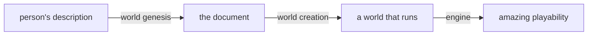
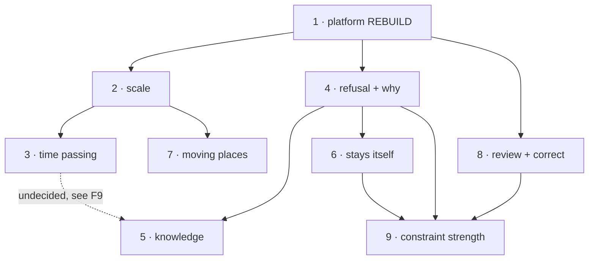

# World Model — nine product increments

> **For agentic workers:** this is the **program roadmap**, not a task list. Each increment gets its own
> plan document when it starts, in this directory, following the house format
> (`2026-07-29-station-f-contracts-space.md` is the reference shape). Read §Fence and §Closed decisions
> before touching anything. Areas are a **lookup**, never a guess: run `./harness/review.sh` from the
> workspace root and declare what it prints.

**End goal:** a person describes a world, and gets a world worth being in.

**The three joints, and every increment moves one of them:**

**Evidence base — cite these, do not re-derive them:**

| Source | What it establishes |
|---|---|
| `docs/30_architecture/world_model/01_engine_capability_audit.md` | 24 rules vs the engine: 3 working, 12 partial, 9 absent, every row cited to file:line. The 13 rules blocked on class→number. World identity during play: none. Which rules each world needs. |
| `docs/superpowers/debates/2026-08-25-world-model-clean-sheet/R_score_grelda.md` | Three blind readers, one document, 22 questions. Rulings transmit; quantities do not. Ladder gap demonstrated. F1 narrower than claimed. |
| `.../R_score_grelda_review.md` | Adversarial review of that scoring, including the finding it rejected. |
| `.../SCHEMA-v3.md` §4 + `.../SCHEMA-v5.md` §2 + `.../SCHEMA-v6.md` §3 | The 25 reader obligations under construction. |
| `docs/10_prds/prd_world_creation_depth.md` | The accretion diagnosis and the one-declaration-per-concept target. Four-seat adversarial provenance. |
| `docs/superpowers/debates/2026-08-26-landing-contract-retarget/AMENDMENT.md` | **Increment 1's decided scope.** The retarget, the staged `Claims:` rule, the first customers, the stranded-capability obligations. Answers 23 blocking findings. |
| `.../2026-08-26-landing-contract-retarget/FINDINGS_{contracts,genesis,playloop}.md` | The three adversarial seats, verbatim, including the findings that killed the original proposal. |
| `docs/30_architecture/world_model/00_world_model_and_genesis_pipeline.md` | The design record, version history, and why each earlier contract version died. |

---

## The fence — every increment implicitly includes these

- **Two examples from two different worlds, or the feature is not understood yet.** One example is how a
  world's noun gets welded into generic code. A feature spec with a single worked example is incomplete.
- **No identifier whose name could only have come from one world.** A movement *type* is fine (`swim` is
  a value); `caste`, `granter`, `spectral` are not. Live instance of the bug:
  `fn_move_duration_actor` hardcodes `'walk'`.
- **Vocabulary is minted, open, per-world. Grammar is closed, ours, in code.** For a scale word: *what it
  measures*, *which rungs exist*, *their order*, *their direction* and *its polarity* are grammar. The
  magnitudes are vocabulary.
- **An engine gap becomes an engine program, never a patch at world creation.**
- **Prevention emerges from a comparison, never from a list of exceptions.**
- **Every authored leaf reaches a reader** — and where it does not yet, the engine work is named, scoped
  and scheduled. Inert-with-no-plan is a defect; inert-with-a-named-program is a roadmap item.
- **Mechanism first; the example is only a test.** If the mechanism cannot be stated without naming a
  world, there is no mechanism yet — say so.
- **Clean cutover.** No shims, no bridges, no deprecated paths, no aliases.

## Two standing gates — established in increment 1, green at the end of every increment

1. **The document validator.** All 13 refusal rules executable, run at emit and in CI over every document
   on disk. Today **no document in this project has ever been validated.**
2. **The two-direction field index.** One direction catches authored fields nothing reads; the other
   catches engine inputs nothing authors — the direction nobody ever computed, and how the second defect
   class grew silently. **It goes red today** (see the audit's dead-column list). Each increment turns rows
   green. This is the progress scoreboard; nobody's opinion substitutes for it.

## Closed decisions — do not reopen

An agent who "improves" any of these is reopening a settled decision.

1. **Genesis is rebuilt, not bridged.** The old format and its bespoke commit path are removed.
2. **Word-to-number splits into grammar and vocabulary** (see Fence). This is not negotiable per-scale.
3. **Do not write the ladders by averaging the three readers' anchors.** Three readers disagreeing 10× on
   a rung is a requirement to decide something, not a range to split. Their tables
   (`R_score_grelda.md` §4.1/§4.2) are evidence of what a ladder must fix, not votes.
4. **Drift prevention is not a tone rule.** Earned change is legitimate and must not be blocked: a world
   under a permanent drought whose hero destroys the god that cursed it *stops being in drought*. The
   distinction is **cause** — earned change has a recorded event behind it; dilution has none.
5. **Authored exclusions are permanent** and are not overturnable by power creep. They are the arithmetic
   the drama rests on, not style.
6. **Moving locations are real.** A train that is a location containing locations; a floating island. The
   `motion` facet stays — an earlier proposal to delete it on the evidence of three worlds is retracted.
7. **The review surface has two independent toggles** (invented structure, secrets). The secrets toggle is
   **server-side or build-time, never a client preference** — reachable by a player it becomes a spoiler
   button, and someone will find it.
8. **A character's withheld interior never appears on a confirmation surface** at any setting.
9. **The epistemic wall works by construction and is not to be disturbed** (audit row 19). Build on it.

---

## The increments

Marked **REBUILD** / **EXTENDS** / **NEW** against what the audit found already built.

### 1 — Your world reaches everything that plays it · REBUILD

**Goal:** a world authored in the real contract loads and plays, and adding the next concept is one
declaration rather than new code.

**Why first:** the other seven declare into this. Build features first and we rebuild the accretion
problem `prd_world_creation_depth.md` diagnosed — every concept re-answering the same questions in
bespoke code across seven functions and one growing validator.

> **Status 2026-08-26:** blocker cleared (`SCHEMA-v6.md`), scope decided (`AMENDMENT.md`), obligations
> written (`SCHEMA-v7.md` — O12–O14, R14–R17, two derived reader obligations, count 25 → 27), and the
> task-by-task plan exists at `docs/superpowers/plans/2026-08-27-increment-1-landing-contract.md`.
> Task 7 was blocked on v7 and is now unblocked. **Not started:** tasks 1–9.
>
> **Increment 1's scope is `AMENDMENT.md`, not this entry.** It is an amendment to
> `prd_world_creation_depth.md`, whose mechanism survived all three seats unchanged. Read the amendment
> before its plan. Its `Claims:` list — the sections that enter the coverage check in this increment — is
> amendment §3.1.

**Ships:** the contract as a machine artifact (schema + service type from one source, no drift, with
`additionalProperties:false` and `DisallowUnknownFields` so malformed input is **refused, not dropped**);
the eight stranded-capability obligations of amendment §4 (`tension` required on every extent — its
absence today gives an **infinite** beat budget; one root; three arrival candidates with one chosen; the
Ironmoor name guard; both arrival floor refusals executable; array ceilings; tagline and ornament derived);
the landing framework — one declaration per concept, stating what it mints, what event grounds it, who comes
to know it, what it writes, what refuses it; world creation rebuilt on it; provenance on every element
(stated vs inferred, and what each inference follows from); **the world's own description and vocabulary
reaching the narrator every beat** (audit: `world.brief` carries a `COMMENT` saying it is never rendered);
both standing gates; the brief-to-document coverage check.

**Prerequisite task — DONE, `SCHEMA-v6.md`.** The containment contradiction is settled: `within` is
ungated, and which containment tree an edge belongs to is **derived from the container's facets**. The gate
was violated 28 times across the three v4 documents and not one instance was an error. **The validator is
unblocked.** One question deliberately left open and filed as increment 2's first design question: whether
a container declaring both `extent` and `matter` — a living house, a train — aggregates its contents into
its own mass. Placement is settled (`extent` wins).

**First customers:** `prd_world_creation_depth.md` §5's three, re-expressed in v6 — the `collective`
facet plus `offices[]`, `law[]`, and one authored imminent change through `processes[]`/`cycles[]`. §6's
eleven acceptance criteria stand unchanged. Chosen over the four this round originally proposed because
those had **no player observable inside the five-beat window** (≤150 s of world time) and were selected
*because* absent from the engine — the reader-with-no-consumer class the coverage index exists to catch.

**Proof:** the three existing documents round-trip with no field loss. A pipeline-created world passes the
validator and the coverage check first try. Everything the person said survives byte-identical across two
runs; only inferred parts differ. A world plays at least as well as today, narrator now holding the world.

### 2 — Distance, weight and size cost you something · EXTENDS

**Goal:** every scale word resolves to a quantity, by one mechanism.

**Already built:** distance (recursive climb to a common parent), move duration as distance ÷ speed
charged in ticks, recursive volume and weight through containers, capacity refusals that fire, over-load
dropping speed to zero. **The maths and the consumption work; only the word layer is missing.**

**Ships:** one generic resolver replacing the **five** ad-hoc conversions (**C21** — the audit's “three” undercounts, and **two of the five carry a silent numeric default**), with the grammar/vocabulary split;
the actor↔movement-type binding that removes the hardcoded `'walk'`.

**Two mappings:** a hillside climb where the author writes a *slow* movement and the engine must produce a
duration; a tower world where a diver's descent costs *breath* rather than time — one resolver, different
measured dimension.

**Design inputs (`R_score_grelda.md` §2, §3):** words with an everyday absolute meaning converge unaided
and need no table (`never`). An example value pins one point on one scale and does **not** fix the
dimension — but it does *bound* a ladder, so examples belong on interval endpoints. Ordinary prose in the
document anchored a class as well as an example did, across two models.

**First design question, filed by `SCHEMA-v6.md`:** does a container declaring both `extent` and `matter` — a living house, a train — aggregate its contents into its own mass? Placement is settled (`extent` wins). Answer this before writing either function.

**Proof:** three blind readers re-run; the ten-fold spreads collapse. Before-numbers are on file.

### 3 — The world acts while you're not watching · NEW

**Goal:** authored state changes with elapsed time, derived at read time rather than by an event per tick.

**Why it matters most:** the difference between a world and a diorama. **Seven missing features collapse
into one mechanism** — decay toward a terminus, stocks drawn down, rates of change, cycles and phases,
thresholds firing once and irreversibly, needs going unmet and continuing to bite, beliefs expiring.

**Two mappings:** a living house that eats grain and after a stated span without it closes permanently
with whatever is inside; a tide climbing a fixed amount per year for three hundred years that never
reverses. One mechanism — a rate, a threshold, a permanence flag.

**Also:** `world_pressure(accrued, threshold)` is exactly this shape and is touched by no code.

**Proof:** all seven expressed through the one mechanism with no bespoke code per feature; a fired
irreversible threshold cannot be made to un-fire.

### 4 — A refusal that considers you and says why · EXTENDS

**Goal:** when several authored conditions bear on one attempted act, a stated rule decides, and the
refusal names the condition that stopped it.

**Already built:** the gate is live, blocks commits, mirrored in SQL and Go. **Two defects:** it consults
only two flags on the door itself and nothing about who is passing; and the refusal is a generic
`premise_broken`/`journey_barred` naming nothing.

**The contract gap behind it:** every reading rule is a function of a *single* field, and the contract is
silent where fields meet. Three readers all permitted the same door and **each invented a different
precedence rule** — matching answers over three grammars, which scored as the strongest convergence on
the board and is the most fragile result in it (`R_score_grelda.md` §5 Q4, §8.3).

**Ships:** a general permit/refuse keyed to the actor, returning which condition decided; the precedence
rules in the contract; hazard as a cost on crossing distinct from refusal; and the missing obligation a
blind seat proposed — for a sender and a receiver, does this arrive, arrive degraded, or not arrive, and
which term failed (`R_score_grelda.md` §8.1).

**Two mappings:** a door that opens only for someone the house has already accepted and refuses everyone
else by naming the missing standing; a descent that permits anyone but charges breath, where running out
is the refusal.

**Proof:** a new blind reading round where the split questions return identical **with the same
reasoning.** Matching answers alone do not count.

### 5 — People know different things, and some of them are wrong · EXTENDS

**Goal:** what a character knows can differ from the truth, and from what the character beside them knows.

**Already built, and it is the hard part:** perceptions fan out per event to the right receivers, how a
thing was learned is recorded and surfaced, and the wall stopping a character's secret reaching anyone
else holds **by construction**.

**Dead today:** confidence is permanently 1.0. Knowledge is instantaneous — every perception is stamped
with the event's own tick. Nothing misreports. Three enum labels for unreliable knowledge are produced by
no code. No readable-and-wrong document exists.

**Ships:** delay before a fact is knowable; confidence by acquisition path and what class of event
corrects it; signs that misreport at a rate while never revealing the value behind them; a contested event
held unresolved until an event resolves it; a record that is readable and false.

**Two mappings:** a reputation travelling underground at weeks-per-block, so a district knows before a
city does; a public transcription of a shared dream, accurate about the dream and false as an accusation.

**Proof:** two characters, one event, provably different knowledge — and the true value unreachable
through the unreliable route.

### 6 — The world stays itself, and changes only on purpose · MOSTLY NEW

**Goal:** a hundred beats in it is still the described world, and play can genuinely rewrite it.

**Ships:** authored exclusions holding for the world's life (**all three test worlds wrote one and no code
reads any of them**); confirmation that facts change only through recorded events (mostly already true
architecturally — that is what makes the drought-lifting case legitimate); drift measured over a long run
as a *comparison* between the narration and the world's own minted vocabulary.

**Flagged honestly:** the drift measurement is the only speculative piece here — and the play-loop seat
raised it to a near-block. **F11 `block`:** a measure that reads *words* cannot implement closed decision 4,
which turns on *cause*. **F12 `gate`:** there is no before-number for drift and increment 1 destroys the
chance to take one — so if drift is to be measured at all, the baseline must be captured **before**
increment 1 lands. **F10 `accept`:** the document's own nouns suffice for a first partial baseline.

**The narrator work is SHIPPED (2026-08-26), independently of the retarget** — a global `THE WORLD` /
`THE REGION` / `ITS REGISTER` block sourced from the committed world row, present in all three prompt
builders, with `world.brief` structurally excluded and that exclusion tested two ways (a static check on
the query text and a DB-backed sentinel). Mutation-verified: suppressing the block and leaking the brief
were both caught. `core/api/worldstatement.go`, `worldstatement_test.go`, `narrateprompt.go`,
`beatseats.go`, `beatsstream.go`, `prompts/narrate.txt`, `prompts/README.md`.

**It was not the largest lever** — that claim is withdrawn
(**F4 `gate`**: the narrator already receives world prose every beat). What it needs is the *committed
document's* vocabulary, never the raw brief, present in all three prompt builders. Independent of the
retarget (**C19**), so it ships on its own.

**Two mappings:** a world where no money or law obtains a pact, and every attempt must fail as a scene; a
world where living below a waterline is forbidden and no amount of player leverage legalises it.

**Proof:** an attempt to introduce an excluded thing is refused, and the refusal names the exclusion.
Revert the enforcement and watch it get through. Separately: a long run deliberately transforming the
world, where the transformation sticks.

### 7 — A place can move · NEW

**Goal:** a location can move, and everything inside it goes too, however deep.

**Today:** a traveller's position is interpolated transiently for one purpose and never persisted. There
is no moving container at all; containment is entirely static.

**Two mappings:** a train as an extent containing carriages containing people, arriving somewhere none of
them walked to; a drifting settlement whose inhabitants wake adjacent to a different neighbour.

**Proof:** something inside something inside a moving place ends up where the moving place went.

### 8 — You see what was invented, and change it · NEW

**Goal:** a person corrects the world before it becomes real, without being told the parts they should
discover.

**Ships:** the review surface showing invented **structure** — there is a granary, there is an office
deciding rations, there is a district you did not mention; the question loop for gaps worth asking about
rather than filling silently; amendment that re-derives dependents and leaves stated content untouched.
Two independent toggles per closed decisions 7 and 8.

**Proof:** an amended answer re-derives its dependents and leaves stated content byte-identical. With
secrets off, no character's withheld interior appears anywhere on the surface.

### 9 — The person sets how hard each rule is · NEW

**Goal:** a constraint the world was described as having can be tuned from absolute to flavour, and the
engine honours the setting.

**Why it is not a new mechanism:** the contract already carries a hardness ladder. `law[].enforced_by` is
`physics` → `persons` → `office` — unbreakable, socially expected, or someone comes after you — and
`excluded[]` is the absolute rung, *"for the life of the world."* This increment makes that ladder a
**control surface** rather than an authoring-time guess. Sliding a rule to the top promotes it into the
never-allow list; sliding it down demotes it to a law with a named enforcer.

**Ships:** the strength setting as **named rungs, never a continuous value** — the contract's discipline
is classes, and a number in an authored field is a refusal. It may render as a slider; it must be a class
underneath. Genesis proposes the rung it inferred from the description; the person changes it.

**Two mappings:** a world where no money obtains a pact — absolute, and every attempt must fail as a
scene; a world where you do not praise another house in front of your own — flavour, breakable, and
someone notices.

**Why it is last:** the control means nothing until exclusions are actually enforced (6) and a refusal can
say which rule stopped you (4), and it needs a surface to live on (8). Built earlier it is a dial wired to
nothing — the exact defect class this whole effort exists to kill.

**Proof:** one world, one rule, three settings, three different outcomes for the same player attempt — and
at the top setting the attempt is refused with the rule named.

---

## Dependencies and parallel waves

**This graph is the corrected one.** The first version claimed five increments ran concurrently after 1
and was wrong in three places, each found by the play-loop seat:

| Missing edge | Why | Finding |
|---|---|---|
| **4 → 6** | Increment 6's own stated proof is *"the refusal names the exclusion."* Naming the condition that refused **is** increment 4's ship. 6 cannot meet its proof before 4 lands, and they share the refusal path | **F7 `block`** |
| **2 → 7** | Moving places needs the actor-to-movement-type binding that increment 2 delivers; 7 was also missing from the file-overlap note and collides across the distance function and the journey code | **F8 `block`** |
| **3 → 5, undecided** | Wave 2 is only concurrent if increment 5's information delay uses the existing scheduled-event table. If it uses read-time derivation instead, it needs increment 3. **The design choice is undecided, so the edge is undecided** | **F9 `block`** |

| Wave | Runs concurrently | Notes |
|---|---|---|
| **0** | **1 alone.** Internal tracks: settle-containment *(done, `SCHEMA-v6.md`)* · machine artifact · validator · coverage index · landing framework · the stranded-capability obligations (amendment §4) | Its `Claims:` list is amendment §3.1 |
| **1** | **2, 4, 8** — three, not five | 6 moved behind 4; 7 moved behind 2 |
| **2** | **3, 6, 7** | 6 after 4; 7 after 2; 3 after 2 |
| **3** | **5** | After 4, and after 3 if F9 resolves that way |
| **4** | **9** | Needs 4's named refusal, 6's enforcement and 8's surface |

**The coupling that is not in the graph, and matters more than any edge:** the startup coverage check is
whole-schema all-or-nothing, so **every increment changes what every other increment must claim**
(**F6 `block`**). Amendment §3.1 breaks the cycle with a staged, written `Claims:` list per increment.
Without that staging every increment above is serialised regardless of this graph.

**Priority inside wave 1 if hands are limited:** 2 first — thirteen of twenty-four rules are behind its
resolver. Then 4, since 5 waits on it.

**File-overlap note for concurrent workers:** increments 2, 4 and 7 all touch the movement and portal
neighbourhood — the move-duration function, the portal gate, the orchestrator, the distance function and
the journey code. The original note named only 2 and 4; **F8** added 7. Agree the resolver signature and
the mover-aware gate signature in increment 1's plan so none of the three negotiates mid-flight.

## Out of scope for all eight, recorded so it is not silently absorbed

- **Growth during play** — what may be invented after genesis and what is frozen. Open item in the design
  record; not in these increments.
- **Multiplayer consequences** — designed on paper, never tested.
- **The `office` facet/section redundancy** — all three worlds use the section, none uses the facet. A
  contract cleanup, not an increment.
- **Regenerating the reader test against a second document.** `R_score_grelda.md` §9 names it; increments
  2 and 4 each carry a reading round, which is where it lands.

## Open questions

1. **How much of increment 1's consumption rebuild is genuinely needed at parity** versus deferrable per
   concept. The audit lists what works; nobody has yet mapped which of those readers survive the framework
   unchanged. First task of increment 1's plan.
2. **Whether the drift comparison in increment 6 can be made to work at all.** Named speculative.
3. **Whether `hazard` belongs in increment 4 or 3.** Filed under 4 as a cost on crossing; it is arguably
   a time-derived cost. Decide when 4's plan is written.
