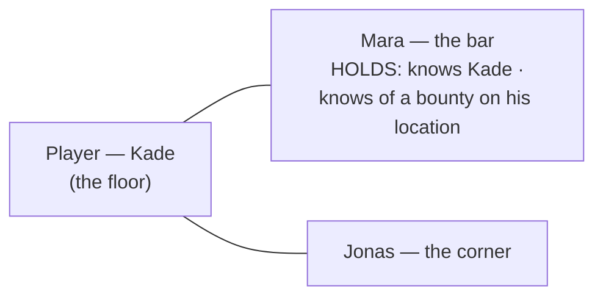
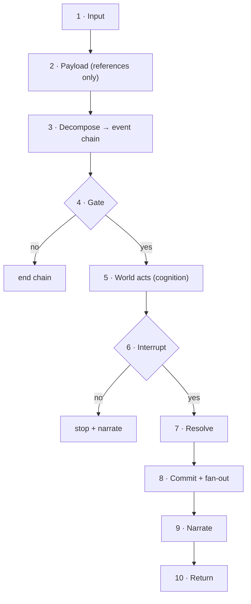

# Tavern Simulation — one full beat, end to end

One player beat in the seed tavern, as **simulated DB artifacts** + the **prompts IN / contracts OUT** of
each seat. **Grounded in the docs.**

- Event model — **§2** (closed event *types*, not verbs) + **§3** (the six-type spine).
- Knowledge — **B-2** (knowledge via valid paths only) + **B-7** (told ≠ witnessed) + **B-10** (perceptions
  link to their source event as provenance).
- Hidden facts — **SPEC-016** (per-attribute visible/hidden) + **D-11** (establish from authored canon).
- Player words — **SPEC-015** (the decomposer must NOT author the player's words/canon).
- Thin-slice action set — **§7** (move + say; persuade/attack/search are adjudicated, SPEC-013).

> **Legend** `[built]` = shipped thin slice. `[design]` = world-acts slice, not built.

---

## 0. The event vocabulary (read first)

The engine enumerates a **closed set of canon EVENT TYPES** (§3), not verbs. Open player language collapses
onto them (§2).

| event type | changes | thin slice? |
|---|---|---|
| **ActorMoved** | an actor's location | `[built]` (`move`) |
| **Communicated** | conveys info: **words** (say), **show** (non-verbal), or **intent** — told ≠ witnessed (B-7) | `[built]` (`say`); intent/show `[design]` |
| **ObjectRelocated** | an object's physical position | `[design]` |
| **Ownership/AccessChanged** | who owns / may access | `[design]` |
| **EntityCreated / EntityDestroyed** | existence | `[design]` |
| **AttributeChanged** | generic `entity.X = Y`; carries **visible/hidden** flag (SPEC-016) | `[design]` |

Richness is **data, not new verbs**: tone/menace is **content**; a changed fact is an **AttributeChanged**.
Intents (intimidate/persuade/attack) are **not** event types — they **adjudicate (SPEC-013)** into these.

---

## 1. The world — simulated DB state

### 1.1 Location

| id | name | areas (topology) | state |
|---|---|---|---|
| `loc_tavern` | The Drowned Rat | the floor · the bar · the corner | lit, low crowd |

Adjacency: `floor ⇄ bar`, `floor ⇄ corner`, `floor ⇄ street`.

### 1.2 Actors — registry + state

No free-floating attributes. State below was set by a committed **AttributeChanged** (§3) — gated (D-1),
visible/hidden-flagged (SPEC-016), value **established from authored canon** (D-11).

| id | name | area | state | flag |
|---|---|---|---|---|
| `act_player` | Kade (you) | the floor | — | — |
| `act_mara` | Mara | the bar | `demeanor = calm` | visible |
| `act_jonas` | Jonas | the corner | `demeanor = watchful` | visible |

> Mara's recognition of Kade is **not** here — recognition is *knowledge she holds* (a perception, B-2),
> so it lives in 1.3. Her richer self (trader, goals, the bounty she knows of) lives in her **Character
> Profile** (Step 5), composed from canon + held perceptions.

### 1.3 What each actor **holds** (perceptions, positive only — B-2)

| holder | perceptions held | acquired via (B-2) |
|---|---|---|
| `act_player` | "You're in The Drowned Rat." · "Mara tends the bar." · "A man sits in the corner." | observation |
| `act_mara` | "A man just came in — **I know him: Kade**." · "He's crossing toward the bar." · "**A standing request exists for Kade's location**." | acquaintance · observation · trade (told) |
| `act_jonas` | "A patron came in." · "He's heading for Mara." | observation |

> The wall = Mara *holds* the recognition (and the bounty); Kade simply lacks both. We never model "what
> isn't known."

### 1.4 The scene



---

## 2. The input

```
I walk to the bar and lean on Mara until she admits she knows me.
```
*(No quoted speech — this is movement + an intent to pressure.)*

---

## 3. The beat — flow



Commit order this beat (world-first): **`move → Mara reacts → you communicate → Mara answers`**.

---

## 4. The beat — step by step

### Step 1 · Input `[built]`
Server resolves the actor. **OUT** → `viewer = act_player`.

### Step 2 · Payload for decompose `[built]` — **references only**
Decompose doesn't gate; it only needs to **resolve the player's references** to entities. Give it the
in-scope names/ids and nothing else:
```
in scope:  loc_bar (the bar) · act_mara (Mara) · act_jonas (a man)
```

### Step 3 · Decompose `[built]` — **classifies intent; never invents words (SPEC-015)**

**PROMPT IN**
```
[SYSTEM] You are DECOMPOSE. Map the player's text to a chain of canon EVENTS (§3 types).
Resolve references to the in-scope entities. You state INTENT; you do not author words or outcomes.
If the player did not quote speech, emit a Communicated INTENT — never invent dialogue.

[IN SCOPE] loc_bar (the bar) · act_mara (Mara) · act_jonas (a man)
[PLAYER TEXT] I walk to the bar and lean on Mara until she admits she knows me.
```

**CONTRACT OUT** (`beat_chain`) — the decomposer emits ONLY the event; **no precondition**:
```json
[
  { "type": "move", "to": "loc_bar" },
  { "type": "communicate", "mode": "intent", "target": "act_mara",
    "intent": "pressure_to_admit_recognition" }
]
```
> No words. `intent` is a **descriptor**, not dialogue. The **engine derives** each step's precondition
> from the event-type rule — `move ⟹ {destination reachable}`, `communicate ⟹ {target present}` —
> deterministically (§9 "state-computable predicate"), never LLM-chosen. Whether she cracks is
> **adjudication (SPEC-013)**. `[design]` for `communicate.intent`.

### Step 4 · Gate `[design reorder — today inside commit]`
Reads raw canon (omniscient). Gates **production-possibility** per event-type rule (§3): for `move`,
reachability; for `communicate`, can-act + channel (**production only**). **OUT:**
```
move:         loc_bar.reachable = true (floor ⇄ bar) · can-act · not-blocked(movement)
communicate:  can-act · not-blocked(say)            → production OK
→ pass
```
> `communicate`'s "**target present**" is **not** a gate check — you can speak into an empty room and the
> saying still happened. It is the **precondition** evaluated at the **interrupt** (Step 6), after the
> world has had its move. *Gate = production-possibility; presence = precondition.*
> *(Any gate false → chain ends here, before the world acts.)*

### Step 5 · World acts `[design / SPEC-012]`

Cognition seats see **only their own** perceptions (B-2) **plus a buffered Character Profile** — far richer
than scene lines. The profile is established at scene-load from authored canon (D-11), **cached to save
tokens**, and the seat may return a **profile delta** when an event changes the actor.

**Mara — PROMPT IN**
```
[SYSTEM] You are MARA. Decide your next action from YOUR profile + perceptions ONLY.
Propose canon event(s) (§3) or "none". You propose; the engine decides outcomes.
If your state changed, return a profile_delta.

[CHARACTER PROFILE — buffered]
kind: human
role: bartender (public) · intelligence trader (true)
personality: calm, guarded, mercenary
mood: alert            (a known face just walked in)
relationships: prior dealings with Kade
held knowledge: a standing request exists for Kade's location
goals: keep cover · monetize information

[YOUR PERCEPTIONS]
- A man just came in — I know him: Kade.
- He's crossing toward the bar.
[WIND-UP YOU PERCEIVE] Kade is bearing down on me, about to press me.
```

**Mara — CONTRACT OUT** (`cognition_proposal/1`, `[design]`)
```json
{ "actor": "act_mara",
  "events": [ { "type": "communicate", "mode": "show",
                "content": "stops wiping the glass, then carries on — gives nothing away" } ],
  "profile_delta": { "mood": "alert → calculating" } }
```
> **The inference your example wanted:** Kade here is *income* (she knows of the bounty), so she **holds
> cover** to avoid tipping him while she decides whether to sell it. That only exists because the profile
> carried the trader role + the bounty — **world canon**, not scene lines.
>
> **NOTE (future):** NPCs are limited to a small event subset today; **widen the NPC event set later**.

**Jonas — CONTRACT OUT** (own perceptions only): `{ "actor": "act_jonas", "events": [{ "type": "none" }] }`

### Step 6 · Interrupt `[design]`
The engine's **derived** precondition for `communicate` is `{ act_mara.present }`. After the world acted, Kade's **perceived** state still
has Mara at the bar → **holds** → `continue`. **No model call.**
> Mara's *show* (the pause) is committed and **will be narrated whether or not the chain interrupts** — a
> perceived world event is never silently dropped.

### Step 7 · Resolve `[built = identity; adjudication design]`
| step | resolved outcome |
|---|---|
| `move` | Kade at the bar `[built]` |
| `communicate (intent)` | the pressure is delivered & perceived `[built]` |
| *does she admit?* | **adjudication (SPEC-013)** → she **resists / holds cover** → no admission `[design]` |

Her resolved answer is her own **Communicated (say)** — and **NPC words legitimately come from her
cognition** (only the *player's* words can't be fabricated).

### Step 8 · Commit + fan-out `[built]`

**Canon events — commit order (world-first):**

| id | type | actor | detail |
|---|---|---|---|
| `ev_101` | ActorMoved | act_player | floor → bar |
| `ev_102` | Communicated · show | act_mara | pauses wiping, then carries on |
| `ev_103` | Communicated · intent | act_player | pressures Mara to admit she knows him (no words) |
| `ev_104` | Communicated · say | act_mara | "Don't know what you mean, friend." (from cognition) |

**Perceptions written — atomic records, each LINKED to its source event (B-10).** *Not* prose; the narrator
composes prose from these.

| id | holder | src event | epistemic | content |
|---|---|---|---|---|
| `pc_1` | act_player | `ev_101` | witnessed | you moved to the bar |
| `pc_2` | act_player | `ev_102` | witnessed | Mara paused wiping, then carried on |
| `pc_3` | act_player | `ev_103` | self | you pressed Mara to admit she knows you |
| `pc_4` | act_player | `ev_104` | told (B-7) | Mara: "Don't know what you mean, friend." |
| `pc_5` | act_mara | `ev_103` | witnessed | Kade pressed me to admit I know him |
| `pc_6` | act_jonas | `ev_101…104` | witnessed | the patron leaned on Mara; she brushed him off |

> Mara's recognition + bounty knowledge are **never** fanned to Kade. Her `mood` delta is **hidden** —
> server-side buffer only (Step 10).

### Step 9 · Narrate `[built]` — composes prose from `pc_1…pc_4`, in order

**PROMPT IN**
```
[SYSTEM] Narrate from the player's perceptions ONLY, in order. Reveal nothing not perceived.
[PERCEPTIONS — ordered]
1 (ev_101) you moved to the bar
2 (ev_102) Mara paused wiping, then carried on
3 (ev_103) you pressed Mara to admit she knows you
4 (ev_104) Mara: "Don't know what you mean, friend."
```
**OUT (prose)**
```
You cross to the bar. Mara's rag stops on the glass, just for a breath, then carries on.
You lean in and hold her eye — you know she remembers you, and you want her to say it.
"Don't know what you mean, friend," she says, even as still water.
```
> The narrator never had "Mara knows Kade" or the bounty, so it can't leak them. The deception is free.

### Step 10 · Return `[built]` + profile handling

**Player-facing** `beat_result/1` (perceptions only — no NPC profile):
```json
{ "schema_version": "beat_result/1",
  "narration": "You cross to the bar ... even as still water.",
  "result": { "committed": ["ev_101","ev_102","ev_103","ev_104"], "halt_reason": null, "ticks_advanced": 2 } }
```

**Server-side** `[design]`: Mara's `profile_delta {mood: calculating}` updates the **cognition buffer** +
emits an **AttributeChanged** (hidden). Visible changes would already be in the fan-out; hidden ones stay
server-side and **never** appear in the player's return.

---

## 5. The contracts in one place

| contract | direction | status | shape |
|---|---|---|---|
| `beat_chain/1` | decompose OUT | `[built]` | events `{move, say}`; **never invents player words** (SPEC-015) |
| `beat_chain` (+intent, full spine) | decompose OUT | `[design]` | + `communicate.intent`, ObjectRelocated, AttributeChanged(+flag)…; **precondition engine-derived, not emitted** |
| Character Profile | cognition IN (buffered) | `[design]` | kind/personality/mood/relationships/held-knowledge/goals |
| `cognition_proposal/1` | NPC OUT | `[design]` | `{actor, events[], profile_delta?}` — propose only; NPC words OK |
| `beat_result/1` | beat OUT (player) | `[built]` | `{narration, result{committed, halt_reason, ticks_advanced}}` — no NPC profiles |

---

## 6. What this beat shows

- **Decompose never authors the player's words (SPEC-015).** No quoted speech → a Communicated **intent**.
- **NPC words come from cognition** — only the player's can't be fabricated.
- **Cognition reasons over a buffered Character Profile** (world canon: trader role + bounty), enabling
  inference scene-lines can't.
- **Events commit world-first** (`move → reaction → your action → answer`).
- **Perceptions are atomic, event-linked records (B-10)** — the narrator composes prose from them.
- **Hidden state (recognition, bounty, mood) never reaches the player** — only the gate reads canon.
