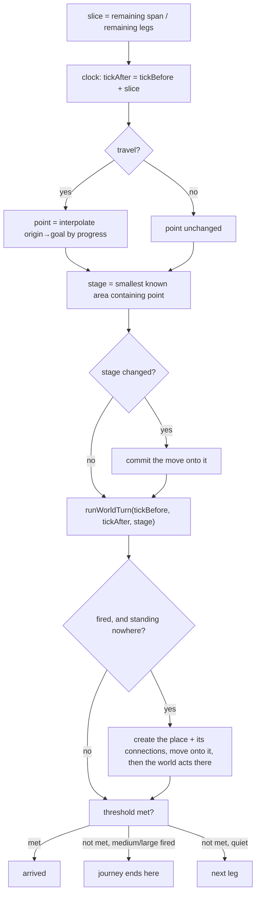

# Design — The Journey + the BE↔FE contract

**Status: DESIGN, founder-approved in brainstorming 2026-08-07.** Awaiting founder review of this written
spec, then one implementation plan per rung (writing-plans). Builds on the Living World (Station G), which
is complete and whole-branch clean on `feat/living-world` (HEAD `6f8c7a1`).

**Supersedes nothing. Amends nothing.** Every prior ruling cited here survives verbatim; where this design
came close to reopening one (the pressure formula, §R8) the founder ruled to leave it alone.

---

## 1. The problem

Two problems, and they are the same problem.

**The engine has no way to let you leave.** An action that exceeds the beat's tension budget halts the
chain and commits nothing — `core/api/orchestrator.go:258-261` (move) and `:328-332` (non-move):

```go
if over {
    outcome.HaltReason = "turn_budget"
    outcome.TicksAdvanced = curTick - startTick
    return nil
}
```

That is the dead end RULINGS-2026-07-30 §2 threw out: *"'You can't even try to leave' is dramatically
dead — the exact player-centric wall this system refuses."* The runChain comment says so itself — *"this
is the honest INTERIM over-budget behavior, no Journey/accumulation logic yet"* (`orchestrator.go:226-228`).

**The contract cannot express a journey even if the engine had one.** There is exactly one endpoint,
`POST /worlds/{w}/beat` (`core/api/beathandler.go:20`, registered `main.go:63`), returning narration plus
a result blob (`beathandler.go:264-286`). It carries **no world state at all**: no location, no participant
roster, no absolute tick — only a tick *delta*. The engine builds a full `PerceptionPayload` twice per beat
(`beathandler.go:130`, `:202`) and discards it. `GET /worlds/{w}/scene/current` is specified in
`docs/30_architecture/mvp_slice_and_bridge.md:59` and does not exist. Neither does `beats/continue`
(`:74`), nor any streaming (`:65-76`).

A journey is the first feature that cannot work on the thin contract. A multi-beat trip is unplayable
unless the player can be told *where they are, how far along, that they can still be stopped, and that
they may continue*. So the Journey forces the contract to grow up — that is not scope creep, it is the
feature's actual shape.

## 2. The principle

From the founding ruling (RULINGS-2026-07-30 §2), which this design implements literally:

> Each beat, the world acts first (its slot): it may telegraph, cut in, or redirect the actor — or do
> nothing. **Nobody acts this slot → the action makes progress and carries to the next slot.** … **Context
> re-evaluates as the actor moves.** … Across the slots the journey needs, the world had **multiple
> chances** to stop or redirect the actor. If it never did → the actor **arrives**.

And from the Living World design (2026-08-05, Unit 1), which generalised it past travel:

> Sustained-until-threshold acts are NOT a duration class — they are the Journey. … travel resolves on
> *distance covered*, a vigil resolves on *the clock reaching a tick*, a watch resolves on *an event
> firing* — one mechanism, spatial or temporal.

The world's-turn composer (`core/api/worldturn.go:39`) was built for this and needs **zero changes**: its
own docstring records the contract — *"This SAME function is the reusable unit the Journey will later call
per leg… it carries NO progress/threshold/'until' logic of its own."* The Journey calls it once per leg.

## 3. Founder rulings — this session (2026-08-07)

Recorded so an implementer who wasn't in the room cannot misread them.

**R1 — Scope.** This program = the Journey mechanism + the documented BE↔FE contract + a real,
journey-capable play page. The full frontend product (four Aux lenses, World Workspace, accounts) is its
own later program.

**R2 — The road is unmapped until the world needs a stage.** Nothing is built while you walk. When the
world's turn is about to act mid-journey, and only then, resolve in this order: *is there a known place
containing the point you have reached?* → that is the stage. *No?* → the world **creates** one, derived
from the parent region and the known places nearby, so a trip between cities yields a town or a waystation.
The intrusion is then authored **for that place** — its size, state and scope bound what can plausibly
happen there. Founder: *"a dragon would not be attacking a small town."* What gets created **lasts**.

**R3 — Places gain extent; containment replaces proximity.** Founder: *"a coordinate is a single point in
space… if your coordinates are within an area, you are actually somewhere."* Without extent every trip
re-mints (a point never matches a point), so extent is what makes R2 terminate. **Where am I = the smallest
area containing my point.** No language model ever draws geometry: the author picks a size *class*, the
engine draws the footprint from a per-world table — the same split already used for time
(`fn_duration_class_seconds`, migration `20260805100001`).

**R4 — The road builds itself.** A created place is created **with its connections** — the way in and the
way out — so the ground covered becomes real map and the arrival step is always legal from where you
stand. Creation **fills gaps only**: where a connection already exists and is shut or locked, it is obeyed,
never overridden. The locked-door promise (`fn_portal_permits`, migration `20260729100004`) is untouched.

**R5 — A hard cut-in ends the journey.** You are standing where it happened, with a full turn. Saying
"carry on home" starts a fresh journey from there. Nothing suspends, nothing auto-resumes, no expiry rule
has to be invented. (Same shape as the held-outcome discard-and-restate, RULINGS-2026-07-24 §1.)

**R6 — Continue, or change your mind.** Continue advances one leg. Any other input **ends** the journey and
runs as a normal turn where you stand. Founder: *"the actions are all typed… there is no waiting or
loading, so the user cannot ever interrupt its own actions while they are being computed unless the world
interrupts him first. And after an interruption the user has full autonomy."* A leg is therefore atomic —
there is no cancel path to build.

**R7 — Bounded presses, scaling danger.** A journey splits into **5–10 legs** (per-world data, low end for
short spans, high end for long hauls); each press covers an equal slice of what remains. The walk home and
the ten-day ride are both a handful of presses; the *risk per press* is what differs, and it already does —
see R8.

**R8 — Pressure stays purely time-based.** The founder considered and rejected adding a tension term:
*"leave it only time based for now, so this can be done programmatically and requires no LLM in the
middle."* The approved Living World line stands unchanged:

> **No tension-damping.** Disruption at the worst moment is the feature (§5) — accrual is pure elapsed
> time; a tense scene never lowers the odds.

Nothing in `fn_pressure_chance` (migration `20260805100002`), `pressure.go`, or their tests is touched by
this program. The scaling the founder asked for is already the shipped behaviour, quoted from the same
design: *"A 3-day journey is thousands of climbs → saturates to the cap almost instantly (that is why long
trips are very likely to erupt); three quick tavern lines is ~a minute → a climb or two → barely moves."*

**R9 — All three journey kinds ship.** Travel ("walk to the old house"), timed wait ("stay hidden for two
hours"), and watch-for-a-fact ("wait until the ship is in"). **Time-of-day waits are out**: there is no
world calendar — `in_world_label` is free text authored per perception (`20260614090002_projection_functions.sql:73`),
so no tick means "2am". A calendar is separate future work.

**R10 — The documented contract in full, streaming included.** Plural `beats`, `beats/continue`,
`scene/current`, the journey block, and live delivery. Transport is **server-sent events** — already the
documented choice (`mvp_slice_and_bridge.md:67`) and it closes open item §6.1 with one answer for both
channels, since the player only ever acts through a POST. Delivery is **one finished line at a time**:
each narration segment is emitted the moment it completes *and passes its validation belts*. Nothing
unchecked reaches a player.

**R11 — Build ladder.** Rung 0 gates → 1 ground → 2 journey → 3 connection → 4 play page. One plan, one
worktree, one PR per rung; never start the next while the last one's gate is red.

## 4. Derived design (mine, from the rulings)

Everything in this section is inference from §3 plus the existing code. It is the part to attack in review.

### 4.1 Journey state is loop state, not canon

A `journey` table, following the `held_outcome` precedent exactly (migration `20260724110004`: *"This is
LOOP STATE, not canon… Because it is loop state, rows may be deleted; there is no append-only
delete-guard"*). Written by Go with a plain INSERT/UPDATE; canon still flows only through the commit twins
(D-1).

| column | meaning |
|---|---|
| `journey_id` | PK |
| `world_id`, `actor_id` | whose journey |
| `kind` | `travel` \| `wait` \| `watch` (genre-agnostic — GA-2) |
| `threshold` | jsonb, shape per kind (§4.4) |
| `span_seconds` | the total the journey covers |
| `legs_total`, `legs_done` | R7 |
| `started_tick`, `current_tick` | forward-only (B-5) |
| `origin_coord`, `goal_coord` | resolved once at start, for interpolation |
| `stage_id` | the place currently containing the traveller; NULL = open road |
| `status` | `active` \| `arrived` \| `ended` |

Read fresh from the table on every input, exactly as `pendingHeldOutcomes` does (`orchestrator.go:457`) —
no server memory, no session machine: the world carries the state.

### 4.2 World-time during a journey

Today the beat's start tick is `max(canon_event.in_world_tick)+1` (`beathandler.go:161-163`). A quiet leg
commits nothing, so under that rule hours of travel would not move the clock — and the pressure climb,
which is *entirely* elapsed-time driven (R8), would never accrue. The journey would be unable to be
interrupted, which is the whole feature.

Fix without inventing filler canon events: the journey row carries `current_tick`, and the world's "now"
becomes

```
fn_world_now(world) = GREATEST( max(canon_event.in_world_tick), max(journey.current_tick) )
```

used everywhere the start tick is computed. Time stays monotonic and append-only (B-5); no event is ever
written to represent "nothing happened"; canon catches up on its own the moment anything commits, because
every terminal case commits at the journey's tick (arrival, eruption, or the player's next action).

### 4.3 One leg



`runWorldTurn` is called unchanged, once per leg, with the leg's `(tickBefore, tickAfter)` — the seam it
was built to be.

### 4.4 Thresholds

Every journey has a **span**; the span is what gets split into legs. The three kinds differ only in the
test run at the end of each leg:

- **travel** — span = `fn_move_duration_actor(world, actor, target)`, the existing physics
  (`20260729100006`). Test: progress ≥ span → arrived, commit `ActorMoved` to the goal target.
- **wait** — span = the stated duration. Test: `current_tick ≥ started_tick + span`.
- **watch** — span = a horizon (the player's own "for an hour", else a per-world default). Test: a
  **deterministic state predicate** over entities the actor may bind — *entity is at place*, or *entity
  attribute equals value*. No model runs per leg, and no ledger archaeology: when a scheduled event brings
  the ship in, the predicate flips on its own. Horizon reached without the fact → `status = ended`,
  journey did not resolve, player has a free turn. Nothing waits forever.

The decomposer gains the *"until/for <condition>"* parse-shape the Living World design already anticipated
(Unit 1) — a shape, like `QUERY`, never a judgment. Predicate targets are bound from the existing
perception-bounded candidate whitelist (RULINGS-2026-07-30 §1), so you cannot watch for something you have
no knowledge path to.

### 4.5 Ground: extent and containment (rung 1)

- **`attrs.extent` already exists** and must be extended, never duplicated: the seed gives the root
  Harbor Quarter `attrs.extent = {"w":2000,"h":2000}` (`seed_drowned_lantern.sql:283`) — a box in that
  place's own frame, centred on its `attrs.coordinates`. A second area convention beside it is
  prohibited, so containment reads *this* field.
- **Extent stays optional and gains a polygon form.** `{"w":…,"h":…}` keeps its current meaning; a place
  may instead carry `{"points":[{"x":…,"y":…},…]}` (≥3) for a non-box footprint such as a road corridor.
  A place with no extent is a point and contains nothing — so every room that ships today is unaffected
  and no existing spatial function changes behaviour.
- `fn_place_at(world, point)` → the **smallest-extent** place containing the point; NULL = open road.
  Nesting falls out: inside the quarter and inside the tavern → the tavern. Postgres tests
  point-in-polygon natively (`polygon @> point`), and a box converts to a polygon in the same call; no
  extension, no PostGIS.
- `extent_class_metres(world, class)` — a per-world config table mapping a size class to a footprint
  radius, drawn as a regular polygon around the point. Same shape and rationale as
  `duration_class_seconds`: **the author picks the class, the engine owns what it means in metres.**
- **v1 constraint:** origin and goal share a parent frame. Nested coordinate frames stay deferred
  (SPEC-018 owns them) and are not reopened here.

### 4.6 Creating a place (rung 2)

Fires only on R2's condition — the world's turn will act and nothing contains the point.

1. **Engine assembles** (deterministic, no model): the point, the parent region, and the nearest known
   places by `fn_distance`.
2. **A new seat authors** what is there: descriptor, kind, and a **size class** from the closed enum. A
   dedicated `place_author` seat (bridge.go pattern, `CapStructuredOutput`) — the World Actor seat is
   reviewed, shipped, and left untouched; one unit, one job.
3. **Engine draws the footprint** from the class (§4.5). Geometry never leaves the engine.
4. **Commit through the normal gate** — `EntityCreated` via `apply_ruled_event`, descriptor-mandatory floor
   and reuse-before-create already enforced by `fn_apply_entity_created` (`20260729100007`). No bypass
   (D-1).
5. **Connections** (R4): a Portal artifact, open, connecting the new place to where the traveller came from
   and to where they are going — created **only where no connection exists**. An existing shut or locked
   connection ends the journey instead ("the way is barred") — the gate's own `gate_reject`, surfaced
   honestly rather than routed around.

Then the world's turn proceeds with the new place as its scene, so the World Actor's existing truth-side
slice (`fn_world_slice`, `20260805100003`) already scopes the intrusion to what that place can support —
R2's "no dragon on the hamlet" needs no new plumbing. The drawn tier (small/medium/large) remains a second,
independent bound.

**Accepted imprecision:** entering a place lands the traveller at that place's entry point, not at the
interpolated coordinate — exactly the rule `fn_target_position` already documents (*"§3 ACCEPTED
IMPRECISION (do NOT 'fix' this)"*). Journey progress is measured in time, so nothing drifts.

### 4.7 Halt reasons and the death of `turn_budget`

An over-budget action no longer halts. It **becomes** a journey. `turn_budget` survives only as the
overflow/impossible-move guard (speed 0 → `max bigint`, `orchestrator.go:420-422`), which is not a
budget failure but an arithmetic impossibility.

**Where the conversion happens.** At the same two pre-commit gates that raise `turn_budget` today
(`orchestrator.go:258`, `:328`), `runChain` hands the attempt to the journey unit and stops. The gates are
the only lines in the beat loop that change; no leg, threshold, or progress logic goes anywhere near
`runChain` or `worldturn.go` (the modular mandate — the Journey is its own unit reusing the seam, not a
patch inside it).

**The rest of the chain.** "Walk home and then sleep" starts the journey and discards the remainder, the
same as every other halt — the prefix stands. Restating after arrival is the player's move, not the
engine's memory (R5's shape, applied to the player's own chain).

**Only the player travels in v1.** NPC and world-actor journeys are out of scope: the world's own
movement stays single-beat, authored per eruption. Nothing in the design forbids them later — the journey
row is already actor-keyed — but no code this program writes assumes more than one active journey per
world.

New halt reasons, joining `completed | telegraph | bounce | unresolved | premise_broken | gate_reject |
ruled_event_rejected | world_eruption`:

- `journey_leg` — you advanced; you may continue.
- `journey_arrived` — threshold met.
- `journey_interrupted` — a medium/large eruption ended it (R5).
- `journey_unresolved` — a watch's horizon passed without the fact (R9/§4.4).

### 4.8 The contract (rung 3)

**Read side**

```
GET /worlds/{w}/scene/current   → where you are, who is present, what matters now
```

Built from the `PerceptionPayload` the engine already assembles and throws away
(`beathandler.go:382-524`) — perception-bound, `schema_version`-stamped, no canon row crosses (B-1, I-3,
D-7). Time travels as tick + label (B-5).

**Write side**

```
POST /worlds/{w}/beats            → SSE stream
POST /worlds/{w}/beats/continue   → SSE stream; advances one leg (C-6)
```

`POST /worlds/{w}/beat` (singular) is **removed**, not aliased — the only client is the throwaway page, so
this is a clean cutover, not a migration.

**The journey block**, on every beat response and on `scene/current`:

```
journey: { active, kind, goal_label, progress, legs_done, legs_total,
           where_label, interruptible, status }
```

Labels only — the frontend renders verbatim and never reconstructs hidden state (D-7).

**The SSE frames** (`mvp_slice_and_bridge.md:65-76`), in order: interpretation → narration lines →
scene delta → journey delta → correction window. One narration frame per **validated** line: the
ghost-speaker belt (segment attributed to someone not in the room) and the verbatim-speech belt (quoted
words must match what was actually said) both run before the line is emitted
(`DecodeAndValidateNarration`, evidence assembled by `speechTexts`, `beathandler.go:346`). A driver that
cannot stream structured output emits the identical frames at the end — **streaming granularity is a
driver capability, not a contract term**, which keeps the provider-neutral promise and lets the frontend
be written once.

**Async channel:** the same SSE transport for `image.ready`, `projection.updated`,
`backstage.applied`, `correction.window_closed` (`mvp_slice_and_bridge.md:79-81`).

### 4.9 The play page (rung 4, frontend repo)

Built in `dreamchat-frontend`, never here (D-7/D-10 — this repo does not grow a `frontend/`). Against the
frozen contract from rung 3. Per `core_ux_loop_and_aux_sidebar.md` §2:

- **Scene canvas** — where you are, the tone; prose expandable (C-2). Images are out this round.
- **Scene participants** — who is present and speaking; characters only, never objects or places (§2.2).
- **Narration panel** — attributed lines arriving one at a time; text-first (§2.3).
- **Input + Continue** — Continue advances one beat and never fast-forwards (C-6, §3.4).
- **Journey state** — where you're headed, how far along, that you can still be stopped, that you arrived.
  This is a **genuinely new surface**: the PRDs specify no mid-journey affordance, so it is designed here
  and folded back into the UX doc.

Out: the four Aux lenses, World Workspace, corrections UX, accounts.

## 5. The ladder

| Rung | Delivers | Gate |
|---|---|---|
| **0 — Close the three gates** | The Living World's recorded deferrals: eruption-log commit atomicity; a runtime `location == scene` check in `runWorldActor`; the empty/QUERY-only floor-window world's-turn gap | The ledger's own condition: these are gated **before the real, non-fake World Actor driver runs at play**, and the Journey's place-creation is authored by that driver |
| **1 — Ground** | `attrs.area`, `fn_place_at`, `extent_class_metres`, seed shapes for the places that need them | Containment proven by pgTAP, including nesting and the no-area-contains-nothing case; every existing spatial test unchanged |
| **2 — The Journey** | `journey` table, span/legs, three thresholds, per-leg world's turn, stage resolution, place + connection creation, interruption, arrival; the over-budget dead-end retired (§4.7) | A walk that exceeds the beat budget completes across legs; an eruption ends it; a locked way bars it; a watch times out |
| **3 — The connection** | `beats`, `beats/continue`, `scene/current`, the journey block, SSE frames with per-line belts; singular `beat` removed | The full frame sequence observed end-to-end; belts still reject a ghost speaker mid-stream |
| **4 — The play page** | Scene, participants, attributed lines, input, continue, journey state | The founder plays a journey: leaves, gets interrupted, restates, arrives |

Rung 2 is playable through the throwaway page (ugly, but it proves the mechanism) before rung 3 exists.

## 6. What this does not do

Explicitly out, so no implementer has to wonder: streaming transport alternatives (settled, §R10);
authentication and sessions (the viewer stays server-resolved, `viewer.go:16`); the four Aux lenses;
World Workspace; corrections UX; images; multiplayer; nested coordinate frames and terrain (SPEC-018);
a world calendar; off-scene eruptions (Living World design "B"); relationship UI (B-3); and any change to
the pressure formula (§R8).

## 7. Open risks

1. **`fn_world_now` touches every start-tick read.** Small blast radius today (one call site,
   `beathandler.go:161`) but it is load-bearing for correctness; it needs its own tests before rung 2
   depends on it.
2. **Place creation is a new seat and a new closed vocabulary.** Both are house patterns, but it is the
   first time the engine lets a model bring a *place* into being off the back of a world eruption. The
   reuse-before-create floor and the size-class enum are the leashes; the whole-branch review should
   probe them.
3. **Streaming inverts the response lifecycle.** Today the handler computes everything, then writes once.
   Frames mean partial output is already on the wire when a later stage fails, so every failure path needs
   a defined frame — including "narrate failed after three lines".
4. **The 5–10 leg band is a guess.** It is data, tunable per world, and the first real playthrough is the
   evidence that sets it. Empirical findings go to the tuning log, per the register discipline.
